# C# Live Project Sprint
The Management Portal software is used to manage a collection of jobs. Admins are able to create and distribute a weekly schedule assigning users to certain jobs. Users are able to keep track of which job they are assigned to for the week.

The primary components of this project include the creation of registered users, differentiation between users and admins, creation of "Jobs" with necessary details, adding users to those jobs with an instance of "Schedule" for each user on each job.

The secondary components include a Chat feature (for all users to have a single main chat room for discussion) and Company News (where admins can create announcements for all employees to read).

#### List of Technologies Used:
- Azure DevOps
- Visual Studio 2017
- Git and Team Foundation Server
- C# ASP.Net MVC
- Entity Framework 6
- PagedList.Mvc
- Leafletjs
- Leafet Routing Machinge API
- Geolocation API
- Bootstrap 4
- Slack and Google Meet for communications
  


## User Story 5327: Show Directions on Map Load
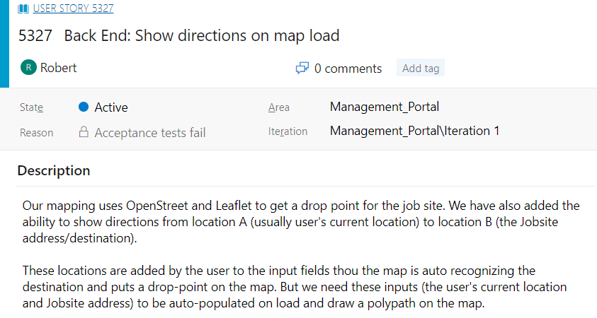

#### What is the issue?
This user story required auto populating the project's current map with a start location using the user's current location, auto populating an end location using the job site's location, and a polypath connecting the start and end destinations immediately after page load.

###### App before fix
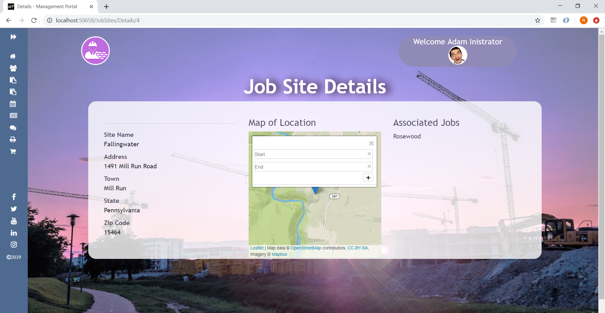

#### How is the issue resolved?
The current project map was created using JavaScript and leafletjs for the map and leaflet routing machine for map routing. I researched leafletjs and leaflet routing machine to understand the previous developer's implementations. Then, I researched how to get a user's current location and found the Geolocation API and it's getCurrentPosition method to get the start location. Then I used the JobSite object's latitude and longitude properties saved in the JobSites database table to get the ending location.

###### setLeafletMap() function is for creating the map
```javascript
function setLeafletMap(mapId, jobSiteLat, jobSiteLong, currentLat, currentLong, popupText)
```

###### Instantiates the map by calling setLeafletMap() and passing it the CSS ID for the map container, job site latitude, job site longitude, user's current latitude, user's current longitude, and job site's address
```javascript
navigator.geolocation.getCurrentPosition(function (location) {
  var currentLat = location.coords.latitude
  var currentLong = location.coors.longitude
  setLeafletMap("jobSiteMap", @Model.Lat, @ Model.Long, currentLat, currentLong, @Model.Address)
});
```
###### Part of setLeafletMap() responsible for populating the start and end destinations
```python
var control = L.Routing.control({
                waypoints: [
                    L.latLng(currentLat, currentLong),
                    L.latLng(jobSiteLat, jobSiteLong)
                ],
                routeWhileDragging: true,
                show: true,
                geocoder: L.Control.Geocoder.nominatim(),
                autoRoute: true
            }).addTo(leafletMap);
```

###### JobSites database table


#### What is the end result?
The result is that when a user goes to the job site's details page, they will see a map with the starting and ending location auto populated with the user's current location and the job site's location, the written directions, and a red polyline connecting the 2 locations.

###### App after fix
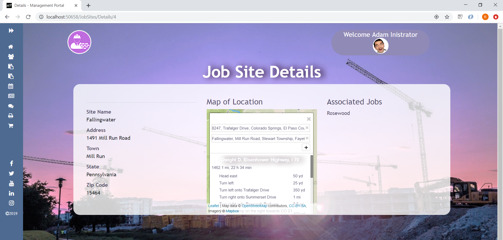


## User Story 5277: Sorting, Filtering, & Paging ChatMessages Index
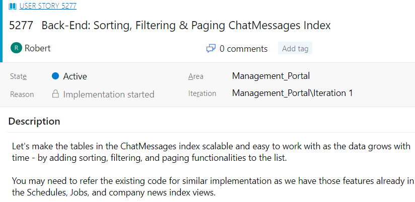

#### What is the issue?
This user story required adding sorting, filtering, and paging functionalitites to the list table in the ChatMessages view.

###### App before fix
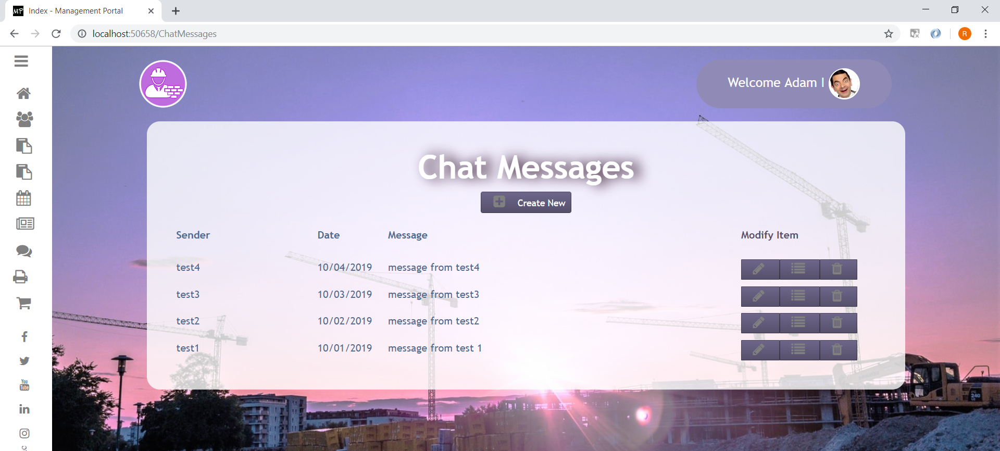

#### How is the issue resolved?
First, I researched and used Microsoft's documentation as a resource. Then, looking inside ChatMessagesController.cs and it's Index method, all it did was return a list of data from the ChatMessages database table. I replaced it and added the sorting and filtering logic and used a NuGet package called PagedList.Mvc for the paging functionalitites. In the Index view, I added column heading hyperlinks for sorting, a search box for filtering, and paging links for pagination.

###### ChatMessagesController.cs/Index method code
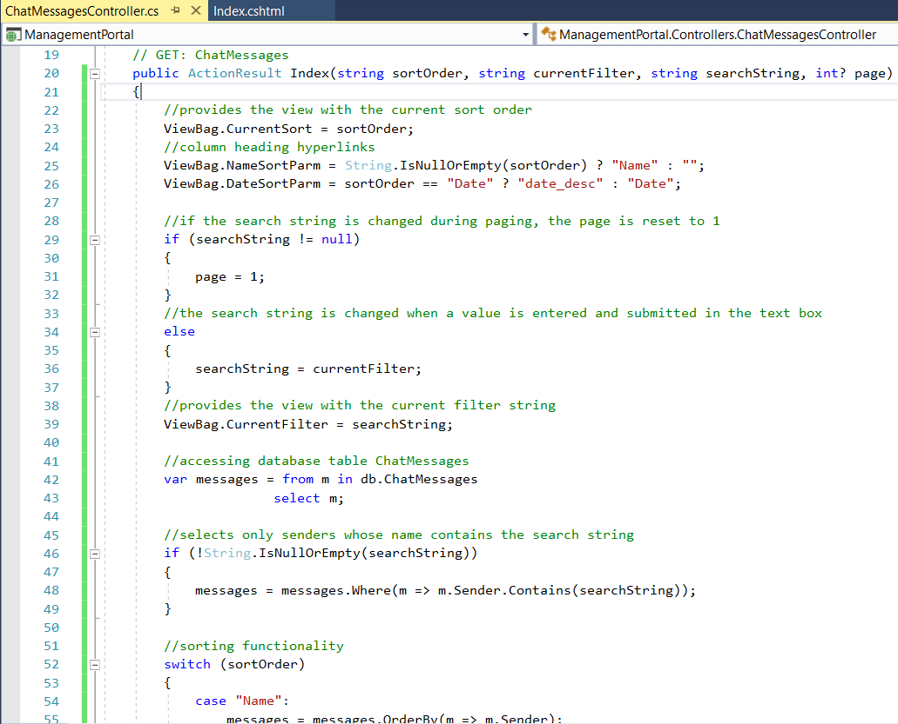
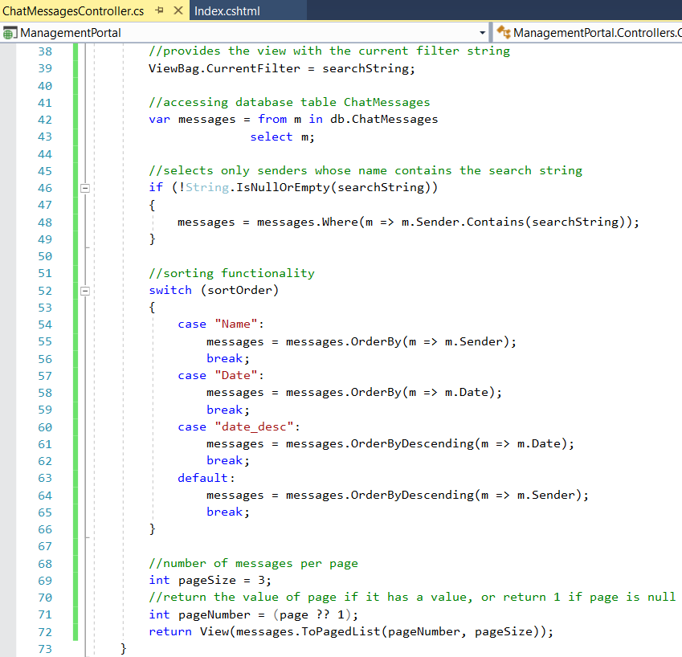

###### ChatMessages database table
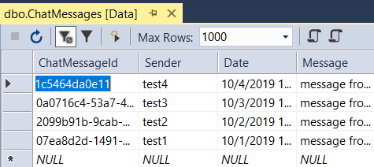

###### ChatMessages/Index.cshtml view
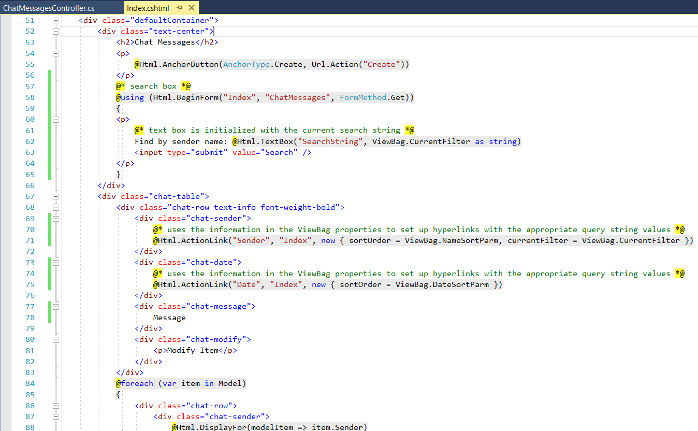
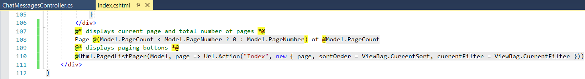

#### What is the end result?
The end result is an interactive table for chat messages that has pages and can be sorted and filtered for ease of use.

###### App after fix


## User Story 5286: Prevent Page Refresh
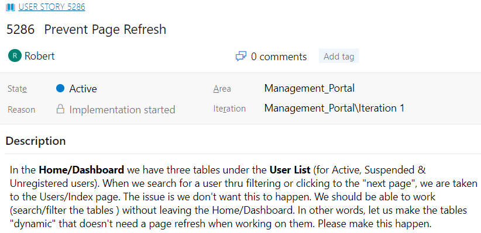

#### What is the issue?
This user story had an issue where if we use the sort, filter, or pagination feature on the User List table (a table that renders 3 sub tables and partial views for Active Users, Suspended Users, and Unregistered Users) from the Home/Dashboard view, it would refresh the page to the User/Index view. Instead, it should refresh on the current page where the features were applied.

#### Why is this an issue?
Inside the _UserList (for Active Users), _SuspendedUsers, and _UnregisteredUsers views, the `Html.BeginForm` (for filtering), `Html.ActionLink` (for sorting), and `Url.Action` (for pagination) had their controllers and actions set specifically for the User controller and the Index method which will return the User/Index view every time.

###### Code snippet
```python
@using (Html.BeginForm("Index", "Users", FormMethod.Get))
```
```python
@Html.ActionLink("User Name", "Index", new { sortOrder = ViewBag.UNameSortParm, currentFilter = ViewBag.CurrentFilter })
```
```python
@Html.PagedListPager(Model, page => Url.Action("Index",
  new { page, sortOrder = ViewBag.CurrentSort, currentFilter = ViewBag.CurrentFilter }))
```

#### How is the issue resolved?
I set the controller and action for the Html.BeginForm, Html.ActionLink, and Url.Action for all 3 user views to `HttpContext.Current.Request.RequestContext.RouteData.Values["controller"].ToString()` and `HttpContext.Current.Request.RequestContext.RouteData.Values["action"].ToString()`. These 2 methods make the features more dynamic by grabbing and using the controller and action names from the current url so that they can be used as a destination point.

###### Code snippet
```python
@using(
  Html.BeginForm(HttpContext.Current.Request.RequestContext.RouteData.Values["action"].ToString(),
  HttpContext.Current.Request.RequestContext.RouteData.Values["controller"].ToString(),
  FormMethod.Get))
```
```python
@Html.ActionLink("User Name",
  HttpContext.Current.Request.RequestContext.RouteData.Values["action"].ToString(),
  HttpContext.Current.Request.RequestContext.RouteData.Values["controller"].ToString(),
  new { sortOrder = ViewBag.UNameSortParm, currentFilter = ViewBag.CurrentFilter }, null)
```
```python
@Html.PagedListPager(Model, page => Url.Action(
  HttpContext.Current.Request.RequestContext.RouteData.Values["action"].ToString(),
  HttpContext.Current.Request.RequestContext.RouteData.Values["controller"].ToString(),
  new { page, sortOrder = ViewBag.CurrentSort, currentFilter = ViewBag.CurrentFilter }))
```

#### What is the end result?
The result is a dynamic User List table that when used to sort, filter, or paginate, it would refresh the page back to the current page it was accesssed from with the updated information.

###### App after fix
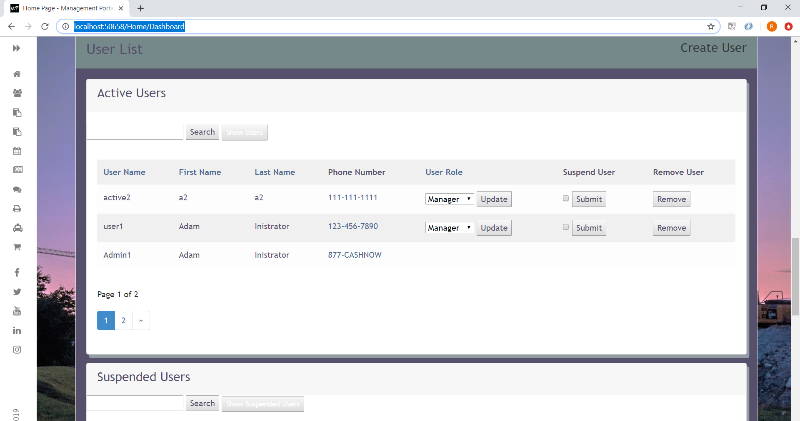


## User Story 5244: Delete Unregistered Users
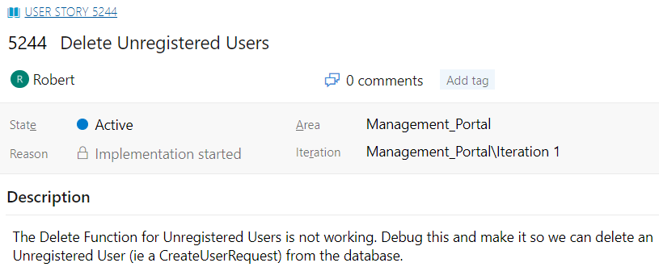

#### What is the issue?
The delete function for unregistered users was not deleting them from the database. Instead, when you try to confirm and delete an unregistered user it goes back to the Index view and the unregistered user is still there.

#### Why is this an issue?
I went to CreateUserRequestController.cs and found the DeleteConfirmed method responsible for deleting unregistered users. The reason the function did not work properly is because all it did was redirect to the Index view.

###### Code snippet
```python
[HttpPost, ActionName("Delete")]
[ValidateAntiForgeryToken]
public ActionResult DeleteConfirmed(Guid id)
{
    return RedirectToAction("Index");
}
```

#### How is the issue resolved?
I used LINQ to search the database table CreateUserRequest (for unregistered users) for the object's ID associated with the unregistered user, removed that CreateUserRequest object (unregistered user) from the database, saved the changes, and redirected back to the Index view.

###### Code snippet
```python
[HttpPost, ActionName("Delete")]
[ValidateAntiForgeryToken]
public ActionResult DeleteConfirmed(Guid id)
{
    //finds object with associated id from database and assigns it as createUserRequest
    CreateUserRequest createUserRequest = db.CreateUserRequests.Find(id);
    //removes createUserRequest from database
    db.CreateUserRequests.Remove(createUserRequest);
    //saves database changes
    db.SaveChanges();
    //redirects to "Index" view
    return RedirectToAction("Index");
}
```

###### CreateUserRequests database table
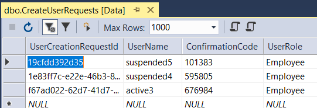


#### What is the end result?
The result is a properly operating delete button that deletes unregistered users.

###### Delete user
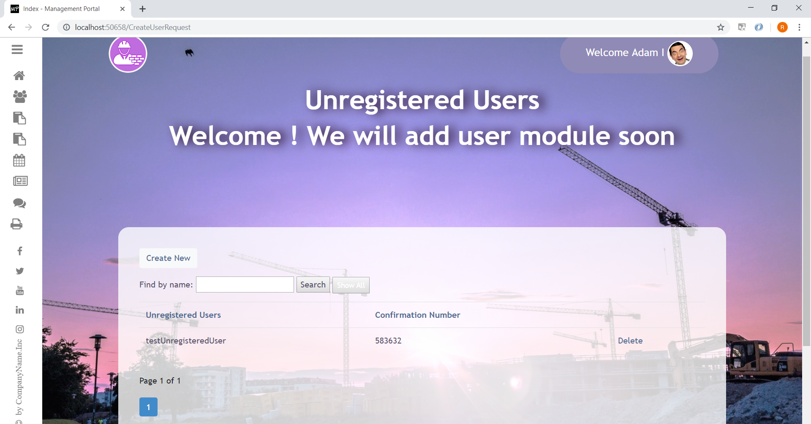

###### Delete user confirmation
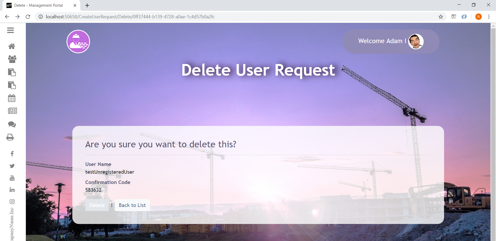

##### User deleted
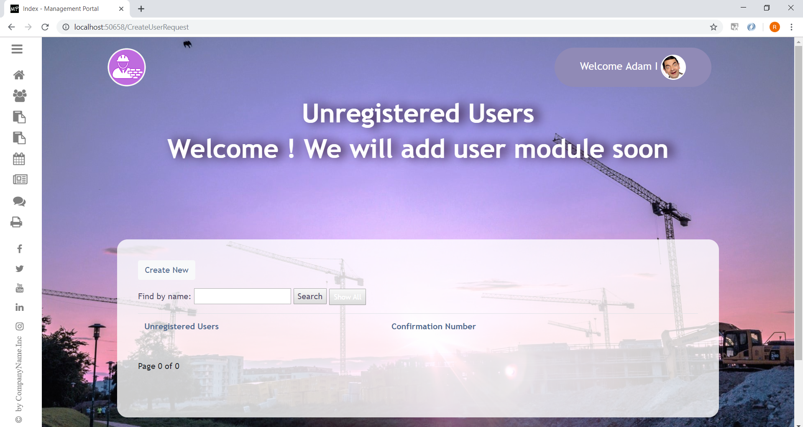


## User Story 5322: List of Jobs to JobSite Details
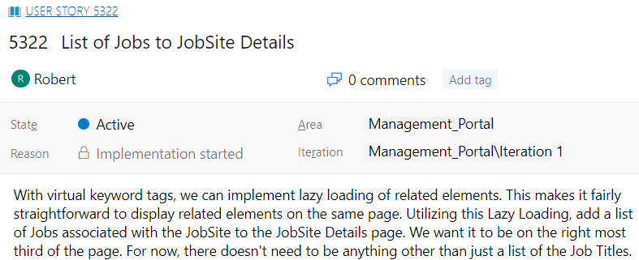

#### What is the issue?
This user story required adding a list of job titles to the JobSites/Details view that are associated with that job site. It needed to be on the right side taking up 1/3 of the container.

###### App before fix
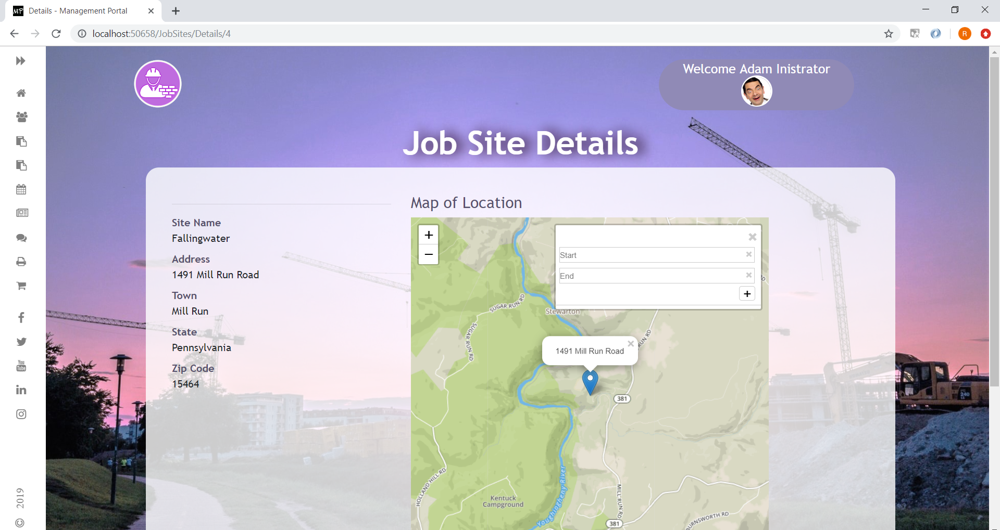

#### How is the issue resolved?
In JobSites/Details.cshtml I added a third column and adjusted the current bootstrap column properties to properly accomodate it. Then I looped through the JobSite object's public virtual Jobs property to access the associated Jobs object's JobTitle property. Then in Content/site.css (responsible for global styling) I found the #jobSiteMap ID associated with the map in the middle column, and I resized it to prevent it from overlapping into the new "Associated Jobs" column.

###### JobSites/Details.cshtml code snippet
```python
<div class="col-md-4">
    <h4>Associated Jobs</h4>
    @foreach (var item in Model.Jobs)
    {
        <p>
            @item.JobTitle
        </p>
    }
</div>
```

###### Content/site.css code snippet
```css
#jobSiteMap {
    height: 100%;
    width: 100%;
}
```

###### Jobs database table
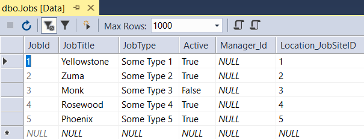

#### What is the result?
The result is when a user goes to the job site's details page, it'll display the jobs associated with that job site.

###### App after fix
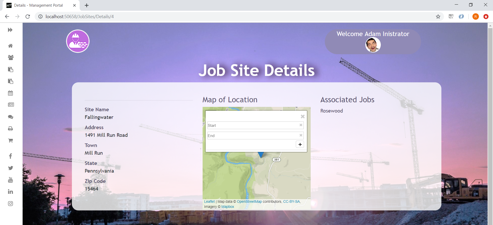


## User Story 5242: Users List Pagination Issue
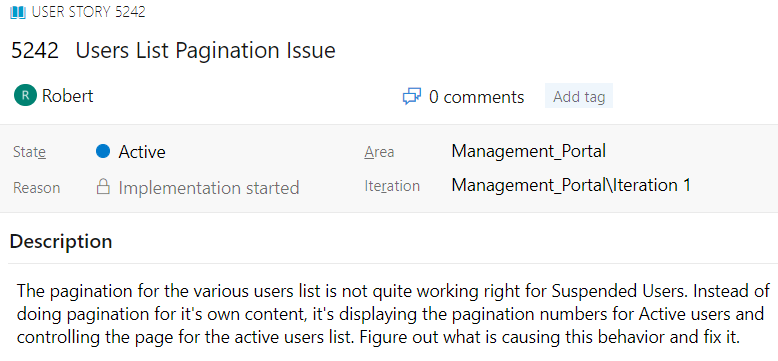

#### What is the issue?
This user story had an issue with the pagination feature for Suspended Users table controlling the pagination for the Active Users table. The sorting feature for Suspended Users was also controlling the sorting for Active Users.

#### Why is this an issue?
After inspecting UserController.cs (the controller for Suspended and Active Users) I noticed that the _SuspendedUsers view was using the same paging and sorting variables used for the _UserList view (view for Active Users). That was why the paging and sorting feature from Suspended Users was controlling the paging and sorting for Active Users. Also, the _UserList (method for Active Users) and _SuspendedUsers methods from the UserController was grabbing all the users from the database rather than the _UserList method filtering for only Active Users and the _SuspendedUsers method filtering only for Suspeded Users. This was causing the ToPagedList method (the method responsible for paging) to receive the wrong number of users being passed to the view, thus interfering with proper pagination behavior.

###### LINQ query to AspNetUsers database table (for active and suspended users)
```
var users = from s in db.Users
            select s;
```

###### AspNetUsers database table (for active and suspended users)
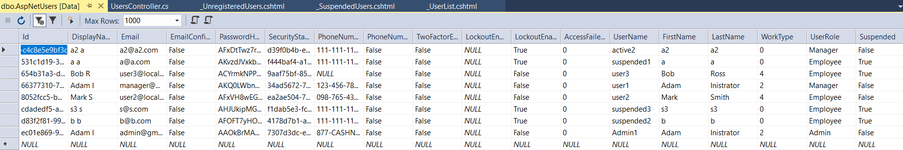

#### How is the issue resolved?
In _SuspendedUsers.cshtml, I changed the paging and sorting variable from `sortOrder` and `page` (which was meant for _UserList.cshtml) to `sortORder2` and `page2`. Then in UserController.cs, using LINQ I made the _UserList method filter the database and only grab the Active Users. I did the same for the _SuspendedUsers method, filtering and grabbing only the Suspended Users.

###### _SuspendedUsers.cshtml code snippet
```python
@Html.ActionLink("User Name", "Index", new { sortOrder2 = ViewBag.UNameSortParm, currentFilter = ViewBag.CurrentFilter })
```
```python
@Html.PagedListPager(Model, page2 => Url.Action("Index",
  new { page2, sortOrder = ViewBag.CurrentSort, currentFilter = ViewBag.CurrentFilter }))
```

###### UserController/_UserList method code snippet
```python
//grabs all non-suspended users from database
var users = from s in db.Users
            where s.Suspended == false
            select s;
```

###### UserController/_SuspendedUsers method code snippet
```python
//grabs all suspended users from database
var users = from s in db.Users
            where s.Suspended == true
            select s;
```

#### What is the end result?
The result were tables with properly operating pagination and sorting features for active and suspended users.

###### App after fix
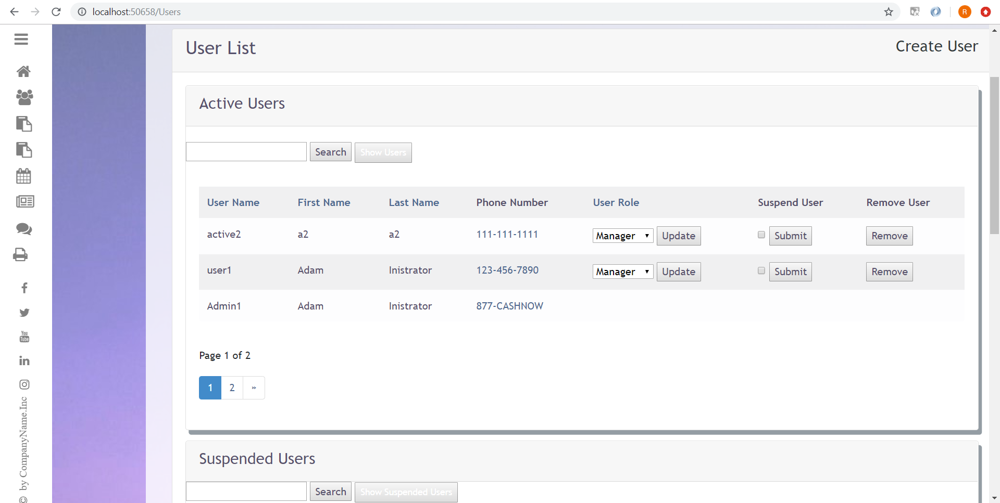
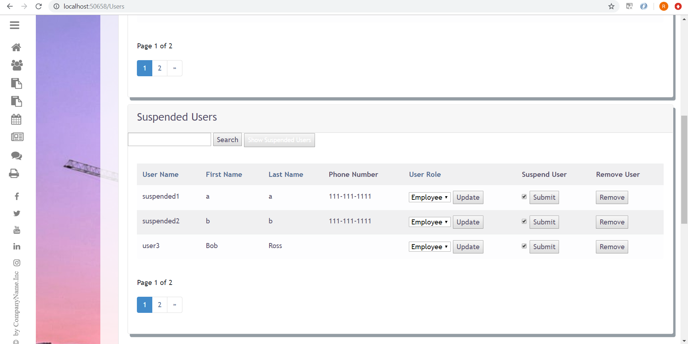


## User Story 5264: Front-End Margin Tweak
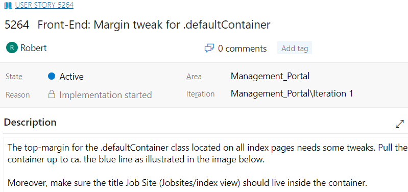

#### What is the issue?
This user story had an issue with the top margin for the global CSS class inside all index pages, .defaultContainer, being too large. Also, the "Job Site" title in JobSites/Index view was outside of its container and it needed to be inside.

###### App before fix
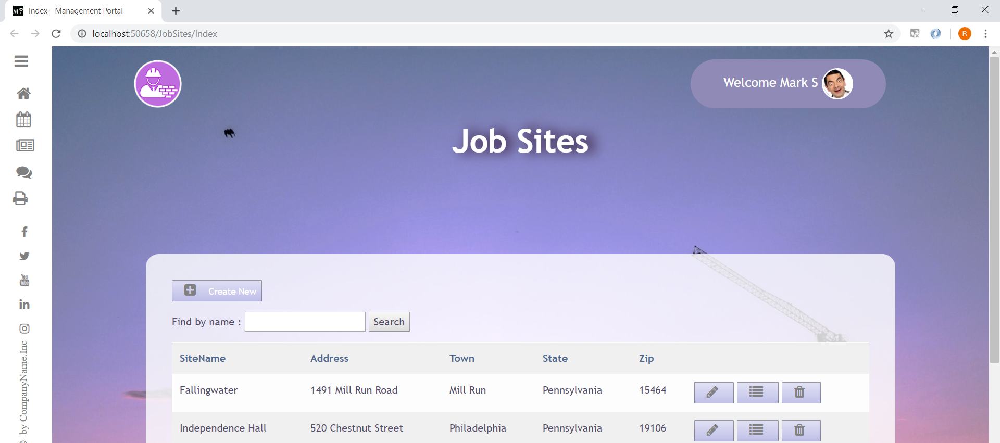

#### Why is this an issue?
I went to Content/site.css (responsible for the global styling), located the .defaultContainer class, and found that the margin was not set appropriately. Then I went to JobSites/Index.cshtml and found the h2 for the "Job Site" title outside of the .defaultContainer.

###### Content/site.css code snippet
```css
.defaultContainer {
    background-color: rgba(255, 255, 255,0.8);
    padding: 40px;
    width: auto;
    border-radius: 20px;
    margin: 10%;
}
```

###### JobSites/Index.cshtml code snippet
```html
<h2>Job Sites</h2>
<div class="defaultContainer">
```

#### How is the issue resolved?
Inside JobSites/Index.cshtml I moved the h2 from outside the .defaultContainer class to inside of it. Then inside Content/site.css I changed the .defaultContainer class to minimize the top margin.

###### JobSites/Index.cshtml code snippet
```html
<div class="defaultContainer">
    <h2>Job Sites</h2>
```

###### Content/site.css code snippet
```css
.defaultContainer {
    background-color: rgba(255, 255, 255,0.8);
    padding: 40px;
    width: auto;
    border-radius: 20px;
    margin: 0% 10% 10% 10%;
}
```

#### What is the end result?
The result is a properly sized top margin for the main container on all index pages and the "Current Jobs" title inside the JobSites/Index view is inside of its container.

###### App after fix
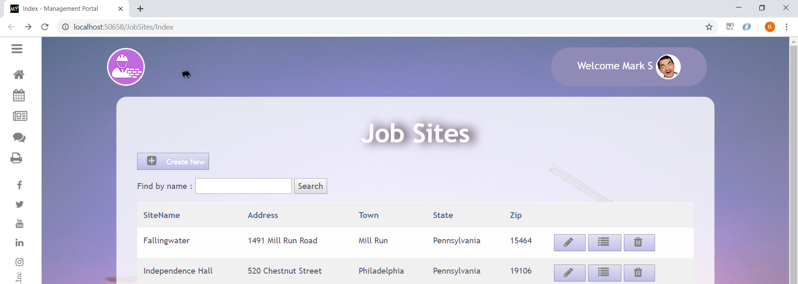
