# C# Live Project Sprint 2
## Table of Contents
- [C# Live Project Sprint 2 General Information](#c-live-project-sprint-2-general-information)
  - [Project Overview](#project-overview)
  - [List of Technologies Used](#list-of-technologies-used)
  - [User Story Overview](#user-story-overview)
- [User Story 1: Show Directions on Map Load](#user-story-1-show-directions-on-map-load)
- [User Story 2: Sorting, Filtering, & Paging ChatMessages Index](#user-story-2-sorting-filtering--paging-chatmessages-index)
- [User Story 3: Delete Unregistered Users](#user-story-3-delete-unregistered-users)
- [User Story 4: List of Jobs to JobSite Details](#user-story-4-list-of-jobs-to-jobsite-details)
- [User Story 5: Users List Pagination Issue](#user-story-5-users-list-pagination-issue)
- [User Story 6: Front End Margin Tweak](#user-story-6-front-end-margin-tweak)
- [Go Back to "Live Project Sprints" Home Page](https://github.com/rbmanez/TTA-Live-Project-Sprints/blob/master/README.md)


## C# Live Project Sprint 2 General Information
#### Project Overview
The Management Portal software is used to manage a collection of jobs. Admins are able to create and distribute a weekly schedule assigning users to certain jobs. Users are able to keep track of which job they are assigned to for the week.

The primary components of this project include the creation of registered users, differentiation between users and admins, creation of Jobs with necessary details, adding users to those jobs with an instance of Schedule for each user on each job.

The secondary components include a Chat feature (for all users to have a single main chat room for discussion) and Company News (where admins can create announcements for all employees to read).

#### List of Technologies Used
- C# ASP.Net MVC
- HTML, CSS, JavaScript
- Entity Framework 6
- PagedList.Mvc
- Leafletjs
- Leafet Routing Machinge API
- Geolocation API
- Bootstrap 4
- Git and Team Foundation Server
- Azure DevOps
- Visual Studio 2017
- Slack and Google Meet for communications

#### User Story Overview
For each user story, I answer the following questions:
1. What is the issue?
2. Why is this an issue? (If applicable)
3. How is the issue resolved?
4. What is the end result?
  


## User Story 1: Show Directions on Map Load
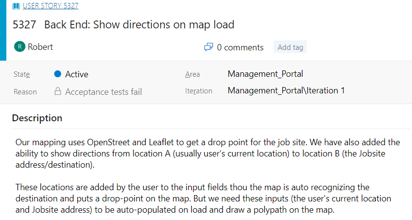

#### 1. What is the issue?
This user story required auto populating the current map with a start location using the user's current location, auto populating an end location using the job site's location, and a polypath automatically connecting the start and end destinations immediately after page load.

###### App before fix
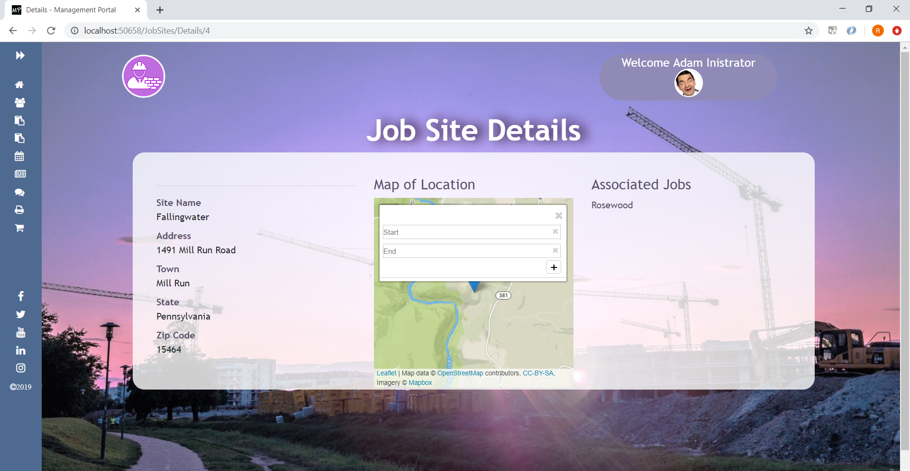

#### 2. How is the issue resolved?
The current map was created using JavaScript and Leafletjs and the map routing used Leaflet Routing Machine. The previous developer created a `setLeafletMap` function to instantiate the map.

The map showed the end location of the `JobSite` location. The issue was that getting the user's current location to be used as the start location was not implemented.

I used the Geolocation API and it's `getCurrentPosition` method to get the user's current location to use as the map's start location.

###### `setLeafletMap` function was created by a previous developer for creating the map. It had no implementation for getting user's current location.
```javascript
function setLeafletMap(mapId, jobSiteLat, jobSiteLong, currentLat, currentLong, popupText)
```

###### I used Geolocation API and it's `getCurrentPosition` method to get user's current location to use as the start location. The `setLeafletMap` function instantiates the map and is passed the map container's CSS id of `#jobSiteMap`, `JobSite`'s `Lat` property, `JobSite`'s `Long` property, user's current latitude, user's current longitude, and `JobSite`'s `Address` property
```javascript
navigator.geolocation.getCurrentPosition(function (location) {
  var currentLat = location.coords.latitude
  var currentLong = location.coors.longitude
  setLeafletMap("jobSiteMap", @Model.Lat, @ Model.Long, currentLat, currentLong, @Model.Address)
});
```
###### Part of `setLeafletMap` that uses Leaflet Routing Machine's `L.Routing.control` function for map routing
```javascript
var control = L.Routing.control({
                waypoints: [
                    L.latLng(currentLat, currentLong),
                    L.latLng(jobSiteLat, jobSiteLong)
                ],
                routeWhileDragging: true,
                show: true,
                geocoder: L.Control.Geocoder.nominatim(),
                autoRoute: true
            }).addTo(leafletMap);
```

#### 3. What is the end result?
The result is that when a user goes to the job site's details page, they will see a map with the starting and ending location auto populated with the user's current location and the `JobSite`'s location, the written directions, and a red polyline connecting the 2 locations.

###### App showing auto populated starting and ending points with written directions (after fix)
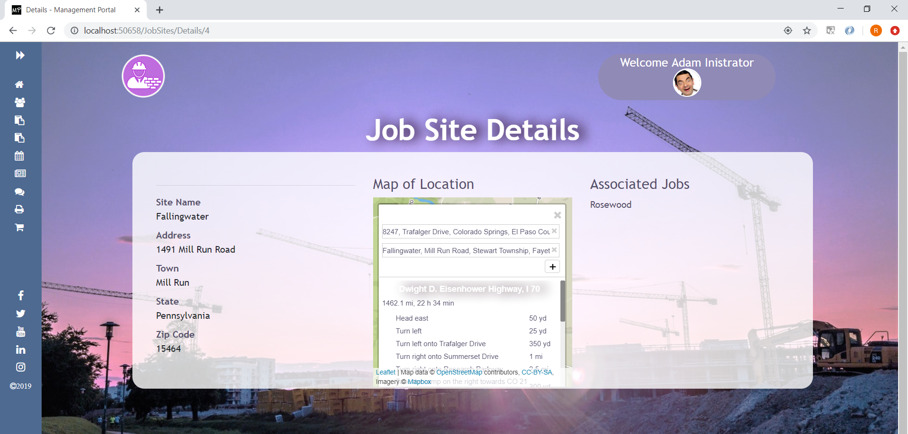

###### App showing red polyline connecting the starting and ending points (after fix)
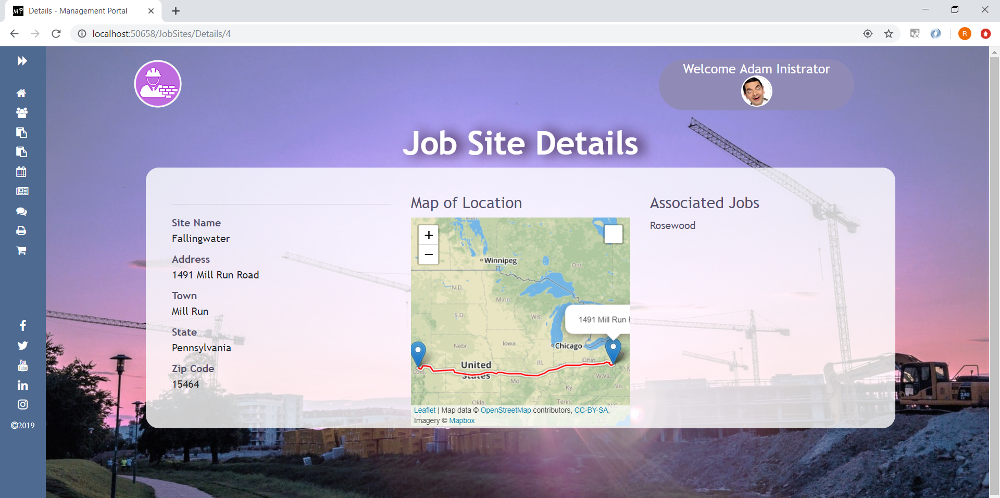


## User Story 2: Sorting, Filtering, & Paging ChatMessages Index
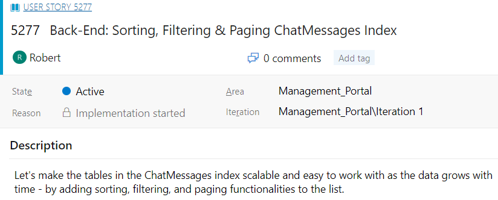

#### 1. What is the issue?
This user story required adding sorting, filtering, and paging functionalitites to the list table in the ChatMessages view.

###### ChatMessages view with no sorting, filtering, and paging functionalitites (before fix)
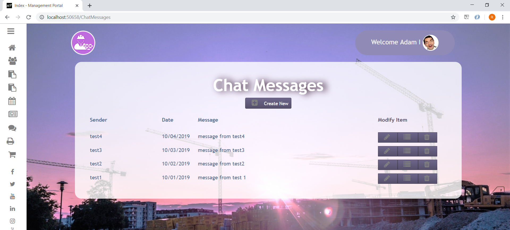

#### 2. How is the issue resolved?
Looking inside `ChatMessagesController` and it's `Index` method, all it did was return a list of data from the `ChatMessages` database table. I replaced it and added the sorting and filtering logic and used a NuGet package called `PagedList.Mvc` for the paging functionalitites.

In the `Index` view, I added column heading hyperlinks for sorting by using the `Html.ActionLink` method, a search box for searching and filtering by using `Html.BeginForm` and `Html.TextBox` methods, and paging links for pagination by using `Html.PagedListPager` method.

###### Adding filtering, sorting, and paging logic inside `ChatMessagesController/Index` method (first half)
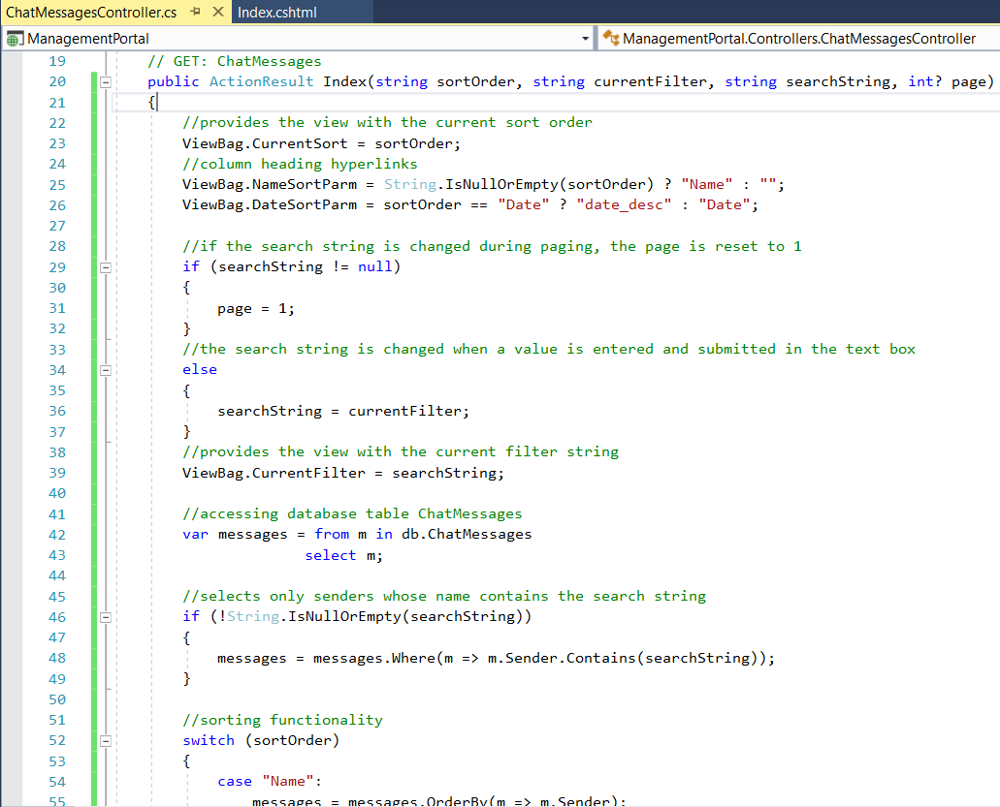

###### Adding filtering, sorting, and paging logic inside `ChatMessagesController/Index` method (second half)
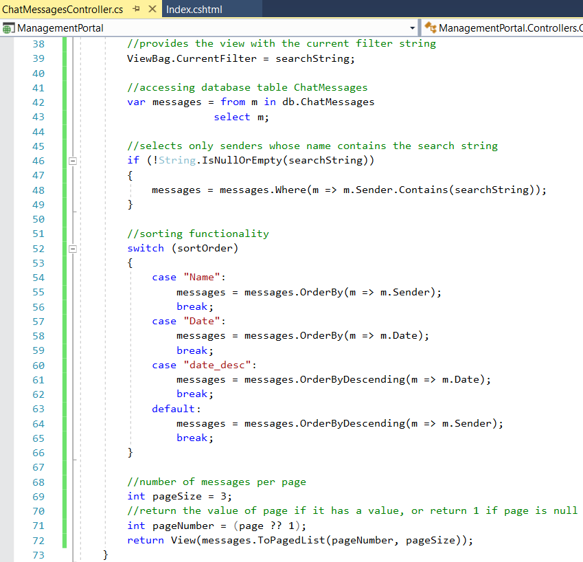

###### Adding a search box for searching and filtering by using `Html.BeginForm` and `Html.TextBox` methods and column heading hyperlinks for sorting by using the `Html.ActionLink` method to ChatMessages `Index` view (top of the page)
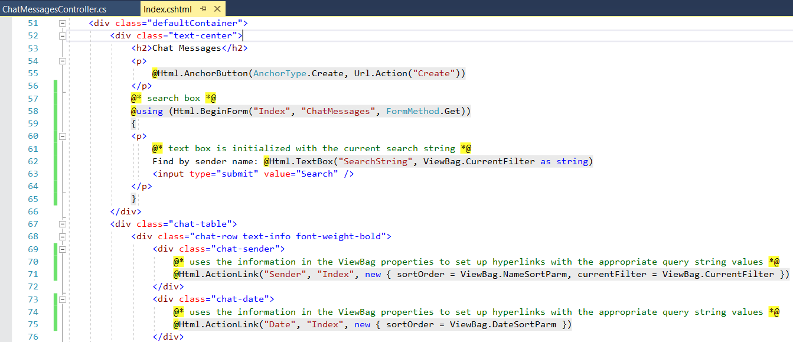

###### Adding paging links for pagination by using `Html.PagedListPager` method to ChatMessages `Index` view (bottom of the page)
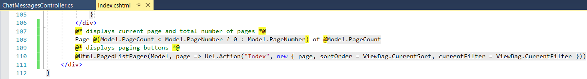

#### 3. What is the end result?
The end result is an interactive table for chat messages with paging functionality that shows 3 messages per page and can be sorted and filtered for ease of use.

###### ChatMessages view with functional sorting, filtering, and paging (after fix)
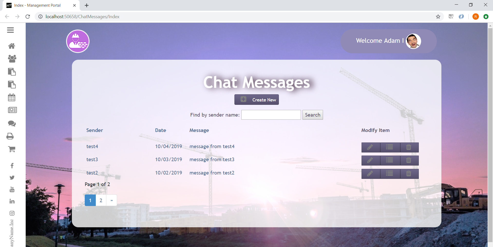


## User Story 3: Delete Unregistered Users
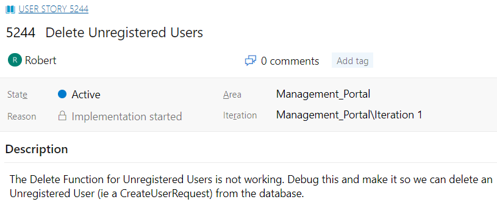

#### 1. What is the issue?
The delete function for `CreateUserRequest` objects (unregistered users) was not deleting them from the database. Instead, when you try to confirm and delete them it goes back to the `Index` view and the `CreateUserRequest` object (unregistered user) is still there.

#### 2. Why is this an issue?
I went to `CreateUserRequestController` and found the `DeleteConfirmed` POST method responsible for deleting `CreateUserRequest` objects  (unregistered users). The reason the function did not delete them is because all it did was redirect to the `Index` view.

###### `CreateUserRequest/DeleteConfirmed` POST method simply redirecting to `Index` view - before fix
```c#
[HttpPost, ActionName("Delete")]
[ValidateAntiForgeryToken]
public ActionResult DeleteConfirmed(Guid id)
{
    return RedirectToAction("Index");
}
```

#### 3. How is the issue resolved?
I searched the `CreateUserRequest` database table for the `CreateUserRequest` object's ID, removed that `CreateUserRequest` object (unregistered user) from the database, saved the changes, and redirected back to the `Index` view.

###### `CreateUserRequest/DeleteConfirmed` POST method now deleting `CreateUserRequest` objects (unregistered users) - after fix
```c#
[HttpPost, ActionName("Delete")]
[ValidateAntiForgeryToken]
public ActionResult DeleteConfirmed(Guid id)
{
    //finds object with associated id from database and assigns it as createUserRequest
    CreateUserRequest createUserRequest = db.CreateUserRequests.Find(id);
    //removes createUserRequest from database
    db.CreateUserRequests.Remove(createUserRequest);
    //saves database changes
    db.SaveChanges();
    //redirects to "Index" view
    return RedirectToAction("Index");
}
```

#### 4. What is the end result?
The result is a properly operating delete button that deletes `CreateUserRequest` objects (unregistered users) from the database.

###### Delete `CreateUserRequest` object (unregistered user) confirmation
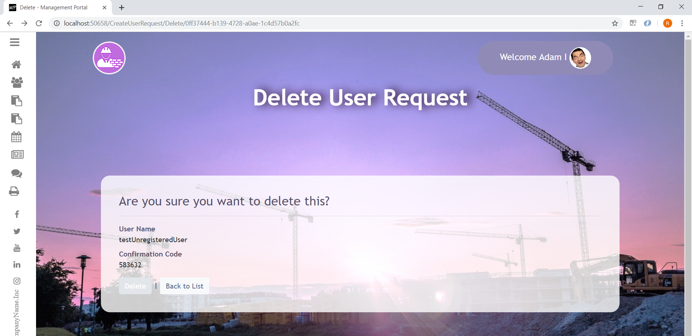

###### `CreateUserRequest` object (unregistered user) successfully deleted
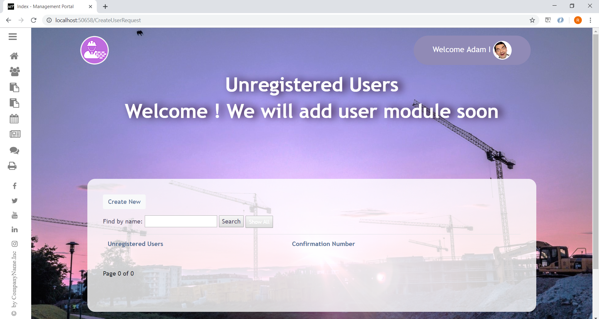


## User Story 4: List of Jobs to JobSite Details
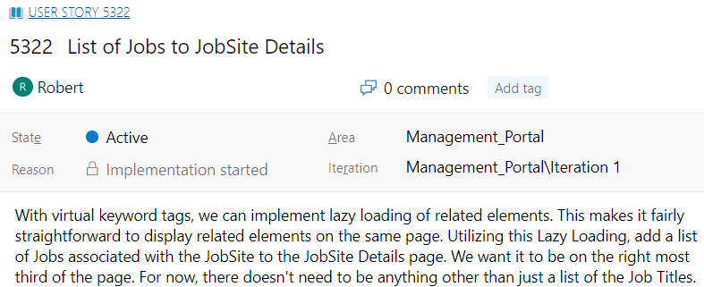

#### 1. What is the issue?
This user story required adding a list of existing `Job` object's `JobTitle` to the `JobSites/Details` view that are associated with that `JobSite` object. The list needed to be on the right side taking up 1/3 of the container.

###### App before fix (`JobSites/Details` view)
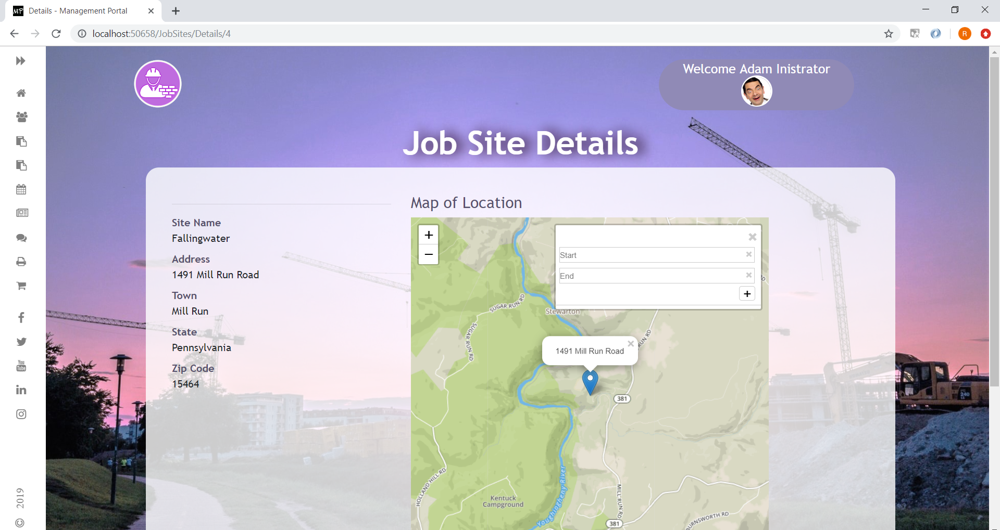

#### 2. How is the issue resolved?
In `JobSites/Details` view I added a third column and adjusted the current Bootstrap columns to properly accomodate it. Then I looped through the `JobSite` object's public virtual `Jobs` property to access the associated `Job` object's `JobTitle` property.

Then in `Content/site.css` (responsible for global styling), I found the `#jobSiteMap` ID associated with the map in the middle column and resized it to prevent it from overlapping into the new "Associated Jobs" column.

###### I incorporated a Bootstrap column and inside it I looped through the `JobSite` object's `Jobs` property to access the associated `Job` object's `JobTitle` property in `JobSites/Details` view
```cshtml
<div class="col-md-4">
    <h4>Associated Jobs</h4>
    @foreach (var item in Model.Jobs)
    {
        <p>
            @item.JobTitle
        </p>
    }
</div>
```

###### Resizing map from `Content/site.css` to prevent overlapping
```css
#jobSiteMap {
    height: 100%;
    width: 100%;
}
```

#### 3. What is the result?
The result is when a user goes to the `JobSite/Details` view, it'll display all of the `Job` object's `JobTitles` associated with that `JobSite` object.

###### App showing `JobSite` object's "Associated Jobs" after fix (`JobSites/Details` view)
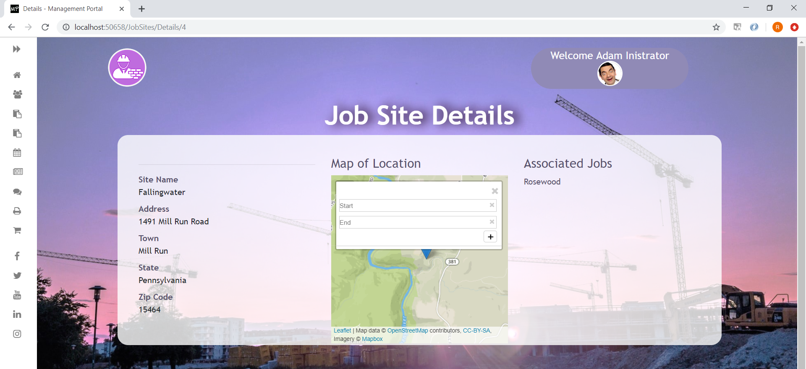


## User Story 5: Users List Pagination Issue
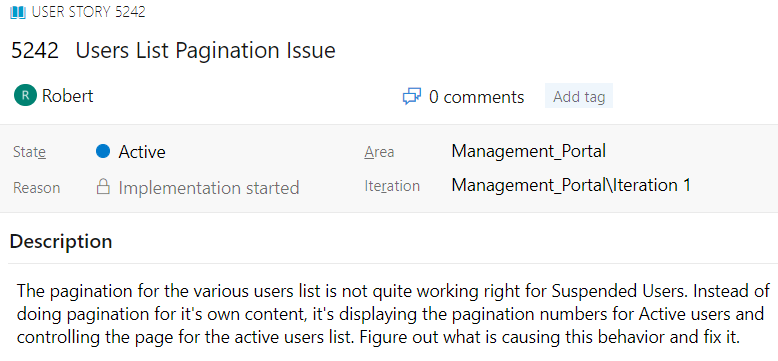

#### 1. What is the issue?
This user story had an issue with the pagination feature for Suspended Users table controlling the pagination for the Active Users table. The sorting feature for Suspended Users was also controlling the sorting for Active Users.

#### 2. Why is this an issue?
After inspecting `UserController` (the controller for Suspended and Active Users) I noticed that the `_SuspendedUsers` partial view was using the same paging and sorting variables (`page` and `sortOrder`) used for the `_UserList` partial view (for Active Users).

Also, the `_UserList` method (for Active Users) and `_SuspendedUsers` methods from the `UserController` were both grabbing all of the Users from the `AspNetUsers` database table rather than the `_UserList` method filtering only for Active Users and the `_SuspendedUsers` method filtering only for Suspeded Users.

This was causing the `ToPagedList` method (responsible for paging) to receive the wrong number of Users being passed to the partial views, thus interfering with proper pagination behavior.

###### Code snippet used for `UserController`'s `_UserList` (for Active Users) and `_SuspendedUsers` method selecting all Users, Active and Suspended alike
```c#
var users = from s in db.Users
            select s;
```

###### AspNetUsers database table (for Users)
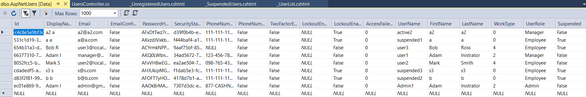

#### 3. How is the issue resolved?
In the `_SuspendedUsers` view, I changed the paging and sorting variable from `page` and `sortOrder` (which was also used for the `_UserList` view) to `page2` and `sortORder2`.

Then in the `UserController`, I made the `_UserList` method filter the database and grab only the Active Users. I did the same for the `_SuspendedUsers` method, filtering and grabbing only the Suspended Users.

###### Using the new variable `sortORder2` in the `_SuspendedUsers` view
```cshtml
@Html.ActionLink("User Name", "Index", new { sortOrder2 = ViewBag.UNameSortParm, currentFilter = ViewBag.CurrentFilter })
```

###### Using the new variable `page2` in the `_SuspendedUsers` view
```cshtml
@Html.PagedListPager(Model, page2 => Url.Action("Index",
  new { page2, sortOrder = ViewBag.CurrentSort, currentFilter = ViewBag.CurrentFilter }))
```

###### `UserController/_UserList` method selecting `User` objects whose `Suspended` property is equal to `false` (selecting Active Users)
```c#
//grabs all non-suspended users from database
var users = from s in db.Users
            where s.Suspended == false
            select s;
```

###### `UserController/_SuspendedUsers` method selecting `User` objects whose `Suspended` property is equal to `true` (selecting Suspended Users)
```c#
//grabs all suspended users from database
var users = from s in db.Users
            where s.Suspended == true
            select s;
```

#### 4. What is the end result?
The results were tables with properly operating pagination and sorting features for Active and Suspended Users.

###### App after fix (Active Users table)
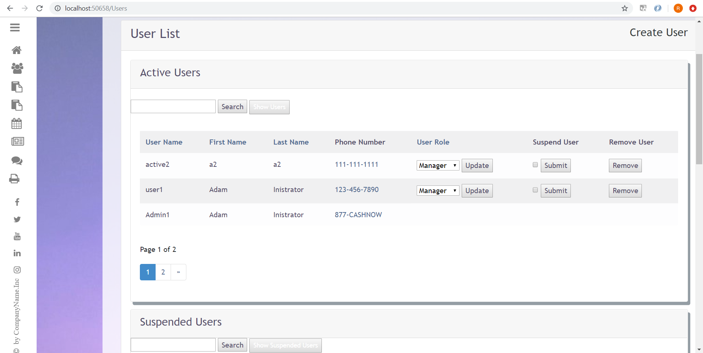

###### App after fix (Suspended Users table)
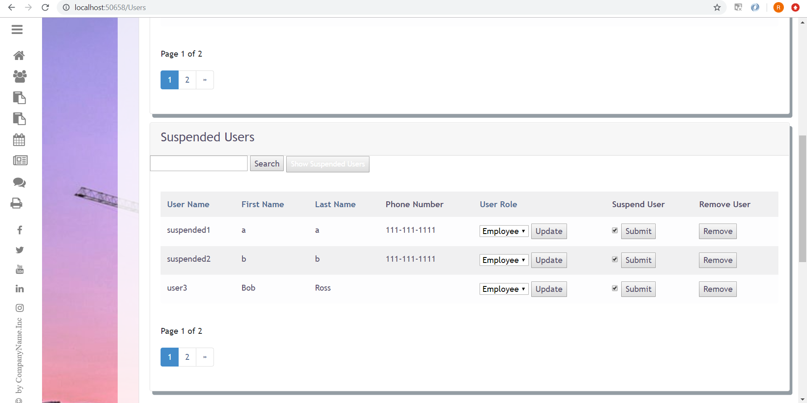


## User Story 6: Front End Margin Tweak
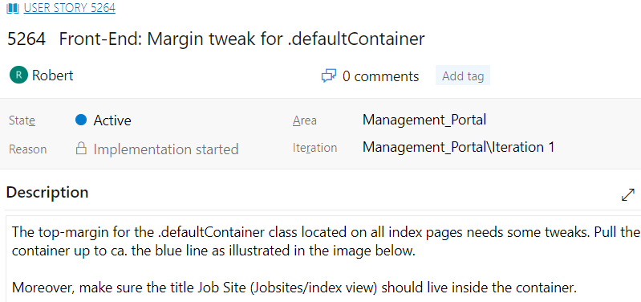

#### 1. What is the issue?
This user story had an issue with the top margin for all index pages being too large. This was controlled by the global CSS class `.defaultContainer`. Also, the "Job Sites" title in `JobSites/Index` view was outside of its `.defaultContainer` and it needed to be inside of it.

###### App showing top margin being too large and "Job Sites" title outside of its container (before fix)
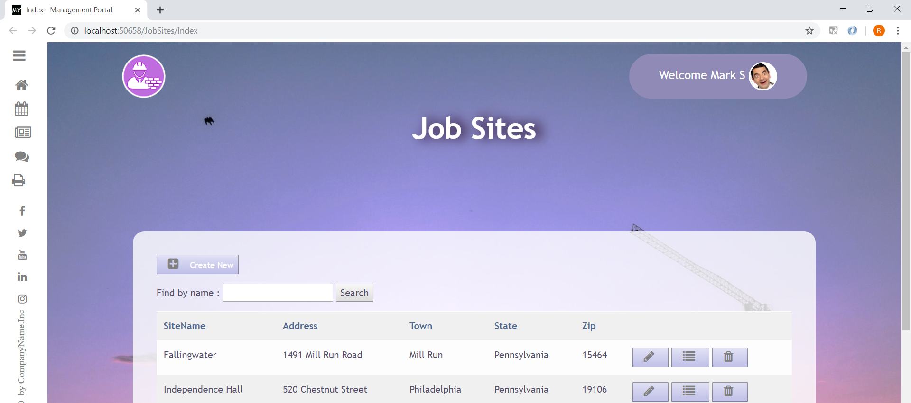

#### 2. Why is this an issue?
I went to `Content/site.css` (responsible for the global CSS styling), located the `.defaultContainer` CSS class, and found that the margin was not set appropriately. Then I went to `JobSites/Index` view and found the `h2` for the "Job Sites" title outside of its `.defaultContainer`.

###### `Content/site.css` showing `.defaultContainer` having 10% margin on all sides (before fix)
```css
.defaultContainer {
    background-color: rgba(255, 255, 255,0.8);
    padding: 40px;
    width: auto;
    border-radius: 20px;
    margin: 10%;
}
```

###### `JobSites/Index` view showing `h2` outside of `.defaultContainer` (before fix)
```cshtml
<h2>Job Sites</h2>
<div class="defaultContainer">
```

#### 3. How is the issue resolved?
Inside `JobSites/Index` view I moved the `h2` from outside of the `.defaultContainer` CSS class to inside of it. Then inside `Content/site.css` I changed the `.defaultContainer` to eliminate the top margin.

###### I moved the `h2` inside of `.defaultContainer` in `JobSites/Index` view (after fix)
```cshtml
<div class="defaultContainer">
    <h2>Job Sites</h2>
```

###### I eliminated the top margin while keeping the other margin sides the same for `.defaultContainer` in `Content/site.css` (after fix)
```css
.defaultContainer {
    background-color: rgba(255, 255, 255,0.8);
    padding: 40px;
    width: auto;
    border-radius: 20px;
    margin: 0% 10% 10% 10%;
}
```

#### 4. What is the end result?
The result is a properly sized top margin for all index pages using `.deafultContainer` and the "Job Sites" title from the `JobSites/Index` view is now inside of `.defaultContainer` container.

###### App showing top margin minimzed and "Job Sites" title from the `JobSites/Index` view inside of its `.defaultContainer` (after fix)
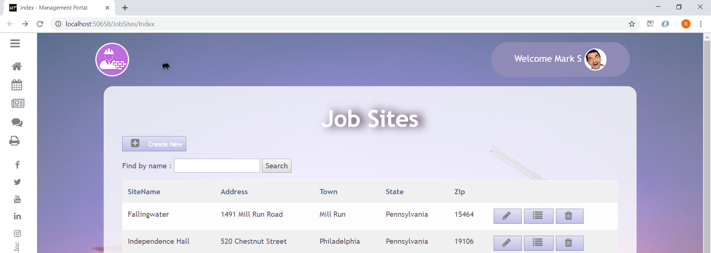
