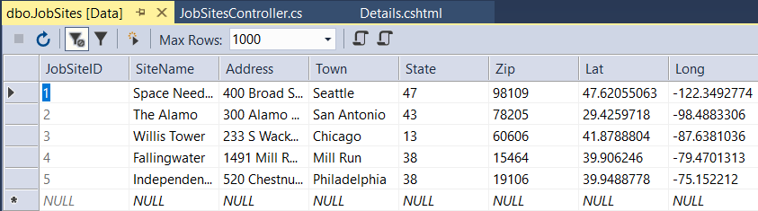
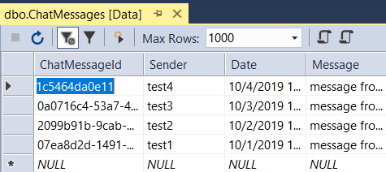
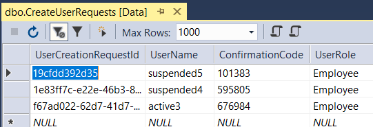
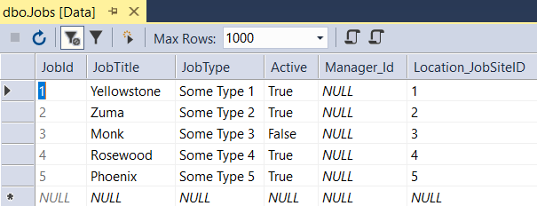
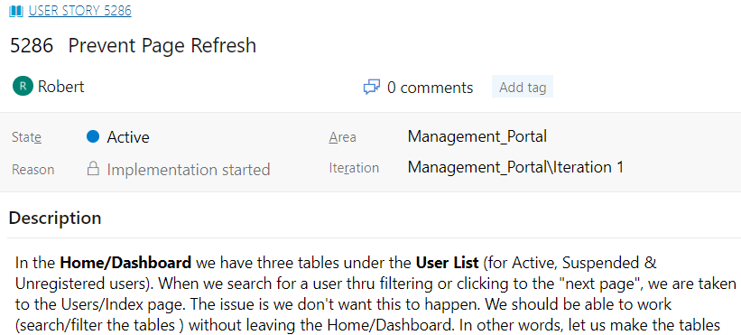
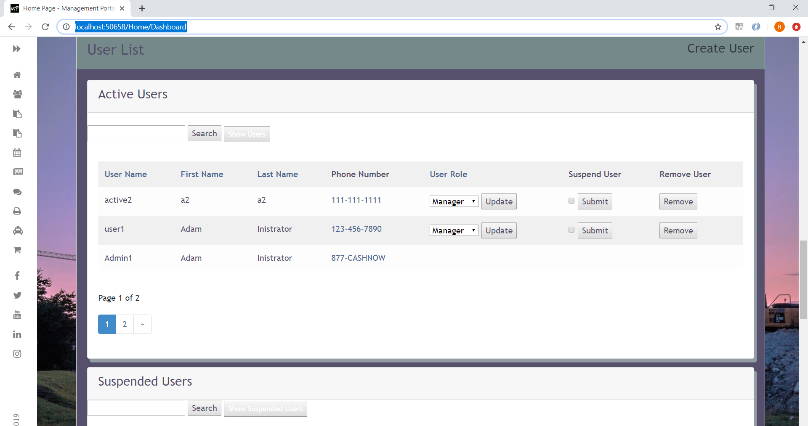

# C# Live Project Sprint 2
## Table of Contents
- [C# Live Project Sprint 2 General Information](#c-live-project-sprint-2-general-information)
  - [Project Overview](#project-overview)
  - [List of Technologies Used](#list-of-technologies-used)
  - [User Story Overview](#user-story-overview)
- [User Story 1: Show Directions on Map Load](#user-story-1-show-directions-on-map-load)
- [User Story 2: Sorting, Filtering, & Paging ChatMessages Index](#user-story-2-sorting-filtering--paging-chatmessages-index)
- [User Story 3: Delete Unregistered Users](#user-story-3-delete-unregistered-users)
- [User Story 4: List of Jobs to JobSite Details](#user-story-4-list-of-jobs-to-jobsite-details)
- [User Story 5: Users List Pagination Issue](#user-story-5-users-list-pagination-issue)
- [User Story 6: Prevent Page Refresh](#user-story-6-prevent-page-refresh)
- [User Story 7: Front End Margin Tweak](#user-story-7-front-end-margin-tweak)

## C# Live Project Sprint 2 General Information
#### Project Overview
The Management Portal software is used to manage a collection of jobs. Admins are able to create and distribute a weekly schedule assigning users to certain jobs. Users are able to keep track of which job they are assigned to for the week.

The primary components of this project include the creation of registered users, differentiation between users and admins, creation of Jobs with necessary details, adding users to those jobs with an instance of Schedule for each user on each job.

The secondary components include a Chat feature (for all users to have a single main chat room for discussion) and Company News (where admins can create announcements for all employees to read).

#### List of Technologies Used
- C# ASP.Net MVC
- HTML, CSS, JavaScript
- Azure DevOps
- Visual Studio 2017
- Git and Team Foundation Server
- Entity Framework 6
- PagedList.Mvc
- Leafletjs
- Leafet Routing Machinge API
- Geolocation API
- Bootstrap 4
- Slack and Google Meet for communications

#### User Story Overview
For each user story, I answer the following questions:
1. What is the issue?
2. Why is this an issue? (If applicable)
3. How is the issue resolved?
4. What is the end result?
  


## User Story 1: Show Directions on Map Load


#### 1. What is the issue?
This user story required auto populating the project's current map with a start location using the user's current location, auto populating an end location using the job site's location, and a polypath connecting the start and end destinations immediately after page load.

###### App before fix


#### 2. How is the issue resolved?
The current project map was created using JavaScript and Leafletjs for the map and Leaflet Routing Machine for map routing. I used the Geolocation API and it's `getCurrentPosition` method to get user's current location to be used as the start location.

Then I used the `JobSite` object's `latitude` and `longitude` properties saved in the `JobSites` database table to use as the ending location.

###### `setLeafletMap()` function was created by a previous developer for creating the map
```javascript
function setLeafletMap(mapId, jobSiteLat, jobSiteLong, currentLat, currentLong, popupText)
```

###### Using Geolocation API and it's `getCurrentPosition` method to get user's current location to be used as the start location. The `setLeafletMap()` function instantiates the map and is passed the map container's CSS id of `#jobSiteMap`, `JobSite`'s `Lat` property, `JobSite`'s `Long` property, user's current latitude, user's current longitude, and `JobSite`'s `Address` property
```javascript
navigator.geolocation.getCurrentPosition(function (location) {
  var currentLat = location.coords.latitude
  var currentLong = location.coors.longitude
  setLeafletMap("jobSiteMap", @Model.Lat, @ Model.Long, currentLat, currentLong, @Model.Address)
});
```
###### Part of `setLeafletMap()` that uses Leafletjs' `L.Routing.control` and `addTo` functions to populate the start and end destinations using user's current location as the starting point and the `JobSite`'s location as the ending point
```javascript
var control = L.Routing.control({
                waypoints: [
                    L.latLng(currentLat, currentLong),
                    L.latLng(jobSiteLat, jobSiteLong)
                ],
                routeWhileDragging: true,
                show: true,
                geocoder: L.Control.Geocoder.nominatim(),
                autoRoute: true
            }).addTo(leafletMap);
```

###### `JobSites` database table


#### 3. What is the end result?
The result is that when a user goes to the job site's details page, they will see a map with the starting and ending location auto populated with the user's current location and the `JobSite`'s location, the written directions, and a red polyline connecting the 2 locations.

###### App showing auto populated starting and ending points with written directions (after fix)


###### App showing red polyline connecting the starting and ending points (after fix)


## User Story 2: Sorting, Filtering, & Paging ChatMessages Index


#### 1. What is the issue?
This user story required adding sorting, filtering, and paging functionalitites to the list table in the ChatMessages view.

###### ChatMessages view before fix


#### 2. How is the issue resolved?
Looking inside `ChatMessagesController` and it's `Index` method, all it did was return a list of data from the `ChatMessages` database table. I replaced it and added the sorting and filtering logic and used a NuGet package called `PagedList.Mvc` for the paging functionalitites.

In the `Index` view, I added column heading hyperlinks for sorting by using the `Html.ActionLink` method, a search box for searching and filtering by using `Html.BeginForm` and `Html.TextBox` methods, and paging links for pagination by using `Html.PagedListPager` method.

###### Adding filtering, sorting, and paging logic inside `ChatMessagesController/Index` method (first half)


###### Adding filtering, sorting, and paging logic inside `ChatMessagesController/Index` method (second half)


###### `ChatMessages` database table


###### Adding column heading hyperlinks for sorting by using the `Html.ActionLink` method, a search box for searching and filtering by using `Html.BeginForm` and `Html.TextBox` methods, and paging links for pagination by using `Html.PagedListPager` method to ChatMessages `Index` view (top of the page)


###### Adding column heading hyperlinks for sorting by using the `Html.ActionLink` method, a search box for searching and filtering by using `Html.BeginForm` and `Html.TextBox` methods, and paging links for pagination by using `Html.PagedListPager` method to ChatMessages `Index` view (bottom of the page)


#### 3. What is the end result?
The end result is an interactive table for chat messages that shows 3 messages per page and can be sorted and filtered for ease of use.

###### ChatMessages view with functional sorting, filtering, and paging (after fix)


## User Story 3: Delete Unregistered Users


#### 1. What is the issue?
The delete function for `CreateUserRequest` objects (unregistered users) was not deleting them from the database. Instead, when you try to confirm and delete them it goes back to the `Index` view and the `CreateUserRequest` object (unregistered user) is still there.

#### 2. Why is this an issue?
I went to `CreateUserRequestController` and found the `DeleteConfirmed` POST method responsible for deleting `CreateUserRequest` objects  (unregistered users). The reason the function did not delete them is because all it did was redirect to the `Index` view.

###### `CreateUserRequest/DeleteConfirmed` POST method simply redirecting to `Index` view - before fix
```c#
[HttpPost, ActionName("Delete")]
[ValidateAntiForgeryToken]
public ActionResult DeleteConfirmed(Guid id)
{
    return RedirectToAction("Index");
}
```

#### 3. How is the issue resolved?
I searched the `CreateUserRequest` database table for the `CreateUserRequest` object's ID, removed that `CreateUserRequest` object (unregistered user) from the database, saved the changes, and redirected back to the `Index` view.

###### `CreateUserRequest/DeleteConfirmed` POST method now deleting `CreateUserRequest` objects (unregistered users) - after fix
```c#
[HttpPost, ActionName("Delete")]
[ValidateAntiForgeryToken]
public ActionResult DeleteConfirmed(Guid id)
{
    //finds object with associated id from database and assigns it as createUserRequest
    CreateUserRequest createUserRequest = db.CreateUserRequests.Find(id);
    //removes createUserRequest from database
    db.CreateUserRequests.Remove(createUserRequest);
    //saves database changes
    db.SaveChanges();
    //redirects to "Index" view
    return RedirectToAction("Index");
}
```

###### `CreateUserRequests` database table



#### 4. What is the end result?
The result is a properly operating delete button that deletes `CreateUserRequest` objects (unregistered users) from the database.

###### Delete `CreateUserRequest` object (unregistered user) confirmation


##### `CreateUserRequest` object (unregistered user) successfully deleted


## User Story 4: List of Jobs to JobSite Details


#### 1. What is the issue?
This user story required adding a list of job titles to the JobSites/Details view that are associated with that job site. It needed to be on the right side taking up 1/3 of the container.

###### App before fix


#### 2. How is the issue resolved?
In JobSites/Details.cshtml I added a third column and adjusted the current bootstrap column properties to properly accomodate it. Then I looped through the JobSite object's public virtual Jobs property to access the associated Jobs object's JobTitle property. Then in Content/site.css (responsible for global styling), I found the #jobSiteMap ID associated with the map in the middle column and resized it to prevent it from overlapping into the new "Associated Jobs" column.

###### JobSites/Details.cshtml code snippet
```cshtml
<div class="col-md-4">
    <h4>Associated Jobs</h4>
    @foreach (var item in Model.Jobs)
    {
        <p>
            @item.JobTitle
        </p>
    }
</div>
```

###### Content/site.css code snippet
```css
#jobSiteMap {
    height: 100%;
    width: 100%;
}
```

###### Jobs database table


#### 3. What is the result?
The result is when a user goes to the job site's details page, it'll display the jobs associated with that job site.

###### App after fix


## User Story 5: Users List Pagination Issue


#### 1. What is the issue?
This user story had an issue with the pagination feature for Suspended Users table controlling the pagination for the Active Users table. The sorting feature for Suspended Users was also controlling the sorting for Active Users.

#### 2. Why is this an issue?
After inspecting UserController.cs (the controller for Suspended and Active Users) I noticed that the _SuspendedUsers partial view was using the same paging and sorting variables used for the _UserList partial view (view for Active Users). That was why the paging and sorting feature from Suspended Users was controlling the paging and sorting for Active Users. Also, the _UserList (method for Active Users) and _SuspendedUsers methods from the UserController was grabbing all the users from the database rather than the _UserList method filtering only for Active Users and the _SuspendedUsers method filtering only for Suspeded Users. This was causing the ToPagedList method (the method responsible for paging) to receive the wrong number of users being passed to the view, thus interfering with proper pagination behavior.

###### UserController.cs code snippet used for _UserList and _SuspendedUsers method to query database
```c#
var users = from s in db.Users
            select s;
```

###### AspNetUsers database table (for active and suspended users)


#### 3. How is the issue resolved?
In _SuspendedUsers.cshtml, I changed the paging and sorting variable from `sortOrder` and `page` (which was meant for _UserList.cshtml) to `sortORder2` and `page2`. Then in UserController.cs, I made the _UserList method filter the database and only grab the Active Users. I did the same for the _SuspendedUsers method, filtering and grabbing only the Suspended Users.

###### _SuspendedUsers.cshtml code snippet
```cshtml
@Html.ActionLink("User Name", "Index", new { sortOrder2 = ViewBag.UNameSortParm, currentFilter = ViewBag.CurrentFilter })
```
```cshtml
@Html.PagedListPager(Model, page2 => Url.Action("Index",
  new { page2, sortOrder = ViewBag.CurrentSort, currentFilter = ViewBag.CurrentFilter }))
```

###### UserController/_UserList method code snippet
```c#
//grabs all non-suspended users from database
var users = from s in db.Users
            where s.Suspended == false
            select s;
```

###### UserController/_SuspendedUsers method code snippet
```c#
//grabs all suspended users from database
var users = from s in db.Users
            where s.Suspended == true
            select s;
```

#### 4. What is the end result?
The result were tables with properly operating pagination and sorting features for active and suspended users.

###### App after fix


## User Story 6: Prevent Page Refresh


#### 1. What is the issue?
This user story had an issue where if we use the sort, filter, or pagination feature on the User List table (a table that renders 3 sub tables and partial views for Active Users, Suspended Users, and Unregistered Users) from the Home/Dashboard view, it would refresh the page to the User/Index view. Instead, it should refresh on the current page where the features were applied.

#### 2. Why is this an issue?
Inside the _UserList (for Active Users), _SuspendedUsers, and _UnregisteredUsers views, the `Html.BeginForm` (for filtering), `Html.ActionLink` (for sorting), and `Url.Action` (for pagination) had their controllers and actions set specifically for the User controller and the Index method which will return the User/Index view every time.

###### Code snippet
```cshtml
@using (Html.BeginForm("Index", "Users", FormMethod.Get))
```
```cshtml
@Html.ActionLink("User Name", "Index", new { sortOrder = ViewBag.UNameSortParm, currentFilter = ViewBag.CurrentFilter })
```
```cshtml
@Html.PagedListPager(Model, page => Url.Action("Index",
  new { page, sortOrder = ViewBag.CurrentSort, currentFilter = ViewBag.CurrentFilter }))
```

#### 3. How is the issue resolved?
I set the controller and action for the Html.BeginForm, Html.ActionLink, and Url.Action for all 3 user views to `HttpContext.Current.Request.RequestContext.RouteData.Values["controller"].ToString()` and `HttpContext.Current.Request.RequestContext.RouteData.Values["action"].ToString()`. These 2 methods make the features more dynamic by grabbing and using the controller and action names from the current url so that they can be used as a destination point.

###### Code snippet
```cshtml
@using(
  Html.BeginForm(HttpContext.Current.Request.RequestContext.RouteData.Values["action"].ToString(),
  HttpContext.Current.Request.RequestContext.RouteData.Values["controller"].ToString(),
  FormMethod.Get))
```
```cshtml
@Html.ActionLink("User Name",
  HttpContext.Current.Request.RequestContext.RouteData.Values["action"].ToString(),
  HttpContext.Current.Request.RequestContext.RouteData.Values["controller"].ToString(),
  new { sortOrder = ViewBag.UNameSortParm, currentFilter = ViewBag.CurrentFilter }, null)
```
```cshtml
@Html.PagedListPager(Model, page => Url.Action(
  HttpContext.Current.Request.RequestContext.RouteData.Values["action"].ToString(),
  HttpContext.Current.Request.RequestContext.RouteData.Values["controller"].ToString(),
  new { page, sortOrder = ViewBag.CurrentSort, currentFilter = ViewBag.CurrentFilter }))
```

#### 4. What is the end result?
The result is a dynamic User List table that when used to sort, filter, or paginate, it would refresh the page back to the current page it was accesssed from with the updated information.

###### App after fix



## User Story 7: Front End Margin Tweak


#### 1. What is the issue?
This user story had an issue with the top margin for the global CSS class inside of all index pages, .defaultContainer, being too large. Also, the "Job Site" title in JobSites/Index view was outside of its container and it needed to be inside of it.

###### App before fix


#### 2. Why is this an issue?
I went to Content/site.css (responsible for the global CSS styling), located the .defaultContainer CSS class, and found that the margin was not set appropriately. Then I went to JobSites/Index.cshtml and found the h2 for the "Job Site" title outside of the .defaultContainer.

###### Content/site.css code snippet
```css
.defaultContainer {
    background-color: rgba(255, 255, 255,0.8);
    padding: 40px;
    width: auto;
    border-radius: 20px;
    margin: 10%;
}
```

###### JobSites/Index.cshtml code snippet
```cshtml
<h2>Job Sites</h2>
<div class="defaultContainer">
```

#### 3. How is the issue resolved?
Inside JobSites/Index.cshtml I moved the h2 from outside the .defaultContainer class to inside of it. Then inside Content/site.css I changed the .defaultContainer class to minimize the top margin.

###### JobSites/Index.cshtml code snippet
```cshtml
<div class="defaultContainer">
    <h2>Job Sites</h2>
```

###### Content/site.css code snippet
```css
.defaultContainer {
    background-color: rgba(255, 255, 255,0.8);
    padding: 40px;
    width: auto;
    border-radius: 20px;
    margin: 0% 10% 10% 10%;
}
```

#### 4. What is the end result?
The result is a properly sized top margin for the main container on all index pages and the "Current Jobs" title inside the JobSites/Index view is now inside of its container.

###### App after fix

