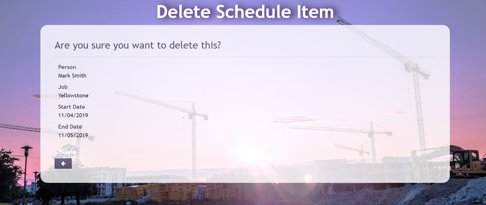
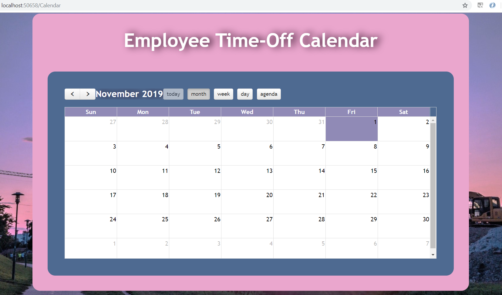

# C# Live Project Sprint 3
## Table of Contents
- [C# Live Project Sprint 3 General Information](#c-live-project-sprint-3-general-information)
  - [Project Overview](#project-overview)
  - [List of Technologies Used](#list-of-technologies-used)
  - [User Story Overview](#user-story-overview)
- [User Story 1: Debug Shift Time CRUD](#user-story-1-debug-shift-time-crud)
- [User Story 2: Personal Photo Refactor](#user-story-2-personal-photo-refactor)
- [User Story 3: Calendar Event Delete](#user-story-3-calendar-event-delete)
- [User Story 4: New Class Vacation Time](#user-story-4-new-class-vacation-time)
- [Go Back to "Live Project Sprints" Home Page](https://github.com/rbmanez/TTA-Live-Project-Sprints/blob/master/README.md)


## C# Live Project Sprint 3 General Information
#### Project Overview
The Management Portal software is used to manage a collection of jobs. Admins are able to create and distribute a weekly schedule assigning users to certain jobs. Users are able to keep track of which job they are assigned to for the week.

The primary components of this project include the creation of registered users, differentiation between users and admins, creation of Jobs with necessary details, adding users to those jobs with an instance of Schedule for each user on each job.

The secondary components include a Chat feature (for all users to have a single main chat room for discussion) and Company News (where admins can create announcements for all employees to read).

#### List of Technologies Used
- C#/ASP.NET MVC
- CSS/Bootstrap, HTML
- Entity Framework 6
- Git and Team Foundation Server (Source Control)
- Azure DevOps (Project Management)
- Visual Studio 2017 (Code Editor)
- Slack and Google Meet ((Team Communication and Stand Ups))

#### User Story Overview
For each user story, I answer the following questions:
1. What is the issue?
2. Why is this an issue? (If applicable)
3. How is the issue resolved?
4. What is the end result?


## User Story 1: Debug Shift Time CRUD


#### 1. What is the issue?
This user story had an issue with `Job` object's `ShiftTimes` property's CRUD functionality. Its `Edit` and `Details` view were throwing errors.

Its `Create` view already had a basic layout but it did not have a working create functionality. It also required a drop down list to select existing `Job` objects and moving the `Default` element from the bottom of the page to the top.

#### 2. Why is this an issue?
The `Edit` view was throwing an error because in the `ShiftTimes` controller's `Edit` GET method, its `id` parameter was assigned the wrong data type of `Guid` while the actual `ShiftTime` model (used in the `Edit` view) assigns its `id` property with the data type of `int`.

As a result of this mismatch, the `id` parameter in the `Edit` method always became `null` and would throw an error.

###### ShiftTimes controller's `Edit` GET method - notice `Guid? id` (before fix)
```c#
public ActionResult Edit(Guid? id)
{
	if (id == null)
	{
		return new HttpStatusCodeResult(HttpStatusCode.BadRequest);
	}
	ShiftTime shiftTime = db.ShiftTime.Find(id);
	if (shiftTime == null)
	{
		return HttpNotFound();
	}
	return View(shiftTime);
}
```

###### Code snippet of `ShiftTime` model - notice `int ShiftTimeId`
```c#
public class ShiftTime
{
	[Key]
	[ForeignKey("Job")]
	public int ShiftTimeId { get; set; }

	public virtual Job Job { get; set; }
	
	...
}
```

###### Error message when trying to access `Edit` view due to `Edit` method's `id` parameter being assigned the data type of `Guid` instead of `int`


The `Details` view was throwing an error due to an `Html.Partial` method from inside of the view that was looking for a file (`"_EditButtonPartial"`) that did not exist.

###### `Html.Partial` method causing the error for `Details` view due to searching for a file (`"_EditButtonPartial"`) that did not exist
```cshtml
@Html.Partial("_EditButtonPartial", Model.ShiftTimeId)
```

###### Error message when trying to access `Details` view


The `Create` view lacked the create functionality because:
1. the view did not have an option to select an existing `Job` object. And since `Job` objects and `ShiftTime` objects had a 1 to 0..1 (zero or one) relationship, in order to create a `ShiftTime` object there must first be an existing `Job` object to select and associate it to.
2. the controller's `Create` GET method didn't do much besides simply returning the view.
3. the controller's `Create` POST method was completely commented out, and the commented out code was implementing a `Guid` data type for the `ShiftTimeId` property (when in fact, based on the `ShiftTime` model, the `ShiftTimeId` property should be an `int`) and a partial view of `"_shiftTimeModal"` that was created for Jobs controller and view.

###### ShiftTime `Create` view before fix (no option of selecting an existing `Job` object, therefore cannot create a `ShiftTime` object)

	
###### Code snippet of `Job` model to show 1 to 0..1 (zero or one) relationship to `ShiftTime` objects
```c#
public class Job
{
	[Key]
	public int JobId { get; set; }

	[Display(Name = "Job Title")]
	public string JobTitle { get; set; }

	[Display(Name = "Weekly Shifts")]
	public virtual ShiftTime WeeklyShifts { get; set; }
	
	...
}
```
	
###### Code snippet of `ShiftTime` model to show 0..1 (zero or one) to 1 relationship to `Job` objects
```c#
public class ShiftTime
{
	[Key]
	[ForeignKey("Job")]
	public int ShiftTimeId { get; set; }

	public virtual Job Job { get; set; }
	
	...
}
```

###### ShiftTimes controller's `Create` GET method (before fix)
```c#
public ActionResult Create()
{
	return View();
}
```

###### ShiftTimes controller's `Create` POST method (before fix)
```c#
//[HttpPost]
//[ValidateAntiForgeryToken]
//public ActionResult Create([Bind(Include = "ShiftTimeId,Monday,Tuesday,Wednesday,Thursday,Friday,Saturday,Sunday,Default")] ShiftTime shiftTime)
//{
//    if (ModelState.IsValid)
//    {
//        //shiftTime.ShiftTimeId = Guid.NewGuid();
//        db.ShiftTime.Add(shiftTime);
//        db.SaveChanges();
//        return RedirectToAction("Index");
//    }
//    return PartialView("_shiftTimeModal", shiftTime);
//}
```

#### 3. How is the issue resolved?
I fixed the `Edit` view by:
1. changing the `Edit` GET method's `id` parameter's data type from `Guid` to `int`
2. changing the view's static heading of "ShiftTime" to a more dynamic approach that grabs the specific `ShiftTime` object's associated `Job` object's `JobTitle` property's value by using the `Html.DisplayFor` method
	
###### ShiftTimes controller's `Edit` GET method with `id` parameter properly assigned as an `int` (after fix)
```c#
public ActionResult Edit(int id)
{
	...
}
```

###### Dynamic heading for `Edit` view by using `Html.DisplayFor` method
```cshtml
<h4 class="card-title">@Html.DisplayFor(model => model.Job.JobTitle)</h4>
```

I fixed the `Details` view by completely eliminating the unnecessary `Html.Partial` method that was causing the error. By the name of the first parameter `"_EditButtonPartial"`, it seemed like the `Html.Partial` method was searching for a file responsible for an edit button. I concluded that this was not necessary due to:
1. this was the `Details` view and not the `Edit` view.
2. the user story only required for the `Details` view to simply show.
3. there was already a functional Edit button from the `Index` view.
4. there was no `"_EditButtonPartial"` file.

I also added a dynamic heading that used the `ShiftTime` object's associated `Job` object's `JobTitle` property's value using `Html.DisplayFor`. Previously there was no heading.

I fixed the `Create` view by:
1. moving the `Default` element from the bottom of the page to the top above the `Monday` element.
2. setting up `Html.BeginForm` for a create form.
3. setting up `Html.DropDownList` for the drop down list and using `Html.LabelFor` for a dynamic heading for the drop down list.
4. setting up ShiftTimes controller's `Create` GET method to pass to the view a list of Jobs from the `Job` database that did not have its `WeeklyShift` property (which has a data type of a `ShiftTime` object) assigned yet.
5. setting up ShiftTimes controller's `Create` POST method to find the selected `Job` object from the `Job` database and assigning its `WeeklyShift` property (which has a data type of a `ShiftTime` object) to the newly created `shiftTime` object. Then I added the new `shiftTime` object to the `ShiftTime` database.

###### `Create` view using `Html.BeginForm` method for a create form
```cshtml
@using (Html.BeginForm("Create", "ShiftTimes", FormMethod.Post))
```

###### `Create` view using `Html.DropDownList` method for the drop down list and `Html.LabelFor` method for a dynamic heading for the drop down list
```cshtml
@*drop down list for Jobs with WeeklyShifts that equal null*@
<div class="form-group">
	@Html.LabelFor(model => model.Job.JobTitle, htmlAttributes: new { @class = "control-label col-md-2" })
	<div class="col-md-10">
	    @Html.DropDownList("JobId", (IEnumerable<SelectListItem>)ViewBag.jobs, null, new { @class = "form-control" })
	</div>
</div>
```

###### ShiftTimes controller's `Create` GET method (after fix)
```c#
public ActionResult Create()
{
	// select all Jobs without WeeklyShifts
	var jobsWithoutWeeklyShift = db.Jobs.Where(x => x.WeeklyShifts == null).ToList();
	// pass jobsWithoutWeeklyShift list to Create view
	ViewBag.jobs = new SelectList(jobsWithoutWeeklyShift, "JobId", "JobTitle");
	return View();
}
```

###### ShiftTimes controller's `Create` POST method that creates a new `ShiftTime` object for a selected `Job` object (after fix)
```c#
[HttpPost]
[ValidateAntiForgeryToken]
public ActionResult Create([Bind(Include = "ShiftTimeId,Monday,Tuesday,Wednesday,Thursday,Friday,Saturday,Sunday,Default")] ShiftTime shiftTime)
{
	if (ModelState.IsValid)
	{
		// uses selected Job's JobId to find that object and store it as jobSelected
		Job jobSelected = db.Jobs.Find(Convert.ToInt32(Request["JobId"]));
		// assign jobSelected's WeeklyShift property to new shiftTime
		jobSelected.WeeklyShifts = shiftTime;
		// add new shiftTime object to ShiftTime database
		db.ShiftTime.Add(shiftTime);
		// save database changes
		db.SaveChanges();
		// redirect to Index
		return RedirectToAction("Index");
	}
	return View();
}
```

#### 4. What is the end result?
The result is a functional CRUD feature for `ShiftTimes` objects. A manager can now go into `ShiftTimes` and see, create, edit, or delete a `ShiftTime` object associated to a `Job` object.

###### `Create` view after fix with a dynamic drop down list of existing `Job` objects to choose from in order to create it a `ShiftTime` object. Also, I moved the `Default` element from the bottom of the page to the top above the `Monday` element


###### `Index` view showing created `ShiftTime` object for `Job` object named `"Yellowstone"`


###### `Edit` view after fix - no more errors and an addition of a dynamic heading using `Job` object's `JobTitle` property's value `"Yellowstone"`


###### `Details` view after fix - no more errors and an addition of a dynamic heading using `Job` object's `JobTitle` property's value `"Yellowstone"`


## User Story 2: Personal Photo Refactor


#### 1. What is the issue?
This user story required making the `PersonalProfilesController` and its view responsible for uploading profile pictures for personal profiles and handling a default picture for users who do not have a personal profile and users who do have a personal profile but did not set a profile picture.

It also required having full CRUD capabilities for profile pictures.

#### 2. How is the issue resolved?
The feature to upload profile pictures was previously handled by the `ManageController` and it was accessing the `ProfilePicture` property from the `User` model. I deleted the `ProfilePicture` property from the `User` model and added it to the `PersonalProfile` model instead.

Then I took the logic for uploading a profile picture from the `ManageController` and transfered it to `PersonalProfilesController` and added extra funcionality:
1. I added an "or" condition (`||`) to the `if` statement that checks for users who have a personal profile but has not set a profile picture. Now, if users do not have a personal profile OR if users have a personal profile but did not set a profile picture, their profile picture will be set to the default profile picture.
2. I added the logic for the `DeleteProfilePictureConfirmed` method.
3. I added comments to the `Photo`, `ProfiePicture` POST, `DeleteProfilePicture`, and `DeleteProfilePictureConfirmed` POST methods for more clarity.

###### PersonalProfilesController `Photo` method for uploading a profile picture or default picture (after fix)


###### PersonalProfilesController `ProfilePicture` GET method (after fix)


###### PersonalProfilesController `ProfilePicture` POST method (after fix)


###### PersonalProfilesController `DeleteProfilePicture` GET method (after fix)


###### PersonalProfilesController `DeleteProfilePictureConfirmed` POST method I added (after fix)


I updated all the view files that dealt with showing the profile picture since `PersonalProfilesController` was now in charge of that logic instead of the `ManageController`.

###### Using `Url.Action` method for `img` tag's `src` attribute to access profile picture (or default picture for users without profile pictures) via `PersonalProfiles/Photo` method
```cshtml

```

###### Using `Html.ActionLink` method to create a link to upload profile picture via `PersonalProfiles/ProfilePicture` method
```cshtml
@Html.ActionLink("Upload your profile image here", "ProfilePicture", "PersonalProfiles")
```

###### Using `Html.ActionLink` method to create links for Update, Details, and Delete for profile picture via `PersonalProfiles/ProfilePicture`, `PersonalProfiles/Details`, and `PersonalProfiles/DeleteProfilePicture` methods
```cshtml
@Html.ActionLink("Update", "ProfilePicture", "PersonalProfiles") |
@Html.ActionLink("Details", "Details", new { id = Model.ProfileID }) |
@Html.ActionLink("Delete", "DeleteProfilePicture", new { id = Model.ProfileID })
```

###### Using `Html.BeginForm` method to upload profile picture via `PersonalProfiles/ProfilePicture` POST method
```cshtml
@using (Html.BeginForm("ProfilePicture", "PersonalProfiles", FormMethod.Post, new { enctype = "multipart/form-data" }))
```
	
###### Using `Html.BeginForm` method for profile picture delete confirmation via `PersonalProfiles/DeleteProfilePicture` POST method
```cshtml
@using (Html.BeginForm("DeleteProfilePicture", "PersonalProfiles", FormMethod.Post))
```

#### 3. What is the end result?
The result is a fully functional CRUD feature for profile pictures that is now being handled by `PersonalProfilesController` and its views. Users can now upload, see, update, or delete their profile pictures.

If users do not have a personal profile or if users do have a personal profile but did not set a profile picture, they are assigned a default profile picture.

###### `PersonalProfiles/Edit` view showing the default profile picture and the Update, Details, and Delete features.

	
###### `PersonalProfiles/ProfilePicture` view for uploading profile picture


###### `PersonalProfiles/Details` view (I uploaded a new profile picture that replaced the default profile picture)


###### `PersonalProfiles/DeleteProfilePicture` view for profile picture delete confirmation


## User Story 3: Calendar Event Delete


#### 1. What is the issue?
This user story had an issue with deleting `CalendarEvent` objects from the calendar. When a `Schedule` object is created it automatically creates an associated `CalendarEvent` object that shows on the calendar.

When a `Schedule` object is deleted, its associated `CalendarEvent` object from the calendar should automatically be deleted as well. However the `CalendarEvent` object persists on the calendar even after its associated `Schedule` object has been deleted.

###### Deleting a `Schedule` object


###### The `CalendarEvent` object persists even after its associated `Schedule` object has been deleted 


#### 2. Why is this an issue?
After looking inside the `SchedulesController`, the reason why `CalendarEvent` objects were not being deleted from the calendar is because the `Schedules/DeleteConfirmed` POST method was only deleting the `Schedule` object. There was no logic that handled deleting the `Schedule` object's associated `CalendarEvent` object.

###### `Schedules/DeleteConfirmed` POST method only deleting `Schedule` objects (before fix)


#### 3. How is the issue resolved?
I accomplished the user story by adding the logic for deleting `CalendarEvent` objects when the associated `Schedule` object is deleted.
	
###### `Schedules/DeleteConfirmed` POST method is now deleting `CalendarEvent` objects when it's associated `Schedule` object is deleted (after fix)


#### 4. What is the end result?
The result is that when a `Schedule` object is deleted, it's associated `CalendarEvent` object on the calendar is automatically deleted as well.

###### Creating a new `Schedule` object


###### An associated `CalendarEvent` object is automatically created due to creating the `Schedule` object


###### Deleting `Schedule` object


###### `CalendarEvent` object is automatically deleted as well due to its associated `Schedule` object being deleted



## User Story 4: New Class Vacation Time


#### 1. What is the issue?
This user story needed a new `Vacation` model to be created so that we can track `User` object's vacation time.

#### 2. How is the issue resolved?
I accomplished the user story by creating an `enum` for `VacationType`, creating a new `Vacation` model with properties for `VacationType` and `User` object, and updating the `User` model by adding a `Vacation` object property to it. This established a 1 to many relationship between `User` and `Vacation` objects.
	
###### I created an `enum` for `VacationType` property
```c#
public enum VacationType
{
	PTO,
	Injury,
	FamilyLeave,
	SickTime,
	Other
}
```
	
###### I created a new `Vacation` model with `VacationType` property and `User` object property
```c#
public class Vacation
{
	public int VacationID { get; set; }

	[DataType(DataType.Date)]
	[DisplayFormat(DataFormatString = "{0:yyyy-MM-dd}", ApplyFormatInEditMode = true)]
	public DateTime StartDate { get; set; }

	[DataType(DataType.Date)]
	[DisplayFormat(DataFormatString = "{0:yyyy-MM-dd}", ApplyFormatInEditMode = true)]
	public DateTime EndDate { get; set; }

	public VacationType VacationType { get; set; }

	public virtual ApplicationUser User { get; set; }
}
```
	
###### I added a new `Vacation` object property inside `User` model
```c#
public virtual ICollection<Vacation> Vacation { get; set; }
```

#### 3. What is the end result?
The result is that there is now a `Vacation` model to help keep track of `User` object's vacation time.
