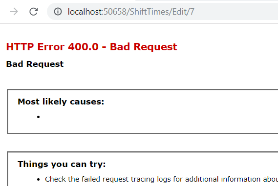
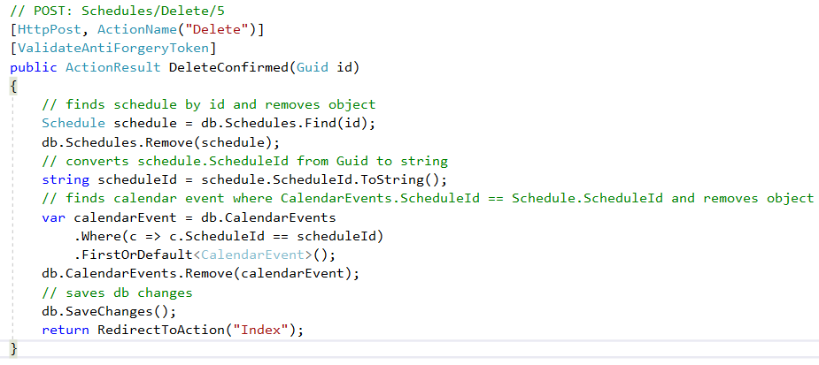

# C# Live Project Sprint 3
## Table of Contents
- [C# Live Project Sprint 3 General Information](#c-live-project-sprint-3-general-information)
  - [Project Overview](#project-overview)
  - [List of Technologies Used](#list-of-technologies-used)
  - [User Story Overview](#user-story-overview)
- [User Story 1: Debug Shift Time CRUD](#user-story-1-debug-shift-time-crud)
- [User Story 2: Personal Photo Refator](#user-story-2-personal-photo-refator)
- [User Story 3: Calendar Event Delete](#user-story-3-calendar-event-delete)
- [User Story 4: New Class Vacation Time](#user-story-4-new-class-vacation-time)


## C# Live Project Sprint 3 General Information
#### Project Overview
The Management Portal software is used to manage a collection of jobs. Admins are able to create and distribute a weekly schedule assigning users to certain jobs. Users are able to keep track of which job they are assigned to for the week.

The primary components of this project include the creation of registered users, differentiation between users and admins, creation of Jobs with necessary details, adding users to those jobs with an instance of Schedule for each user on each job.

The secondary components include a Chat feature (for all users to have a single main chat room for discussion) and Company News (where admins can create announcements for all employees to read).

#### List of Technologies Used
- C# ASP.Net MVC
- HTML, CSS, JavaScript
- Azure DevOps
- Visual Studio 2017
- Git and Team Foundation Server
- Entity Framework 6
- Bootstrap 4
- Slack and Google Meet for communications

#### User Story Overview
For each user story, I answer the following questions:
1. What is the issue?
2. Why is this an issue? (If applicable)
3. How is the issue resolved?
4. What is the end result?


## User Story 1: Debug Shift Time CRUD


#### 1. What is the issue?
This user story had an issue with `Job` object's `ShiftTimes` property's CRUD functionality. The `Edit` and `Details` view were throwing errors, and the `Create` view already had a basic layout but it did not have a working create functionality.

The `Create` view also required a drop down list and moving the `Default` element to the top of the page.

#### 2. Why is this an issue?
The `Edit` view was throwing an error because in the `ShiftTimes` controller's `Edit` GET method, the `id` parameter that was declared was of the wrong data type.

The `ShiftTime` model used in the `Edit` view has an integer data type for its `id` property, but the `Edit` method's parameter was declared as a Guid.

As a result, `id` always had a value of `null` and would throw an error. Besides this view issue, the Edit functionality and its POST method was working perfectly.

###### ShiftTimes controller's `Edit` GET method
```c#
public ActionResult Edit(Guid? id)
{
	if (id == null)
	{
		return new HttpStatusCodeResult(HttpStatusCode.BadRequest);
	}
	ShiftTime shiftTime = db.ShiftTime.Find(id);
	if (shiftTime == null)
	{
		return HttpNotFound();
	}
	return View(shiftTime);
}
```

###### Error message when trying to access `Edit` view due to parameter being passed to the `Edit` method having the wrong data type


The `Details` view was throwing an error due to a line of code from inside of the view that was looking for a file that did not exist.

###### The code causing the error for `Details` view due to searching for a file that did not exist
```cshtml
@Html.Partial("_EditButtonPartial", Model.ShiftTimeId)
```

###### Error message when trying to access `Details` view


The `Create` view lacked the create functionality because:
1. the view did not have an option to select an existing `Job` object. And since `Job` objects and `ShiftTime` objects had a 1 to 0..1 (zero or one) relationship, in order to create a `ShiftTime` object there must first be an existing `Job` object to select and attach it to.
2. the controller's `Create` GET method didn't do much besides simply returning the view.
3. the controller's `Create` POST method was completely commented out, and the commented out code was implementing a `Guid` data type for the `ShiftTimeId` property (when in fact, based on the `ShiftTime` model it should be an integer) and a partial view of `"_shiftTimeModal"` that was created for Jobs controller and view.

###### ShiftTime `Create` view before fix

	
###### Code snippet of `Job` model
```c#
public class Job
{
	[Key]
	public int JobId { get; set; }

	[Display(Name = "Job Title")]
	public string JobTitle { get; set; }

	[Display(Name = "Weekly Shifts")]
	public virtual ShiftTime WeeklyShifts { get; set; }
}
```
	
###### Code snippet of `ShiftTime` model
```c#
public class ShiftTime
{
	[Key]
	[ForeignKey("Job")]
	public int ShiftTimeId { get; set; }

	public virtual Job Job { get; set; }
}
```

###### ShiftTimes controller's `Create` GET method
```c#
public ActionResult Create()
{
	return View();
}
```

###### ShiftTimes controller's `Create` POST method
```c#
//[HttpPost]
//[ValidateAntiForgeryToken]
//public ActionResult Create([Bind(Include = "ShiftTimeId,Monday,Tuesday,Wednesday,Thursday,Friday,Saturday,Sunday,Default")] ShiftTime shiftTime)
//{
//    if (ModelState.IsValid)
//    {
//        //shiftTime.ShiftTimeId = Guid.NewGuid();
//        db.ShiftTime.Add(shiftTime);
//        db.SaveChanges();
//        return RedirectToAction("Index");
//    }
//    return PartialView("_shiftTimeModal", shiftTime);
//}
```

#### 3. How is the issue resolved?
I fixed the `Edit` view by changing the parameter data type for `id` from `Guid` to `int`. I also changed the view's static heading of "ShiftTime" to a more dynamic approach that grabs the specific `ShiftTime` object's associated `Job` object's `JobTitle` property and value by using `Html.DisplayFor`.
	
###### ShiftTimes controller's `Edit` GET method
```c#
public ActionResult Edit(int id)
{
	if (id == null)
	{
		return new HttpStatusCodeResult(HttpStatusCode.BadRequest);
	}
	ShiftTime shiftTime = db.ShiftTime.Find(id);
	if (shiftTime == null)
	{
		return HttpNotFound();
	}
	return View(shiftTime);
}
```

###### Dynamic heading by using `Html.DisplayFor`
```cshtml
<h4 class="card-title">@Html.DisplayFor(model => model.Job.JobTitle)</h4>
```

I fixed the `Details` view by completely eliminating the line of code that was causing the error. By the name of the first parameter `"_EditButtonPartial"`, it seemed like the problematic line of code was searching for a file responsible for an edit button. I concluded that this was not necessary due to:
1. this was the `Details` view and not the `Edit` view.
2. the user story only required for the `Details` view to simply show.
3. there was already a functional Edit button from the `Index` view.

I also added a dynamic heading that used the `ShiftTime` object's associated `Job` object's `JobTitle` property and value using `Html.DisplayFor`. Previously there was no heading.

###### Dynamic heading by using `Html.DisplayFor`
```cshtml
<h4 class="card-title">@Html.DisplayFor(model => model.Job.JobTitle)</h4>
```

I fixed the `Create` view by:
1. moving the `Default` element to the top of the page.
2. setting up `Html.BeginForm` for a create form.
3. setting up `Html.DropDownList` for the drop down list and using `Html.LabelFor` for a dynamic heading for the drop down list.
4. setting up ShiftTimes controller's `Create` GET method to pass to the view a list of Jobs from the `Job` database that did not have its `WeeklyShift` property assigned yet.
5. setting up ShiftTimes controller's `Create` POST method to find the selected `Job` object from the `Job` database and assigning its `WeeklyShift` property to the newly created `shiftTime`. Then I added the new `shiftTime` object to the `ShiftTime` database.

###### `Html.BeginForm` for a create form
```cshtml
@using (Html.BeginForm("Create", "ShiftTimes", FormMethod.Post))
```

###### `Html.DropDownList` for the drop down list and `Html.LabelFor` for a dynamic heading for the drop down list
```cshtml
@*drop down list for Jobs with WeeklyShifts that equal null*@
<div class="form-group">
	@Html.LabelFor(model => model.Job.JobTitle, htmlAttributes: new { @class = "control-label col-md-2" })
	<div class="col-md-10">
	    @Html.DropDownList("JobId", (IEnumerable<SelectListItem>)ViewBag.jobs, null, new { @class = "form-control" })
	</div>
</div>
```

###### ShiftTimes controller's `Create` GET method
```c#
public ActionResult Create()
{
	// select all Jobs without WeeklyShifts
	var jobsWithoutWeeklyShift = db.Jobs.Where(x => x.WeeklyShifts == null).ToList();
	// pass jobsWithoutWeeklyShift list to Create view
	ViewBag.jobs = new SelectList(jobsWithoutWeeklyShift, "JobId", "JobTitle");
	return View();
}
```

###### ShiftTimes controller's `Create` POST method
```c#
[HttpPost]
[ValidateAntiForgeryToken]
public ActionResult Create([Bind(Include = "ShiftTimeId,Monday,Tuesday,Wednesday,Thursday,Friday,Saturday,Sunday,Default")] ShiftTime shiftTime)
{
	if (ModelState.IsValid)
	{
		// uses selected Job's JobId to find that object and store it as jobSelected
		Job jobSelected = db.Jobs.Find(Convert.ToInt32(Request["JobId"]));
		// assign jobSelected's WeeklyShift property to new shiftTime
		jobSelected.WeeklyShifts = shiftTime;
		// add new shiftTime object to ShiftTime database
		db.ShiftTime.Add(shiftTime);
		// save database changes
		db.SaveChanges();
		// redirect to Index
		return RedirectToAction("Index");
	}
	return View();
}
```

#### 4. What is the end result?
The result is a functional CRUD feature for `ShiftTimes` objects. A manager can now go into `ShiftTimes` and see, create, edit, or delete a `ShiftTime` object associated to a `Job` object.

###### `Create` view after fix


###### `Index` view showing created `ShiftTime` object for `Job` object named "Yellowstone"


###### `Edit` view after fix


###### `Details` view after fix


## User Story 2: Personal Photo Refator


#### 1. What is the issue?
This user story required making the `PersonalProfilesController` and its view responsible for uploading profile pictures for personal profiles. It also required adding full CRUD capabilities for profile pictures.

#### 2. How is the issue resolved?
The feature to upload profile pictures was previously handled by the `ManageController` and it was accessing the `ProfilePicture` property from the `User` model.

I deleted the `ProfilePicture` property from the `User` model and added it to the `PersonalProfile` model instead. Inside `PersonalProfilesController` I added logic for CRUD functionality.

###### ProfilePicture property inside PersonalProfile model
```c#
public byte[] ProfilePicture { get; set; }
```

I took the logic for uploading a profile picture from the `ManageController` and transfered it to `PersonalProfilesController` and made some adjustments to make it work for the views that needed access to it.

###### PersonalProfilesController Photo method for profile picture


###### PersonalProfilesController ProfilePicture GET method


###### PersonalProfilesController ProfilePicture POST method


###### PersonalProfilesController DeleteProfilePicture GET method


###### PersonalProfilesController DeleteProfilePictureConfirmed POST method


I updated all the view files that dealt with the profile picture since `PersonalProfilesController` was now in charge of that logic.

###### Access to profile picture (or default picture for users without profile pictures)
```cshtml

```

###### Link to upload profile picture
```cshtml
@Html.ActionLink("Upload your profile image here", "ProfilePicture", "PersonalProfiles")
```

###### Links to update, see details, and delete for profile picture
```cshtml
@Html.ActionLink("Update", "ProfilePicture", "PersonalProfiles") |
@Html.ActionLink("Details", "Details", new { id = Model.ProfileID }) |
@Html.ActionLink("Delete", "DeleteProfilePicture", new { id = Model.ProfileID })
```

###### Logic to upload profile picture via POST
```cshtml
@using (Html.BeginForm("ProfilePicture", "PersonalProfiles", FormMethod.Post, new { enctype = "multipart/form-data" }))
```
	
###### Logic for profile picture delete confirmation via POST
```cshtml
@using (Html.BeginForm("DeleteProfilePicture", "PersonalProfiles", FormMethod.Post))
```

#### 3. What is the end result?
The result is a fully functioning CRUD feature for profile pictures that is now being handled by `PersonalProfilesController` and its views.

###### PersonalProfiles/Edit view showing default profile picture (for users who has not uploaded their own profile picture) and the update, details, and delete features.

	
###### PersonalProfiles/ProfilePicture view for uploading profile picture


###### PersonalProfiles/Details view (I uploaded a new profile picture)


###### PersonalProfiles/DeleteProfilePicture view for delete confirmation


## User Story 3: Calendar Event Delete


#### 1. What is the issue?
This user story had an issue with deleting calendar events from the calendar. When a schedule is created it automatically creates a calendar event that shows on the calendar.

When a schedule is deleted, the calendar event from the calendar should automatically be deleted as well. However the calendar event persists on the calendar even after the associated schedule has been deleted.

###### Deleting schedule


###### Calendar event persists


#### 2. Why is this an issue?
After looking inside the `SchedulesController`, the reason why calendar events were not being deleted from the calendar is because the delete method was only deleting the schedule. There was no logic that handled deleting the schedule's associated calendar event.

###### Code snippet of SchedulesController.DeleteConfirmed method


#### 3. How is the issue resolved?
I accomplished the user story by adding the logic for deleting calendar events when the associated schedule is deleted.
	
###### Code snippet of solution from SchedulesController.DeleteConfirmed method


#### 4. What is the end result?
The result is that when a schedule is deleted, it's associated calendar event on the calendar is automatically deleted as well.

###### Creating a new schedule


###### Calendar event created due to new schedule


###### Deleting schedule


###### Calendar event deleted due to schedule being deleted


## User Story 4: New Class Vacation Time


#### 1. What is the issue?
This user story needed a new `Vacation` model to be created so that we can track `Users` vacation time.

#### 2. How is the issue resolved?
I accomplished the user story by creating a new `Vacation` model, creating an `enum` for vacation type, and updating the `User` model by adding a `Vacation` property to it. This established a 1 to many relationship between `User` and `Vacation` objects.
	
###### New Vacation class model
```c#
public class Vacation
{
	public int VacationID { get; set; }

	[DataType(DataType.Date)]
	[DisplayFormat(DataFormatString = "{0:yyyy-MM-dd}", ApplyFormatInEditMode = true)]
	public DateTime StartDate { get; set; }

	[DataType(DataType.Date)]
	[DisplayFormat(DataFormatString = "{0:yyyy-MM-dd}", ApplyFormatInEditMode = true)]
	public DateTime EndDate { get; set; }

	public VacationType VacationType { get; set; }

	public virtual ApplicationUser User { get; set; }
}
```
	
###### Enum for vacation type
```c#
public enum VacationType
{
	PTO,
	Injury,
	FamilyLeave,
	SickTime,
	Other
}
```
	
###### New Vacation property in User model
```c#
public virtual ICollection<Vacation> Vacation { get; set; }
```

#### 3. What is the end result?
The result is that there is now a `Vacation` model to help keep track of `Users` vacation time.
