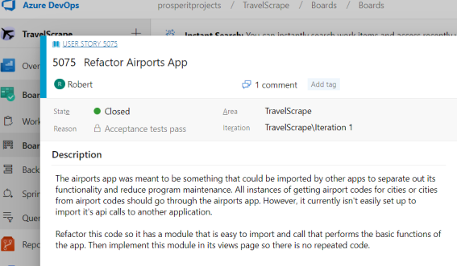
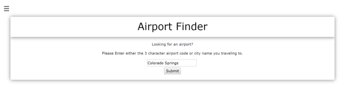
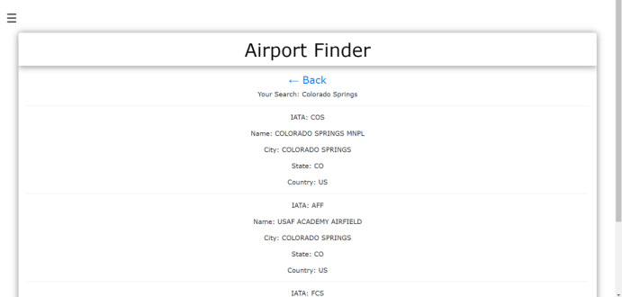
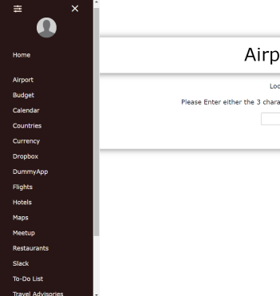

 # Python Live Project Sprint 1
TravelScrape is a web scraping application project built with Django and Beautfiulsoup. With webscraping and API's, the application gathers data from the web that is relevant to the user who will be traveling. It will include weather, flights, events, restaurants, etc.

#### List of Technologies Used:
- Python & Django Web Framework, HTML, CSS, JavaScript
- Selenium (Python Library)
- BeautifulSoup (Python Library)
- Amadeus API (used for Airports App)
- Virtualenv (Python Library)
- DevOps (Project Management)
- Git (Source Control)
- Slack (Team Communication)
- Google Hangout (Team Meetings)
- VS Code (Code Editor)


## 1) User Story 5075: Refactor Airports App


#### What is the issue?
The objective of this user story was to refactor the Airports App from the TravelScrape main project so that it has a module that is easy to import and call by other apps. 

#### How is the issue resolved?
I succeeded with the user story by creating a module that takes care of the API call and returns the data. Then I implemented this module in its views page so there is no repeated code.

###### Code snippet of the module:
```python
def make_api_call(search):
    # Athentication for the Amadeus API
    amadeus = Client(
        client_id = "oXoHcPGNhQAKNcvvhFIkB9kFudwrBYTy", 
        client_secret = "zs3PhgM4HNpZbCm4"
    )
    try:
        # Retrieves the response from the api as a json
        response = amadeus.reference_data.locations.get( 
            subType=Location.ANY,
            keyword=search
        )
        # Extracts and returns a list of locations from the json
        return response.data 
    except ResponseError as error:
        return error.code
```

#### What is the end result?
The functionality of the Airports App takes a user's input. If a user inputs a city name, the app retrieves the associated airport codes. If a user inputs an airport code, the app retrieves the associated city name.

###### Airports App Input:


###### Airports App Output:



## 2) User Story 5080: Front End Calendar App


#### What is the issue?
The objective of this user story was to utilize the global styles of the TravelScrapes main project so that the Calendar App will appear uniform with the rest of the site. Also, some CSS styling that is supposed to be specific to only the Calendar App were overriding the styles in other apps.

#### How is the issue resolved?
I succeeded with the user story by incorporating the global CSS classes from the static/css file with the appropriate HTML tags. I also changed the vague CSS selectors that are supposed to be responsible for only the Calendar App to unique CSS class names.

###### Code snippet of global styling for the TravelScrapes main project:
```css
/* use this for all form containers */
.appContainer{
    background: rgba(255, 255, 255, 0.4);
    box-shadow: 0 1px 16px 0 rgba(0,0,0,0.5);
    border-radius: 1px;
    margin: 1% 3% 3% 3%;
    word-wrap: normal;
    position: relative;
    flex-basis: auto;
    height: auto;
    padding: 20px;
    overflow: hidden;
    border-radius: 6px;
}

/* use this for all header styling */
.header {
    text-align: center;
    color: black;
    background: rgba(255, 255, 255, 0.9);
    box-shadow: 0 1px 16px 0 rgba(0,0,0,0.5);
    padding: 1% 1% 1% 1%;
    margin: -20px -20px 20px -20px;
}
```

###### Code snippet of CSS classes specific to only the Calendar App:
```css
.calendar {
    width: 98%;
    margin: auto;
    font-size: 13px;
  }

.calendar-btn {
    outline: none;
    color: black;
    background-color: transparent;
    box-shadow: 0 0 0 0;
 }
 
 .calendar-delete {
    text-align: left;
    margin-left: 20px;
    margin-bottom: 20px;
    width: 39%;
}
```
#### What is the end result?
In the end, the Calendar App looked uniform with the rest of the site and the CSS classes specific to it are no longer overriding the styles of the other apps.

###### Calendar App Interface:


## 3) User Story 5083: Organize the Navbar


#### What is the issue?
The objective of this user story was to organize the side navbar to display all of the apps in alphabetical order. I also needed to move the home button from the bottom of the navbar to the top of it.

#### How is the issue resolved?
I reorganized the placement of each anchor tag to be in alphabetical order, with the "Home" anchor tag at the very top.

###### Code snippet of the solution:
```html
<a class="dropdown-item" href="/">Home</a>
<br>
<a class="dropdown-item" href="/AirportApp">Airport</a>
<a class="dropdown-item" href="/BudgetApp">Budget</a>
<a class="dropdown-item" href="/CalendarApp">Calendar</a>
<a class="dropdown-item" href="/Countries">Countries</a>
<a class="dropdown-item" href="/currency">Currency</a>
<a class="dropdown-item" href="/DropboxApp">Dropbox</a> 
<a class="dropdown-item" href="/DummyApp">DummyApp</a>
<a class="dropdown-item" href="/FlightApp">Flights</a>
<a class="dropdown-item" href="/HotelApp">Hotels</a>
<a class="dropdown-item" href="/MapsApp">Maps</a>
<a class="dropdown-item" href="/MeetupApp">Meetup</a>
<a class="dropdown-item" href="/RestaurantsApp">Restaurants</a>
<a class="dropdown-item" href="/DummyApp/dummy">Slack</a>
<a class="dropdown-item" href="/todo_app">To-Do List</a>
<a class="dropdown-item" href="/advisoryApp">Travel Advisories</a>
<a class="dropdown-item" href="/WishListApp">Travel Wish List</a>
<a class="dropdown-item" href="/TravelogueApp">Travelogue</a>
<a class="dropdown-item" href="/WeatherApp">Weather</a>
<br>
<a class="nav-link" href="/logout">Logout</a>
```

#### What is the end result?
In the end, the navbar became easier to operate and navigate.

###### Navbar Image:

