# Python Live Project Sprint 4
## Table of Contents
- [Python Live Project Sprint 4 General Information](#sprint-4-general-information)
  - [Project Overview](#project-overview)
  - [List of Technologies Used](#list-of-technologies-used)
  - [User Story Overview](#user-story-overview)
- [User Story 1: Location Data Redesign](#user-story-1-location-data-redesign)
- [User Story 2: Restaurant Redesign](#user-story-2-restaurant-redesign)
- [User Story 3: Navbar Hover Upgrade](#user-story-3-navbar-hover-upgrade)
- [Go Back to "Live Project Sprints" Home Page](https://github.com/rbmanez/TTA-Live-Project-Sprints/blob/master/README.md)


## Sprint 4 General Information
#### Project Overview
The Space Bar is an interactive Django based site for researching things about space. It uses APIs from NASA and other sources, web scraping from sites like Wikipedia, and packages like BeautifulSoup, Pandas, Selenium, and more.

#### List of Technologies Used
- Python/Django
- JavaScript
- CSS/Bootstrap, HTML
- Leafletjs and Openstreet API (Map)
- Openweather API (Local Weather Information)
- Django Crispy Forms (Django App for Styling Forms)
- Virtualenv (Python Library)
- Git (Source Control)
- DevOps (Project Management)
- VS Code (Code Editor)
- Slack and Google Meet (Team Communication and Stand Ups)

#### User Story Overview
For each user story I answer the following questions:
1. What is the issue?
2. Why is this an issue? (If applicable)
3. How is the issue resolved?
4. What is the end result?


## User Story 1: Location Data Redesign


#### 1. What is the issue?
The issue with this story was that the layout for the Location Data App's page was visually unorganized. This story required clearly separating each section into their own container and adding their own image or graphic.

This story had optional requirements to include a map of the user's current location and also to include an additional API source for local information.

###### App before fix (top half of the page)
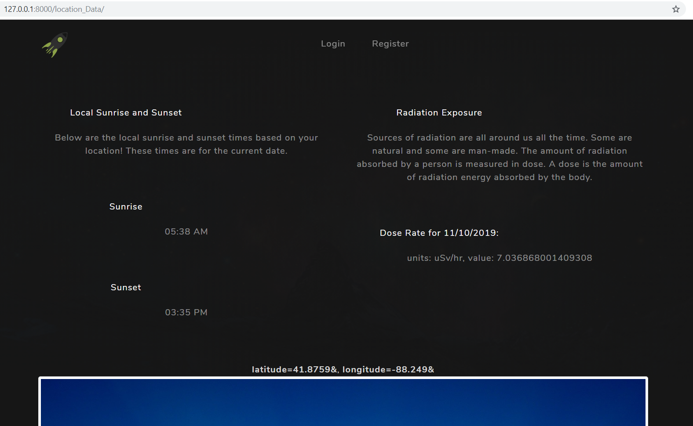
	
###### App before fix (bottom half of the page)
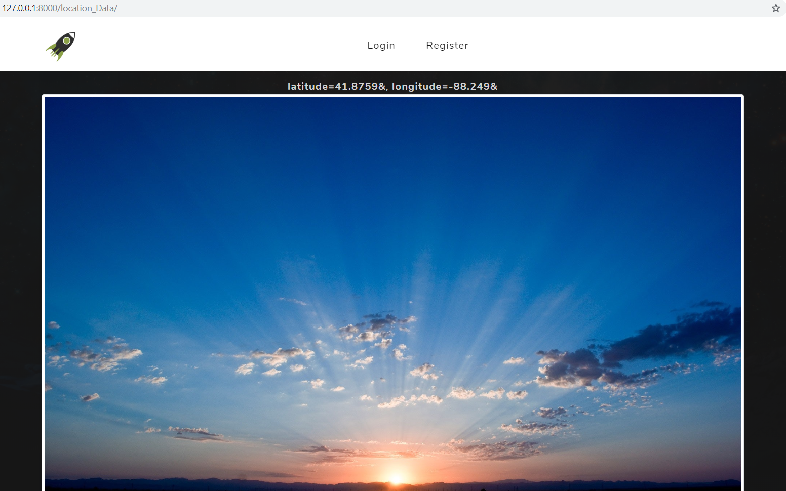

#### 2. Why is this an issue?
The reason why the page was visually unorganized is because the previous developer used the home page's "cafe" section as a template and applied it here.

The code's functionality did not trasfer over well to the Location Data template and required more adjustments to make it more visually effective.

#### 3. How is the issue resolved?
I fixed the layout by first removing all unnecessary Bootstrap and CSS styling. This removed the black background and revealed the main app's very appealing background that was underneath it, which extended from the main app's base.html.

Then I replaced all of the `div` tags with semantic tags to give it more structure and meaning. I added an `h1` tag. I added images for each section.

For styling I took a minimalist and clean approach. I used Bootstrap 4's `.container`, `.row`, and `.column` for layout structure. The project already had global styles for the `h1`, `h2`, and `p` tags so I used those as well to keep a uniform look with the rest of the site.

Then I created CSS classes specific to only the Data Location App to fix margin spacing, font size, and to style the map that I created for one of the optional requirements.
	
###### Location Data App template's code after fix (my_location_data_base.html)
```html
<!-- LOCATION DATA PAGE -->
<main class="container">
  <h1 id="location-data">Location Data</h1>
	
  <!-- top row section -->
  <section class="row location-data-section">
  <!-- left side article of top row for sunrise/sunset -->
  <article class="col-md-5">
    <h2 class="location-data-heading">Local Sunrise/Sunset</h2>
    <p>Below are the local sunrise and sunset times based on your location! These times are for the current date.</p>
    <p>Sunrise: {{ sunrise }}</p>
    <p>Sunset: {{ sunset }}</p>
    
  </article>
  <!-- right side article of top row for radiation -->
  <article class="col-md-5 offset-md-2">
    <h2 class="location-data-heading">Radiation Exposure</h2>
    <p>
    Sources of radiation are all around us all the time. Some are natural and some are man-made. 
    The amount of radiation absorbed by a person is measured in dose. 
    A dose is the amount of radiation energy absorbed by the body.
    </p>
    <p>Dose Rate for {{dateOfRadiation}}:</p>
    <p>{{ radiation }}</p>
    
  </article>
  </section>
	
  <!-- bottom row section -->
  <section class="row location-data-section">
  <!-- left side article of bottom row for map -->
  <article class="col-md-5">
    <h2 class="location-data-heading">Map Location</h2>
    <p>This is your current location on the map.</p>
    <div id="location-data-map"></div>
  </article>
  <!-- right side article of bottom row for local weather -->
  <article class="col-md-5 offset-md-2">
    <h2 class="location-data-heading">Local Weather</h2>
    <p>Below is the current weather for your local area.</p>
    
    <p>Weather Description: {{ weather_description }}</p>
    <p>Average Temperature: {{ average_temp }} &#8457</p>
    <p>High Temperature: {{ high_temp }} &#8457</p>
    <p>Low Temperature: {{ low_temp }} &#8457</p>
    <p>Humidity: {{ humidity }}%</p>
  </article>
  </section>
</main>
```

###### CSS styles specific to only the Location Data App to fix margin spacing, font size, and to style the map that I created for one of the optional requirements (static/css/styles.css)
```css
/* LOCATION DATA STYLE */

/* map */
#location-data-map {
  position: relative;
  border: 5px solid white;
  border-radius: 5px;
  height: 300px;
  width: 100%;
}

/* h1 */
#location-data {
  margin: 20rem 0 20rem 0;
}

/* section tag */
.location-data-section {
  margin: 10rem 0 5rem 0;
}

/* h2 */
.location-data-heading {
  font-size: 1.8rem;
  margin-bottom: 3rem;
}

/* LOCATION DATA STYLE ENDS */
```

As for the optional requirements, I incorporated Openweathermap API as a source of local weather data and signed up to acquire the API key. I created a `local_weather` function to handle the API request and response to get local weather information.

Inside the views, there was already two functions (`User_Latitude` and `User_Longitude`) that used IP-API to return the user's location coordinates (used for the `RadiationExposure` function).

I used those two functions to pass the user's latitude and longitude values into my `local_weather` function.

From the Openweathermap API's JSON object response, I extracted the values for weather description, average temp, high temp, low temp, humidity, and the weather icon code.

I wrapped all of this data into a dictionary to be returned. From the `index` function, I used the `update` function to update the `context` with the `local_weather`'s data to be rendered and used in the template using django template tags.

###### I created `local_weather` function from the views to handle the API request and response to get the local weather information (my_locationData/views.py)
```python
def local_weather(latitude, longitude):
  api_key = "api_key_hidden_for_privacy"
  # make api request
  response = requests.get("https://api.openweathermap.org/data/2.5/weather?lat=" + latitude + "&lon=" + longitude + "&appid=" + api_key)
  # "main" and "weather" are JSON object keys
  main = response.json()["main"]
  weather = response.json()["weather"][0]
  # the next 6 lines are JSON object key values
  weather_description = weather["description"].capitalize() + "."
  average_temp = kelvin_to_fahrenheit(main["temp"])
  high_temp = kelvin_to_fahrenheit(main["temp_max"])
  low_temp = kelvin_to_fahrenheit(main["temp_min"])
  humidity = main["humidity"]
  icon = weather["icon"]
  context = {
    "weather_description": weather_description,
    "average_temp": average_temp,
    "high_temp": high_temp,
    "low_temp": low_temp,
    "humidity": humidity,
    "icon": icon,
    # latitude_only and longitude_only is for map
    "latitude_only": latitude,
    "longitude_only": longitude
  }
  return context
```

###### `index` function from the views - updating the context with data from `local_weather` function (my_locationData/views.py)
```python
def index(request):
  ...
  # update context with data from local_weather method
  context.update(local_weather(User_Latitude(), User_Longitude()))
  return render(request, 'my_Location/my_LocationData.html', context)
```

The temperature values returned from Openweathermap API was in Kelvin. I created a function to convert Kelvin to Fahrenheit, then returned that value as a string so it can be used in the template.

###### I created `kelvin_to_fahrenheit` function (my_locationData/views.py)
```python
def kelvin_to_fahrenheit(k_temp):
  # convert kelvin to fahrenheit and round
  f_temp = round((k_temp-273.15)*9/5+32)
  # return fahrenheit as string
  return str(f_temp)
```

For some reason, the `User_Latitude` and `User_Longitude` functions (created by a previous developer) were producing user's location coordinates for West Chicago when it should've been for my location in Colorado Springs.

I brought this to the project manager's attention and she said the issue may be the IP-API itself or the way the previous developer incorporated it. Either way, I was instructed to go ahead and continue to use those functions and she will create a new user story to handle that issue.

I accomplished the other optional requirement of including a map of the user's current location by using Leafletjs and Openstreet API. I used the pre-existing `User_Latitude` and `User_Longitude` functions to get the user's coordinates for the map.

###### Required link and script tags for leaflet map (my_location_data_base.html)
```html
<!-- Include Leaflet CSS file -->
<link rel="stylesheet" href="https://unpkg.com/leaflet@1.5.1/dist/leaflet.css"
  integrity="sha512-xwE/Az9zrjBIphAcBb3F6JVqxf46+CDLwfLMHloNu6KEQCAWi6HcDUbeOfBIptF7tcCzusKFjFw2yuvEpDL9wQ=="
  crossorigin=""/>
<!-- Include Leaflet JavaScript file after Leaflet’s CSS -->
<script src="https://unpkg.com/leaflet@1.5.1/dist/leaflet.js"
  integrity="sha512-GffPMF3RvMeYyc1LWMHtK8EbPv0iNZ8/oTtHPx9/cc2ILxQ+u905qIwdpULaqDkyBKgOaB57QTMg7ztg8Jm2Og=="
  crossorigin=""></script>
```

###### JavaScript code for creating the leaflet map (my_location_data_base.html)
```html
<!-- JAVASCRIPT FOR LOCATION DATA'S MAP -->
<script>
  // Create map options
  var mapOptions = {
    center: [parseFloat("{{ latitude_only }}"), parseFloat("{{ longitude_only }}")],
    zoom: 10
  }
  // Create map object
  var map = new L.map('location-data-map', mapOptions);
  // Create Layer object
  var layer = new L.tileLayer('http://{s}.tile.openstreetmap.org/{z}/{x}/{y}.png', {
    attribution: '&copy; <a href="https://www.openstreetmap.org/copyright">OpenStreetMap</a> contributors'});
  // Add layer to the map
  map.addLayer(layer);
  // Create marker and add it to map
  var marker = L.marker([parseFloat("{{ latitude_only }}"), parseFloat("{{ longitude_only }}")]).addTo(map);
</script>
```

###### CSS styling for the map (static/css/styles.css)
```css
/* map */
#location-data-map {
  position: relative;
  border: 5px solid white;
  border-radius: 5px;
  height: 300px;
  width: 100%;
}
```

#### 4. What is the end result?
The end result is a visually structured, appealing, and informative page for Location Data App's page. It looks uniform with the rest of the site and it includes data for user location's sunrise/sunset time and radiation exposure.

It now also includes the new features I added: user's local map location and weather data.

###### App after fix (top third of the page)


###### App after fix showing local sunrise/sunset times and radiation exposure (middle third of the page)
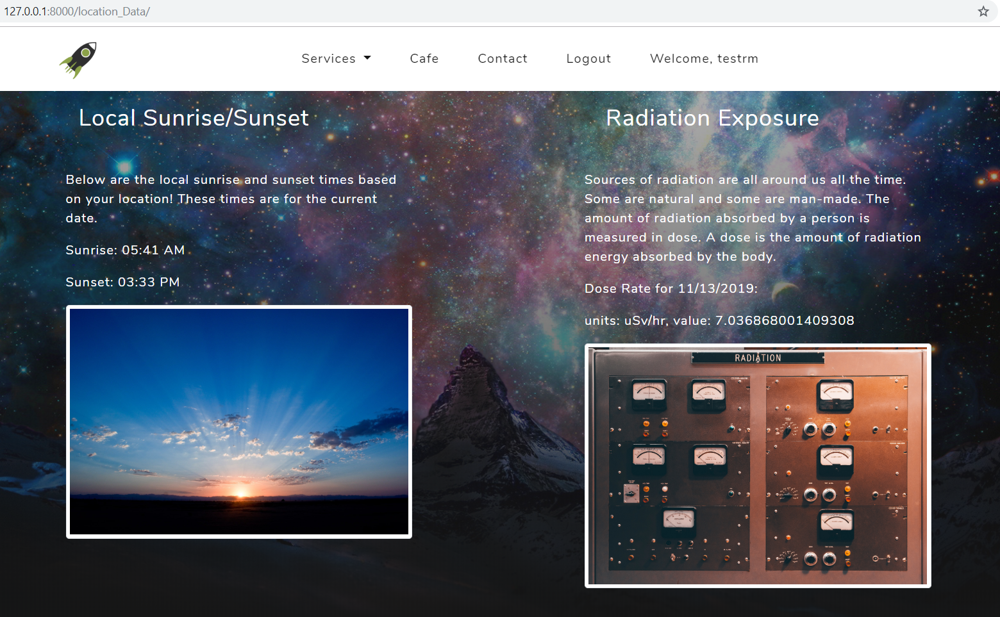

###### App after fix showing new map and local weather data (bottom third of the page)


## User Story 2: Restaurant Redesign


#### 1. What is the issue?
The issue with this story is that neither the Cafe App and it's associated pages nor the Menu App home page are appropriately styled to match the theme of the site. These two apps function together to create the information needed for our hypothetical restaurant.

From the main app's home page, I needed to transfer the Cafe content from inside of it and into the Cafe App's home page, and then move the Cafe button to just below the Services button.

The page content from the Cafe and Menu Apps are also blocked by the side navbar when the page's width is resized smaller. I also needed to make sure the side navbar properly links to each section.

This user story had optional add-ons of creating an Hours page that included information about Cafe Hours in Zulu time and creating an International Space Station page with ISS location information and a link that connects to the ISS App home page.

###### Cafe App's home page before fix (cafe/index.html)
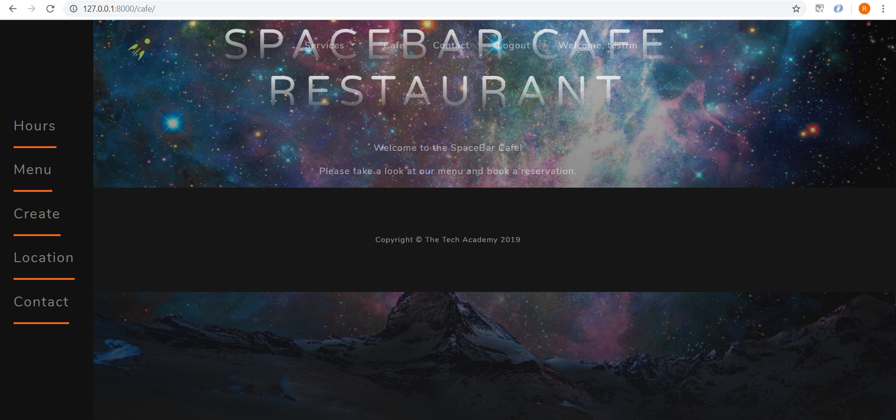

###### Menu App's home page before fix (menu/menu_index.html)
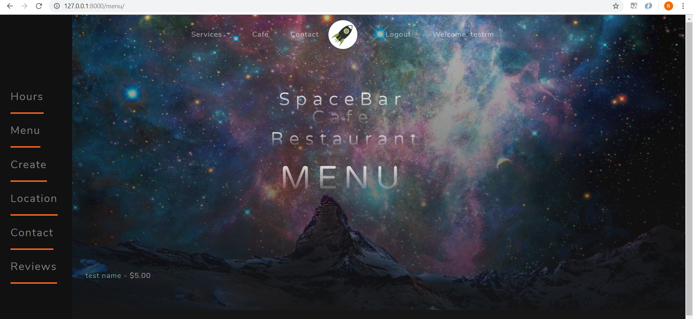

###### Menu App's create page before fix - top half (menu/menu_create.html)
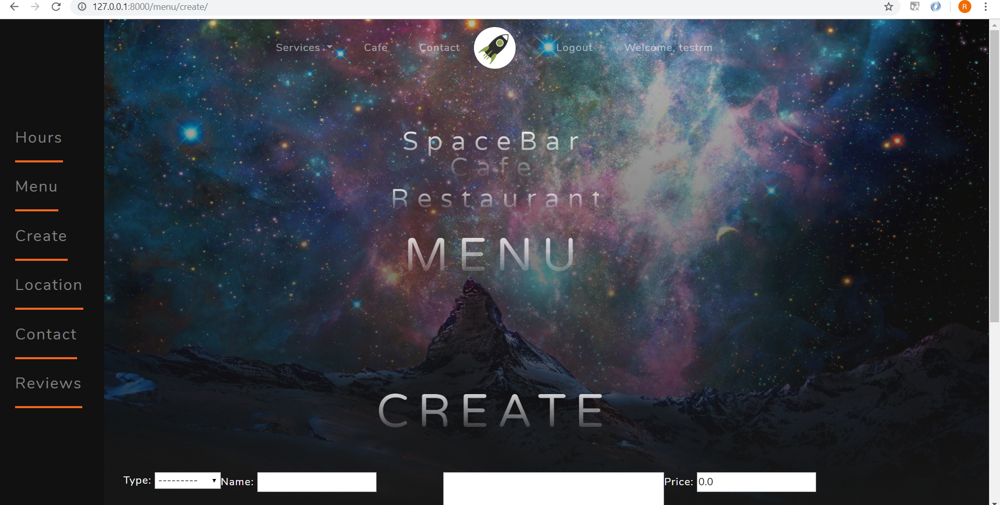

###### Menu App's create page before fix - bottom half (menu/menu_create.html)
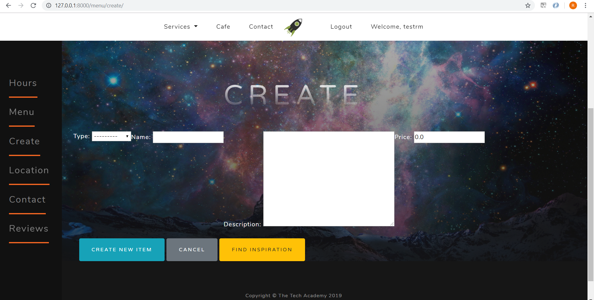

###### Menu App's details page before fix (menu/menu_details.html)
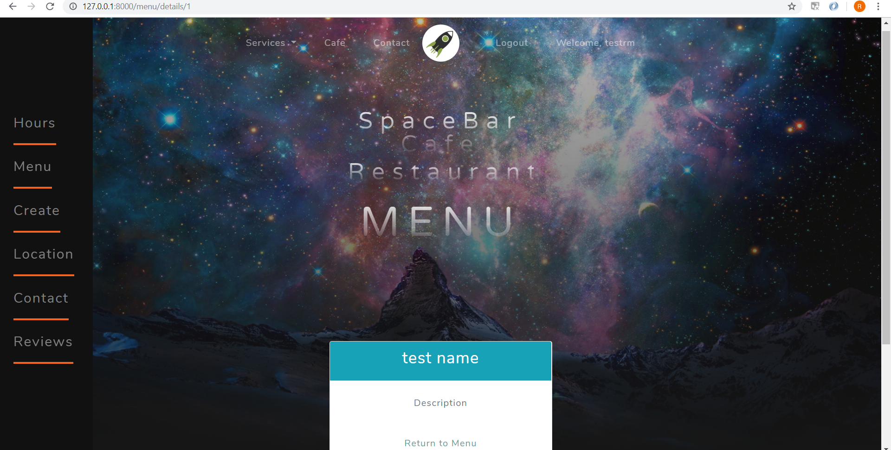

###### Menu App's inspiration page before fix (menu/menu_inspiration.html)
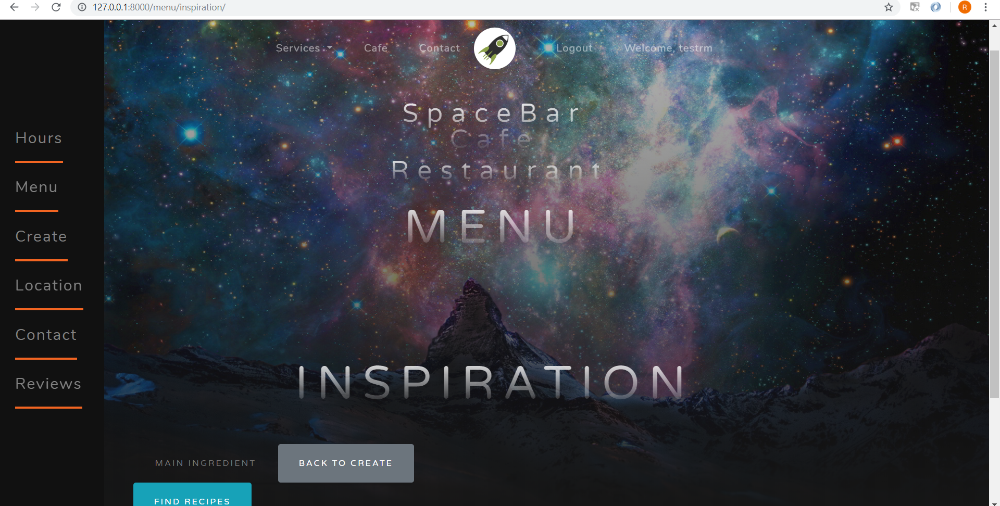

###### Side navbar blocking content when page width is resized smaller


#### 2. Why is this an issue?
The Cafe and Menu Apps were not styled appropriately because the django template tags (`` and ``) and CSS styling were not implemented well. The side navbar was blocking page content when the page width was resized because there was no proper margin in place.

I noticed a common structural template pattern with all of the apps from the project in regards to rendering that app's home page. The pattern is that those apps have their own base.html template that contains all of the content specific for that app's home page.

Those apps also have their own `index.html` template that extends the main project's `base.html` template. They also contain block tags for body content and includes the navbar, the specific app's `base.html`, and footer. This `index.html` template is what ultimately renders the app's home page.

It seems that the previous developer tried to implement this pattern with the other pages of the Menu App (create, details, and inspirations pages). While this pattern worked well for creating the home page, creating the other pages required some adjustments.

#### 3. How did you resolve this issue?
I resolved the issues with the Cafe App home page by moving the Cafe content from the main app's home page to the Cafe App's home page and making adjustments to make the Cafe content work properly for it's new location. Some of the adjustments I made:
1. I created a CSS class called `.cafe-menu-container` that creates a margin preventing the side navbar from blocking content when the page's width is resized smaller. (I used `.cafe-menu-container` for Cafe App's home page and all of Menu App's pages)
2. I created a CSS class called `.cafe-menu-heading` that creates spacing to make the `h1` stand out similarly to the main app's home page's `h1` to create a consistent theme. (I used `.cafe-menu-heading` for Cafe App's home page and all of Menu App's pages)
3. I moved `` to cafe/index.html since that's where all of the similar django template tags were already located and used.
4. I moved `` inside of the `.cafe-menu-container` so that it was not blocked by the side navbar when the page is resized smaller.
5. I moved `` to cafe/cafe_base.html so the images will render since they were not rendering when the tag was located inside cafe/index.html.
6. I replaced some over used `div` tags with `section` and `article` tags to create more semantic.
7. From the main app's home page I moved the Cafe button to just below the Services button.

###### CSS classes I created: `.cafe-menu-container` and `.cafe-menu-heading`
```css
/* CAFE AND MENU STYLING */

/* prevent side navbar from blocking content when page width is resized smaller */
.cafe-menu-container {
  margin-left: 10rem;
}

/* create space to make h1 stand out */
.cafe-menu-heading {
  margin: 15rem 0 28rem 0;
}

/* END CAFE AND MENU STYLING */
```

How I resolved the issues with the Menu App:
1. I moved the logic from menu/menu_index.html that handled looping through `object_list` to menu/menu_base.html and added `` to menu/menu_index.html to maintain the project's template convention and pattern.
2. In menu/menu_base.html I added a link to Cafe App's home page by using an `a` tag and a django template tag to set the `href` to ``.
3. In menu_base.html, menu_create.html, menu_details.html, and menu_inspiration.html pages:
  - I utilized the `.cafe-menu-container` CSS class I created to prevent their content from being blocked by the side navbar when the page is resized smaller.
  - I utilized the `.cafe-menu-heading` CSS class I created that creates spacing to make the `h1` stand out similarly to the `h1` from the main app's home page to have a consistent theme.
  - I moved `` inside `.cafe-menu-container` so that it was not blocked by the side navbar when the page is resized smaller.
  - I implemented some Bootstrap 4 classes to create additional styling.
4. In menu_create.html, menu_details.html, menu_inspiration.html:
  - I added `` to include the side navbar to these pages.
  - I removed `` to avoid awkwardly stacking the menu_base.html template on top of these pages.
5. In menu_create.html, since the project was already utilizing django-crispy-forms to style the user login form, I utilized it as well to style the Menu App's create form by using `` then changing `{{ form.as_p }}` to `{{ form|crispy }}`.

The steps I took to accomplish the optional requirements of creating an Hours page that includes information about Cafe Hours in Zulu time and creating a new International Space Station page that gives ISS location information and contains a link that connects to the ISS App home page:
1. I created cafe/cafe_hours.html and cafe/cafe_iss.html from scratch utilizing HTML5 semantic tags, custom CSS classes, Bootstrap 4 classes, and django template tags.
2. In order for either new templates to be recognized when requested, I had to register them in the `urlpatterns` inside cafe/urls.py.
3. In cafe/views.py I created two functions (`hours` and `iss`) that renders each template when either is requested.

###### The newly created cafe_hours.html (I utilized HTML5 semantic tags, custom CSS classes, Bootstrap 4 classes, and django template tags)
```django






<section class="cafe-menu-container">
	<h1 class="cafe-menu-heading">Spacebar Cafe Hours</h1>
	<section class="container mb-5">
		<article class="card mx-auto">
			<h3 class="card-header bg-info text-white text-center">Hours of Operation</h3>
			<div class="card-body">
				<h5 class="my-5 text-center">11:00 to 23:00 ZULU Time</h5>
				<a href="" class="card-link">Return to Cafe Home</a>
			</div>
		</article>
	</section>
	
</section>


```

###### The newly created cafe_iss.html (contains a link for the ISS App's home page as required by the user story. I utilized HTML5 semantic tags, custom CSS classes, Bootstrap 4 classes, and django template tags)
```django






<section class="cafe-menu-container">
	<h1 class="cafe-menu-heading">International Space Station</h1>
	<section class="container mb-5">
		<article class="card mx-auto">
			<h3 class="card-header bg-info text-white text-center">Welcome to the ISS!</h3>
			<div class="card-body">
				<p class="card-text text-dark text-center">Thank you for boarding the ISS, the number one space station orbiting Earth!</p>
				<p class="text-dark text-center">The ISS serves as a microgravity and space environment research laboratory in which crew members conduct experiments in biology, human biology, physics, astronomy, meteorology, and other fields.</p>
				<p class="text-center mb-5"><a href="">Click here to see our current orbital location!</a></p>
				<a href="" class="card-link">Return to Cafe Home</a>
			</div>
		</article>
	</section>
	
</section>


```

###### cafe/urls.py - url named `'hours'` and `'location'` triggered the views `index` function, which rendered the home page (before update)
```python
urlpatterns = [
		...
		path('hours/', views.index, name='hours'),
		path('location/', views.index, name='location'),
		...
	]
```

###### cafe/urls.py - I changed the `path` function so that url named `'hours'` and `'location'` now triggers the views `hours` and `iss` functions which renders their new pages `cafe_hours.html` and `cafe_iss.html` (after update)
```python
urlpatterns = [
		...
		path('hours/', views.hours, name='hours'),
		path('location/', views.iss, name='location'),
		...
	]
```

###### The `hours` and `iss` functions I created in menu/views.py that renders cafe/cafe_hours.html and cafe/cafe_iss.html
```python
def hours(request):
	return render(request, "cafe/cafe_hours.html")

def iss(request):
	return render(request, "cafe/cafe_iss.html")
```

As for the side navbar, the only thing I had to update was the link for the "Location" tab. Previously it was linked directly to the ISS App's home page. I updated it to link to Cafe App's ISS page as required by the user story. Everything else was linking properly.

#### 4. What is the end result?
The end result is that the Cafe App's home page and all of the Menu App's pages are all styled appropriately to match the theme of the site. The Cafe App now also has 2 new pages, one for Cafe Hours and another for ISS Location.

The Cafe content from the main app's home page has been transferred to Cafe App's home page, the Cafe button has been moved up to just below the Services button, the side navbar is operating and linking properly, and all of the templates for the Cafe and Menu Apps
are working and linking properly.

###### The main app's home page with the Cafe button moved up to just below the Services button
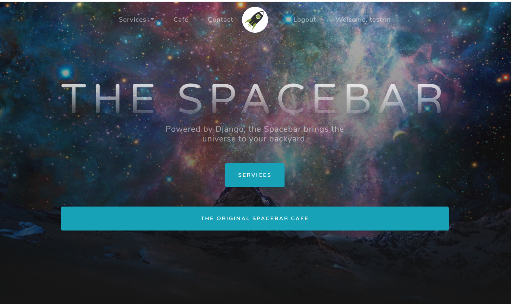

###### Cafe App's home page - top 1/3 of the page (cafe/index.html after fix)
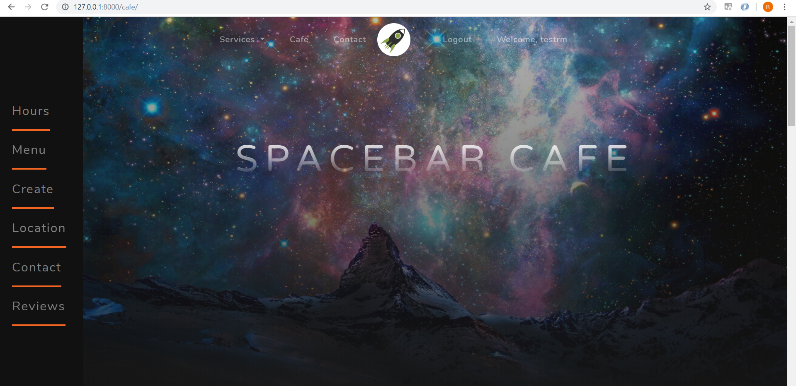

###### Cafe App's home page - mid 1/3 of the page showing cafe image (cafe/index.html after fix)


###### Cafe App's home page - bottom 1/3 of the page showing dummy menu information (cafe/index.html after fix)
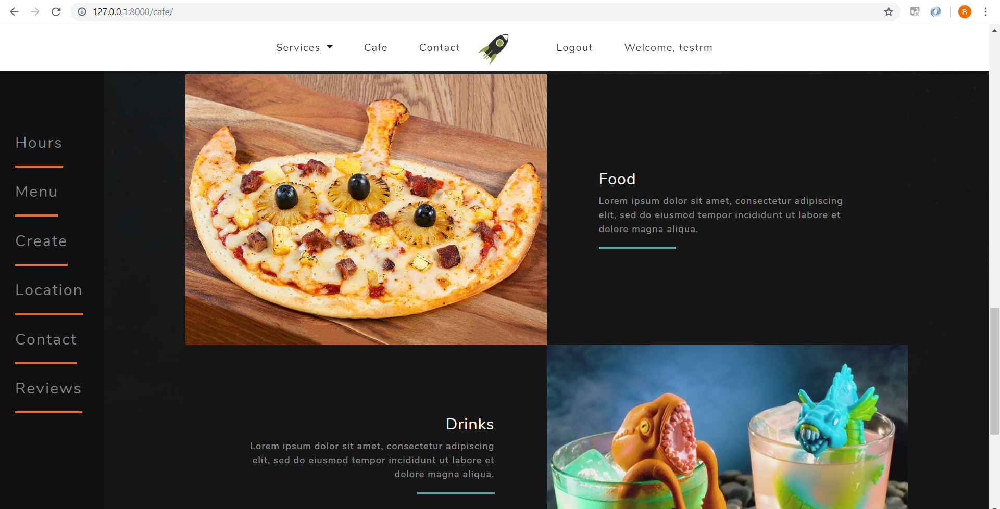

###### Menu App's home page - top half of the page (menu/menu_index.html after fix)
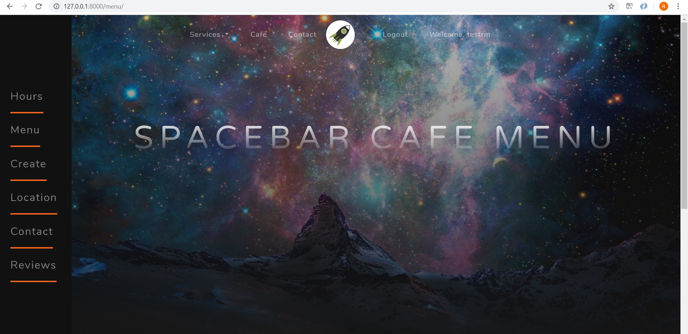

###### Menu App's home page - bottom half of the page showing created menu items (menu/menu_index.html after fix)
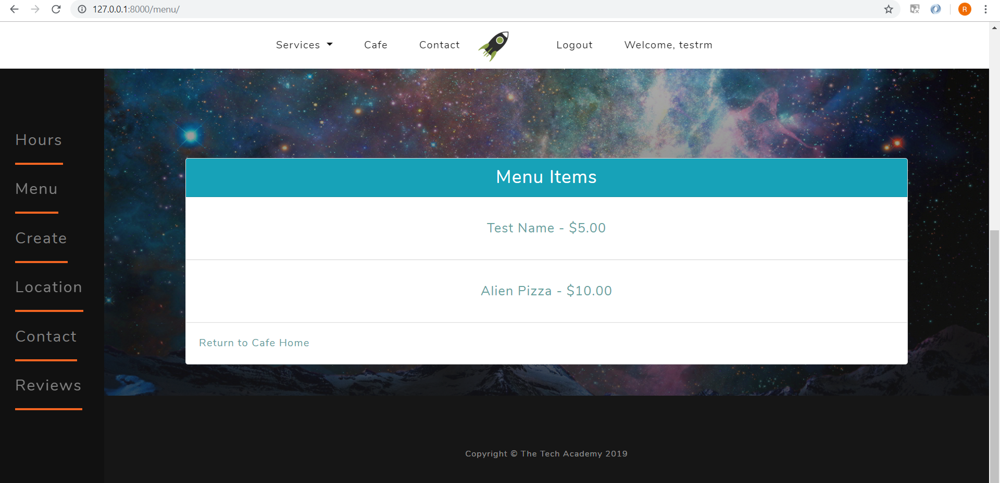

###### Menu App's create page - top half of the page (menu/menu_create.html after fix)


###### Menu App's create page - bottom half of the page showing form to create menu item (menu/menu_create.html after fix)
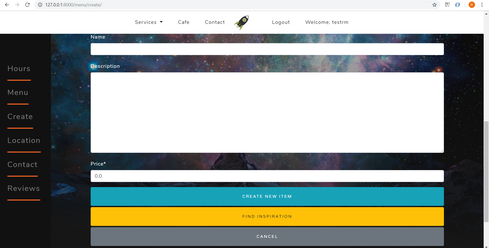

###### Menu App's details page - top half of the page (menu/menu_details.html after fix)


###### Menu App's details page - bottom half of the page showing menu item details (menu/menu_details.html after fix)


###### Menu App's inspiration page - top half of the page (menu/menu_inspiration.html after fix)
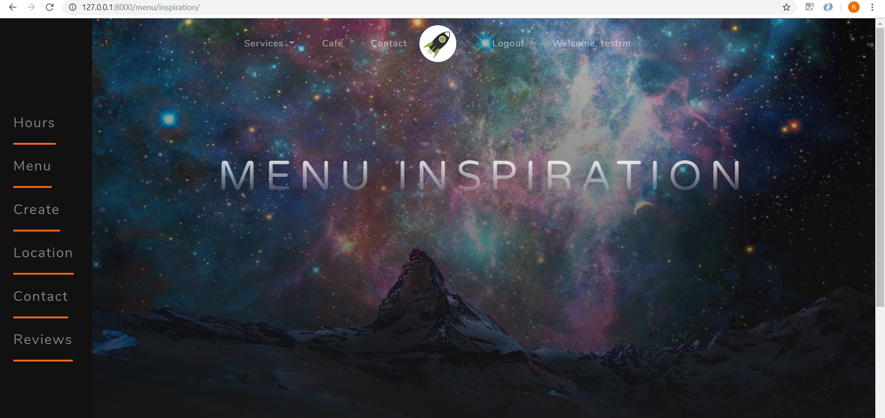

###### Menu App's inspiration page - bottom half of the page (menu/menu_inspiration.html after fix)
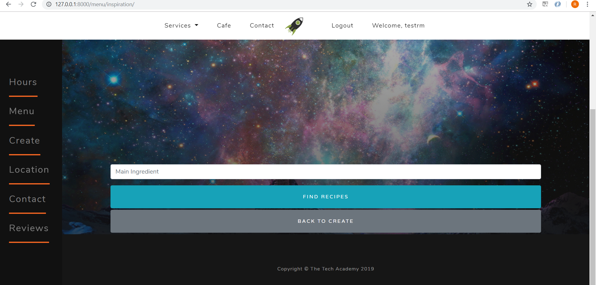

###### Side navbar no longer blocking content when page width is resized smaller


###### Cafe App's new Hours page - top half of the page (cafe/cafe_hours.html)
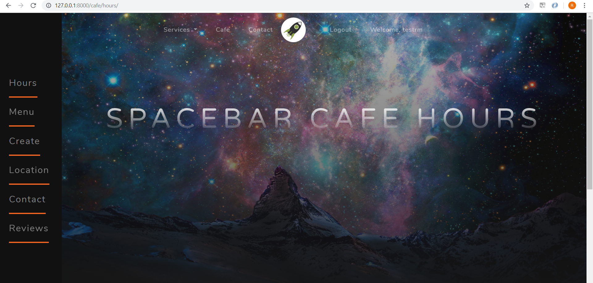

###### Cafe App's new Hours page - bottom half of the page showing Cafe Hours in Zulu time (cafe/cafe_hours.html)


###### Cafe App's new Location page - top half of the page (cafe/cafe_iss.html)


###### Cafe App's new Location page - bottom half of the page showing ISS location information and a link to ISS App's home page (cafe/cafe_iss.html)


## User Story 3: Navbar Hover Upgrade


#### 1. What is the issue?
This story required upgrading the UI experience by giving users the ability to see the children of the navbar sub-items when users hover over them. In this instance, the "Services" navbar item contain two sub-items, "Apis" and "Space Wiki", that contain more sub-items.

###### Navbar "Services" sub-menu before fix


#### 2. How is the issue resolved?
I resolved the issue by using Bootstrap 4 to create a sub-menu for the navbar sub-items "Apis" and "Space Wiki". I used custom CSS to create the hover effect that triggers the new sub-menus to appear. I used django template tags to set the href attributes for the new sub-items to link them to their appropriate templates.

###### Code for "Services" sub-menu before fix (templates/navbar.html)
```django
<li class="nav-item dropdown">
	<a class="nav-link dropdown-toggle js-scroll-trigger services" href="#" id="navbarDropdown" role="button" data-toggle="dropdown" aria-haspopup="true" aria-expanded="false">
		Services
	</a>
	<div class="dropdown-menu dropdownItem" aria-labelledby="navbarDropdown">
		<a class="dropdown-item" href="">Apis</a>
		<a class="dropdown-item" href="">Space Wiki</a>
		<a class="dropdown-item" href="">Pictures</a>
		<a class="dropdown-item" href="">My Location Data</a>
		<a class="dropdown-item" href="">Space News</a>
	</div>
</li>
```

###### Code for "Services" sub-menu after fix (templates/navbar.html)
```django
<li class="nav-item dropdown">
	<a class="nav-link dropdown-toggle js-scroll-trigger services" href="#" id="navbarDropdown" role="button" data-toggle="dropdown" aria-haspopup="true" aria-expanded="false">
	  Services
	</a>
	<div class="dropdown-menu dropdownItem" aria-labelledby="navbarDropdown">
	
	  <!-- show sub-menu for "Apis" on hover -->
	  <div class="dd dropright">
		<a class="dropdown-item dropdown-toggle" href="" data-toggle="dropdown" aria-haspopup="true" aria-expanded="false">
		  Apis
		</a>
		<div class="dd-content dropdown-menu">
		  <a class="dropdown-item" href="">Mars Weather</a>
		  <a class="dropdown-item" href="">Location Data</a>
		  <a class="dropdown-item" href="">Object Finder</a>
		  <a class="dropdown-item" href="">Int. Space Station</a>
		  <a class="dropdown-item" href="">Entertainment</a>
		  <a class="dropdown-item" href="">Space X</a>
		</div>
	  </div>
	  
	  <!-- show sub-menu for "Space Wiki" on hover -->
	  <div class="dd dropright">
		<a class="dropdown-item dropdown-toggle" href="" data-toggle="dropdown" aria-haspopup="true" aria-expanded="false">
		  Space Wiki
		</a>
		<div class="dd-content dropdown-menu">
		  <a class="dropdown-item" href="">Asteroid Mining Wiki</a>
		  <a class="dropdown-item" href="">Space Terms Glossary</a>
		  <a class="dropdown-item" href="">Planet Information</a>
		  <a class="dropdown-item" href="">Space Exploration</a>
		  <a class="dropdown-item" href="">Astronomical Objects</a>
		  <a class="dropdown-item" href="">Space Discovery</a>
		</div>
	  </div>
	  
	  <a class="dropdown-item" href="">Pictures</a>
	  <a class="dropdown-item" href="">My Location Data</a>
	  <a class="dropdown-item" href="">Space News</a>
	</div>
 </li>
```

###### Custom CSS for hover effect (static/css/styles.css)
```css
/* show sub-menu for "Apis" and "Space Wiki" navbar sub-items on hover */
.dd:hover .dd-content {
  display: block;
}
```


## What is the end result?
The end result is a better UI experience by showing the sub-menus for the navbar's sub-items "Apis" and "Space Wiki" on hover.

###### Navbar "Services" sub-menu after fix


###### Navbar "Apis" sub-menu on hover after fix


###### Navbar "Space Wiki" sub-menu on hover after fix

