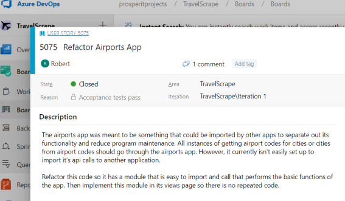
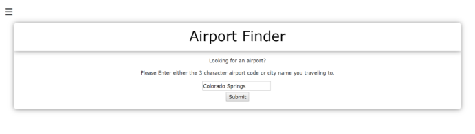
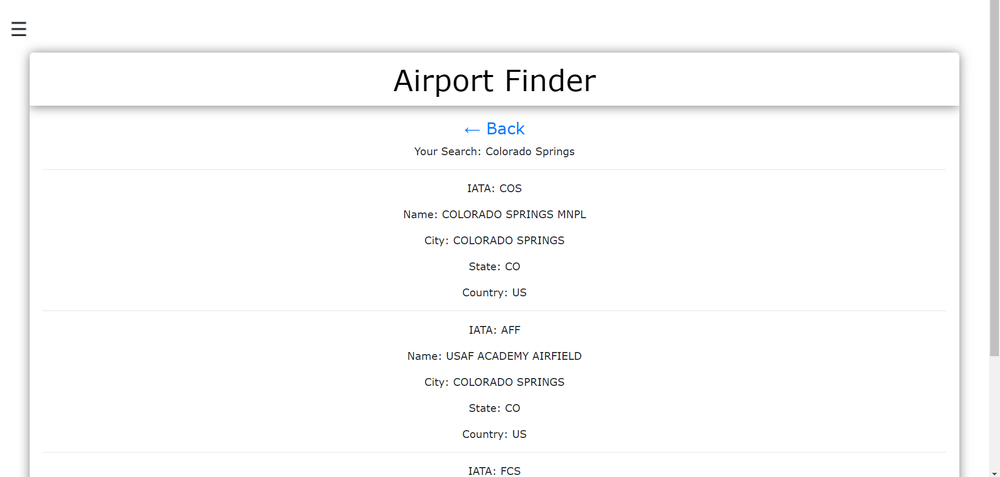
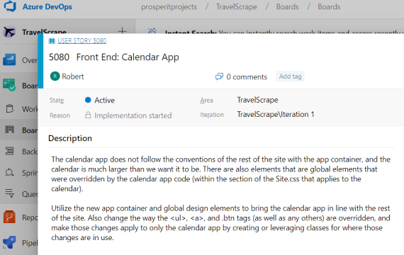
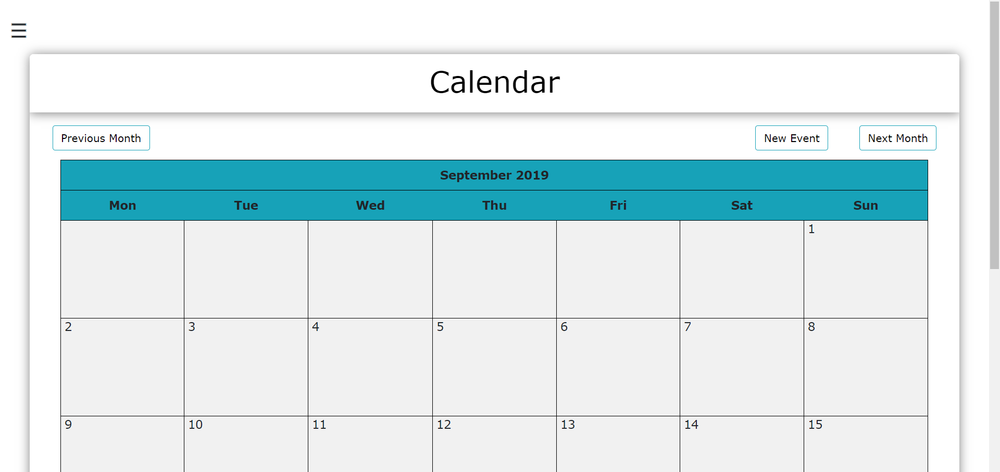
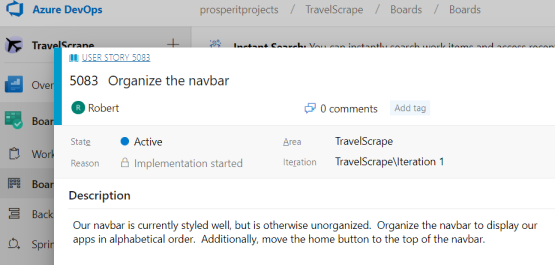

# Live Pojects

The Live Projects are made up of four sprints that lasts 2 weeks each. We get to work with a team of fellow developers to enhance an active software project. This allows us to apply the programming skills we learned on practical assignments that mirror actual software development projects while gaining experience working on a software development team.

##### Live Projects
- [Python Live Project](python)
- C# Live Project
- Front End Live Project
- Back End Live Project

##### General Process

Each Monday is dedicated to onboarding and sprint planning. We define user stories, divide them into tasks, and set goals for what will be accomplished by the end of the week.

We have daily stand up meetings from Monday through Friday. Each developer discusses what they did the day before, what they will be working on for the current day, and any roadblocks they are running into.

Each Friday we have Sprint Retrospective, which is a quick discussion during the daily stand up that explains what was helpful and what was detrimental to productivity and team work flow. These meetings are meant to improve communication and coordination within the team, including the project manager.

<span id="python"></span>

TravelScrape is a web scraping application project built with Django and Beautfiulsoup. With webscraping and API's, the application will gather data from the web that is relevant to the user who will be traveling. It will include weather, flights info, events, restaurants, etc.

##### List of Technologies Used
- Django Web Framework
- Selenium (Python Library)
- BeautifulSoup (Python Library)
- Virtualenv (Python Library)
- VS Code (Code Editor)
- DevOps (Project Management)
- Git (Source Control)
- Slack (Team Communication)
- Google Hangout (Team Meetings)

### User Story: Refactor Airports App



The objective of this user story was to refactor the Airports App from the TravelScrape main project so that it has a module that is easy to import and call and performs the basic functions of the app. Then I had to implement this module in its views page so there is no repeated code. The functionality of the Airports App takes a user's input of a city name and returns the airport names available for that city.

I succeeded with the user story by creating a module that takes care of the API call and returns the data.

##### Code snippet of the module:
```python
def make_api_call(search):
    # Athentication for the Amadeus API
    amadeus = Client(
        client_id = "oXoHcPGNhQAKNcvvhFIkB9kFudwrBYTy", 
        client_secret = "zs3PhgM4HNpZbCm4"
    )
    try:
        # Retrieves the response from the api as a json
        response = amadeus.reference_data.locations.get( 
            subType=Location.ANY,
            keyword=search
        )
        # Extracts and returns a list of locations from the json
        return response.data 
    except ResponseError as error:
        return error.code
```

##### Airports App Input:


##### Airports App Output:


### User Story: Front End Calendar App



The objective of this user story was to utilize the global styles of the TravelScrapes main project so that the Calendar App will appear uniform with the rest of the site and apps. I also needed to refactor the vague CSS selectors associated with the styles meant only for the Calendar App since they were overriding elements from other apps.

I succeeded with the user story by incorporating the global class styles from the static/css file with the appropriate html tags. I also changed the vague CSS selectors to unique class names that are only responsible for the Calendar App.

##### Code snippet of some global styles used for the TravelScrapes main project and all of its apps:
```css
/* use this for all form containers */
.appContainer{
    background: rgba(255, 255, 255, 0.4);
    box-shadow: 0 1px 16px 0 rgba(0,0,0,0.5);
    border-radius: 1px;
    margin: 1% 3% 3% 3%;
    word-wrap: normal;
    position: relative;
    flex-basis: auto;
    height: auto;
    padding: 20px;
    overflow: hidden;
    border-radius: 6px;
}

/* use this for all header styling */
.header {
    text-align: center;
    color: black;
    background: rgba(255, 255, 255, 0.9);
    box-shadow: 0 1px 16px 0 rgba(0,0,0,0.5);
    padding: 1% 1% 1% 1%;
    margin: -20px -20px 20px -20px;
}
```

##### Code snippet of some classes and styles specific to only the Calendar App:
```css
.calendar {
    width: 98%;
    margin: auto;
    font-size: 13px;
  }

.calendar-btn {
    outline: none;
    color: black;
    background-color: transparent;
    box-shadow: 0 0 0 0;
 }
 
 .calendar-delete {
    text-align: left;
    margin-left: 20px;
    margin-bottom: 20px;
    width: 39%;
}
```

##### Calendar App Interface:


### User Story: Organize the Navbar



The objective of this user story was to organize the side navbar to display all of the apps in alphabetical order and move the home button from the bottom to the top.

##### Code snippet of the solution:
```html
<a class="dropdown-item" href="/">Home</a>
<br>
<a class="dropdown-item" href="/AirportApp">Airport</a>
<a class="dropdown-item" href="/BudgetApp">Budget</a>
<a class="dropdown-item" href="/CalendarApp">Calendar</a>
<a class="dropdown-item" href="/Countries">Countries</a>
<a class="dropdown-item" href="/currency">Currency</a>
<a class="dropdown-item" href="/DropboxApp">Dropbox</a> 
<a class="dropdown-item" href="/DummyApp">DummyApp</a>
<a class="dropdown-item" href="/FlightApp">Flights</a>
<a class="dropdown-item" href="/HotelApp">Hotels</a>
<a class="dropdown-item" href="/MapsApp">Maps</a>
<a class="dropdown-item" href="/MeetupApp">Meetup</a>
<a class="dropdown-item" href="/RestaurantsApp">Restaurants</a>
<a class="dropdown-item" href="/DummyApp/dummy">Slack</a>
<a class="dropdown-item" href="/todo_app">To-Do List</a>
<a class="dropdown-item" href="/advisoryApp">Travel Advisories</a>
<a class="dropdown-item" href="/WishListApp">Travel Wish List</a>
<a class="dropdown-item" href="/TravelogueApp">Travelogue</a>
<a class="dropdown-item" href="/WeatherApp">Weather</a>
<br>
<a class="nav-link" href="/logout">Logout</a>
```

##### Navbar Image:


## Conclusion

I aquired an abundance of practical knowledge from the Live Projects, and I am grateful for my experience. I gained the confidence to arrive in the middle of large pre-existing projects and collaborate with a team to accomplish our objectives. I grew a deeper understanding for the development and team process and the significance of effective communication.
