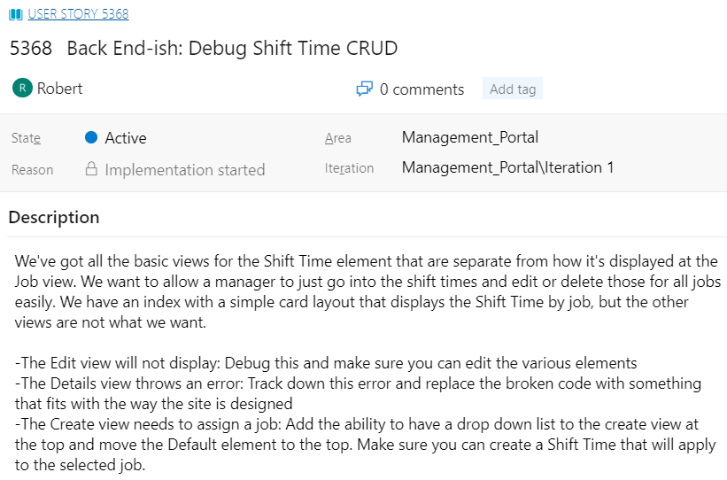
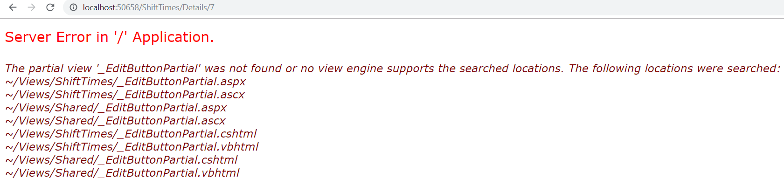
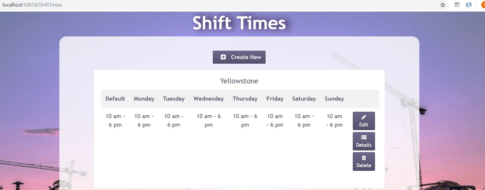
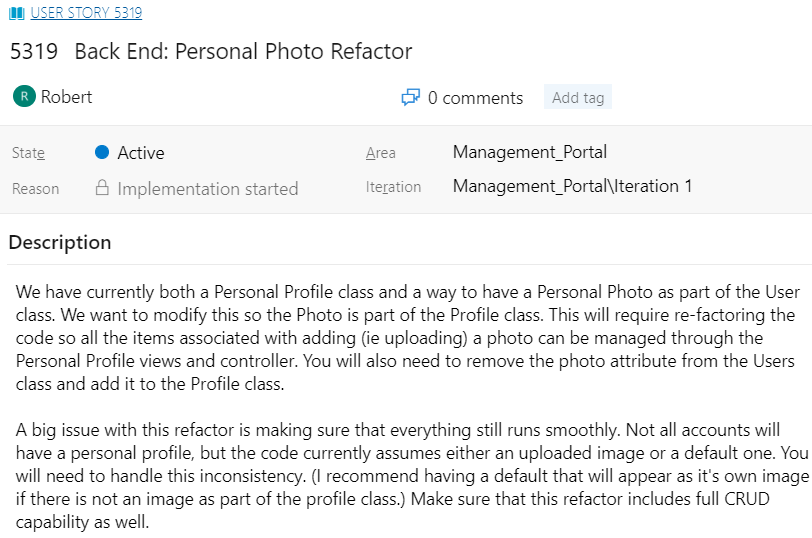
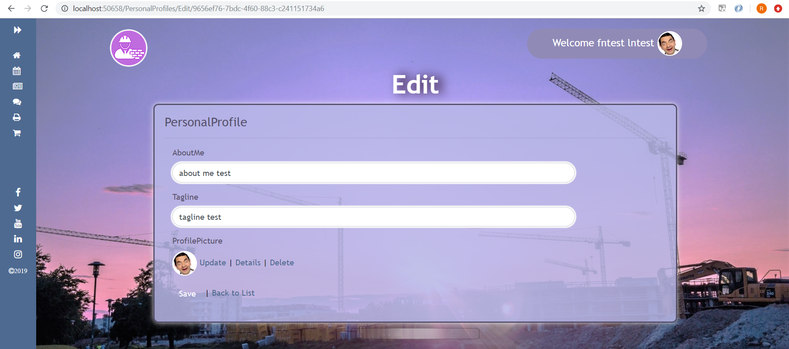
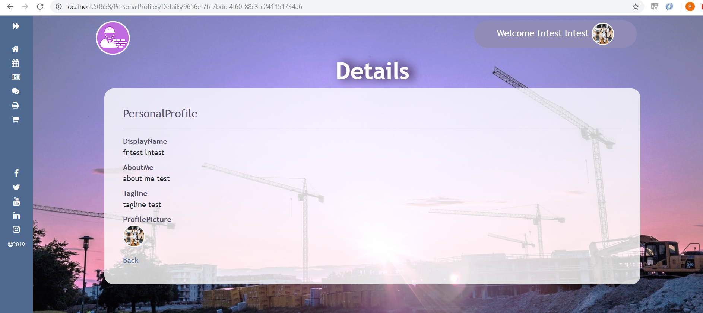
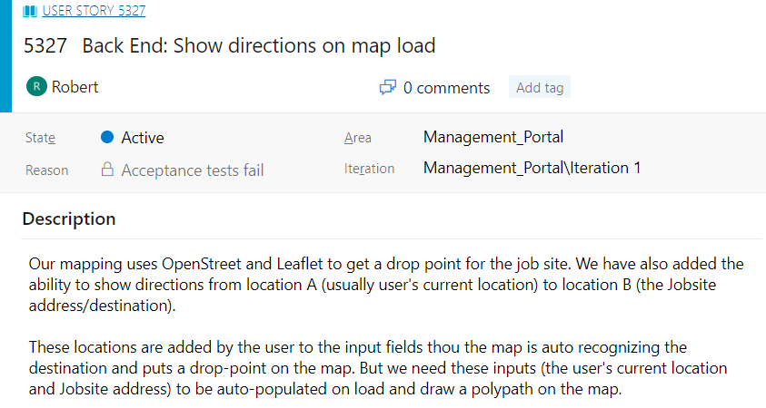
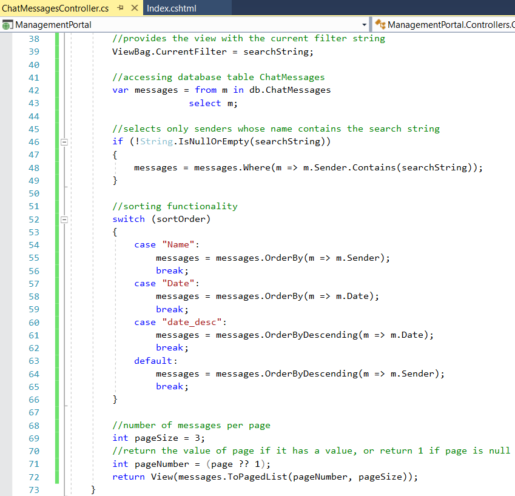
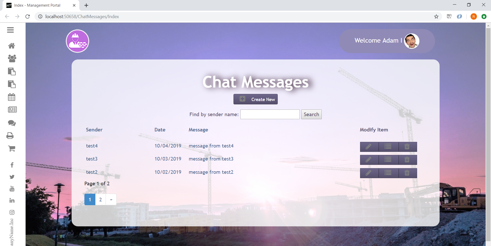

# Prosper I.T. Consulting - Internship
## Table of Contents
- [General Information](#live-project-sprint-general-information)
  - [Prosper I.T. Consulting](#prosper-it-consulting)
  - [Technologies Used](#technologies-used)
  - [Accomplishment Highlights](#accomplishment-highlights)
  - [Sprint Weekly Process](#sprint-weekly-process)
  - [My Take Away Lessons](#my-take-away-lessons)
  - [Featured User Stories](#featured-user-stories)
- [Featured User Story 1: Debug Shift Time CRUD](#featured-user-story-1-debug-shift-time-crud)
- [Featured User Story 2: Personal Photo Refactor](#featured-user-story-2-personal-photo-refactor)
- [Featured User Story 3: Location Data Redesign](#featured-user-story-3-location-data-redesign)
- [Featured User Story 4: Restaurant Redesign](#featured-user-story-4-restaurant-redesign)
- [Featured User Story 5: Show Directions on Map Load](#featured-user-story-5-show-directions-on-map-load)
- [Featured User Story 6: Sorting, Filtering, & Paging ChatMessages Index](#featured-user-story-6-sorting-filtering--paging-chatmessages-index)
- [The Four Live Project Sprints](#the-four-live-project-sprints)
  - [Python Live Project Sprint 4 - The Space Bar](#python-live-project-sprint-4---the-space-bar)
  - [C# Live Project Sprint 3 - Management Portal](#c-live-project-sprint-3---management-portal)
  - [C# Live Project Sprint 2 - Management Portal](#c-live-project-sprint-2---management-portal)
  - [Python Live Project Sprint 1 - TravelScrape](#python-live-project-sprint-1---travelscrape)


## General Information
#### Prosper I.T. Consulting
Prosper I.T. Consulting is a software development company that provides a wide variety of tech services, including: web development, creating custom software and building applications. My internship lasted for 8 weeks and was broken down into 2-week sprint intervals.

#### Technologies Used
- C#/ASP.NET MVC
- Python/Django
- JavaScript
- CSS/Bootstrap
- HTML
- SQL/SQL Server
- Git/Team Foundation Server
- Agile/Scrum

#### Accomplishment Highlights
- full stack development and dev team experience implementing Agile/Scrum methodology and front-end and back-end logic on a Python/Django based software and a C#/ASP.Net based application
- created and also debugged multiple CRUD (create, read, update, delete) features for
database objects
- created and also debugged sorting, filtering, and paging features for multiple tables of
object lists
- created and also redesigned multiple pages involving displaying database data
- made API request to display user's local weather information
- created a map to show user's location

#### Sprint Weekly Process
- Mondays were dedicated to onboarding and sprint planning. We defined user stories, divided them into tasks, and set goals for what will be accomplished by the end of the week.

- We had daily stand up meetings from Monday through Friday via Google Meet. Each developer discussed what we did the day before, what we will be working on for the current day, and any roadblocks we may be experiencing. Outside of the stand up, we also communicated via Slack.

- Each Friday we had Sprint Retrospective, which is a quick discussion during the daily stand up that explains what was helpful and what was detrimental to productivity and team work flow. These meetings were meant to improve communication and coordination within the team, including the project manager.

#### My Take Away Lessons
- I gained the experience of working with a dev team to develop software on the front-end and back-end.
- Patience and persistence are keys to improvement.
- Be comfortable with not knowing something, break down requirements into manageable steps, clarify any uncertainties, and move forward towards a solution.
- I learned to not jump straight into implementation. Instead, seek first to gain a full understanding of what the user story is really asking and requiring. Look around the app and code base and become familiar with the environment. Do some initial research if necessary.
- Always think in terms of what the end goal is, what I'm currently trying to accomplish and why, and what each line of my code is actually doing (also known as [Rubber Duck Debugging](https://en.wikipedia.org/wiki/Rubber_duck_debugging)).
- When in doubt, communicate and clarify.
- Don't be stuck on a problem for too long and ask for help.
- Empathy and kindness are keys to effective relationships and communication, whether it's at work or outside of work.
- Continually learn and improve in terms of software development and personal development. Think big picture and holistically.
- It's about progress, not perfection. Enjoy the journey!

#### Featured User Stories
The next 6 sections are featured highlights of 6 user stories I completed during the entire 8 week internship. To see the full details and all 16 user stories I completed, please see the section below, [The Four Live Project Sprints](#the-four-live-project-sprints), and its sub-heading hyperlinks.

For each user story, I answer the following questions:
1. What is the issue?
2. Why is this an issue? (If applicable)
3. How is the issue resolved?
4. What is the end result?


## Featured User Story 1: Debug Shift Time CRUD

### [This featured user story is from C# Live Project Sprint 3](#c-live-project-sprint-3)

#### Technologies Used
- C#/ASP.NET MVC
- HTML, CSS/Bootstrap
- Git and Team Foundation Server (Source Control)
- Azure DevOps (Project Management)
- Visual Studio 2017 (Code Editor)

#### 1. What is the issue?
This user story had an issue with `Job` object's `ShiftTimes` property's CRUD functionality. Its `Edit` and `Details` view were throwing errors.

Its `Create` view already had a basic layout but it did not have a working create functionality. It also required a drop down list to select existing `Job` objects and moving the `Default` element from the bottom of the page to the top.

#### 2. Why is this an issue?
The `Edit` view was throwing an error because in the `ShiftTimes` controller's `Edit` GET method, its `id` parameter was assigned the wrong data type of `Guid` while the actual `ShiftTime` model (used in the `Edit` view) assigns its `id` property with the data type of `int`.

As a result of this mismatch, the `id` parameter in the `Edit` method always became `null` and would throw an error.

###### ShiftTimes controller's `Edit` GET method - notice `Guid? id` (before fix)
```c#
public ActionResult Edit(Guid? id)
{
	if (id == null)
	{
		return new HttpStatusCodeResult(HttpStatusCode.BadRequest);
	}
	ShiftTime shiftTime = db.ShiftTime.Find(id);
	if (shiftTime == null)
	{
		return HttpNotFound();
	}
	return View(shiftTime);
}
```

###### Code snippet of `ShiftTime` model - notice `int ShiftTimeId`
```c#
public class ShiftTime
{
	[Key]
	[ForeignKey("Job")]
	public int ShiftTimeId { get; set; }

	public virtual Job Job { get; set; }
	
	...
}
```

###### Error message when trying to access `Edit` view due to `Edit` method's `id` parameter being assigned the data type of `Guid` instead of `int`


The `Details` view was throwing an error due to an `Html.Partial` method from inside of the view that was looking for a file (`"_EditButtonPartial"`) that did not exist.

###### `Html.Partial` method causing the error for `Details` view due to searching for a file (`"_EditButtonPartial"`) that did not exist
```cshtml
@Html.Partial("_EditButtonPartial", Model.ShiftTimeId)
```

###### Error message when trying to access `Details` view


The `Create` view lacked the create functionality because:
1. the view did not have an option to select an existing `Job` object. And since `Job` objects and `ShiftTime` objects had a 1 to 0..1 (zero or one) relationship, in order to create a `ShiftTime` object there must first be an existing `Job` object to select and associate it to.
2. the controller's `Create` GET method didn't do much besides simply returning the view.
3. the controller's `Create` POST method was completely commented out, and the commented out code was implementing a `Guid` data type for the `ShiftTimeId` property (when in fact, based on the `ShiftTime` model, the `ShiftTimeId` property should be an `int`) and a partial view of `"_shiftTimeModal"` that was created for Jobs controller and view.

###### ShiftTime `Create` view before fix (no option of selecting an existing `Job` object, therefore cannot create a `ShiftTime` object)

	
###### Code snippet of `Job` model to show 1 to 0..1 (zero or one) relationship to `ShiftTime` objects
```c#
public class Job
{
	[Key]
	public int JobId { get; set; }

	[Display(Name = "Job Title")]
	public string JobTitle { get; set; }

	[Display(Name = "Weekly Shifts")]
	public virtual ShiftTime WeeklyShifts { get; set; }
	
	...
}
```
	
###### Code snippet of `ShiftTime` model to show 0..1 (zero or one) to 1 relationship to `Job` objects
```c#
public class ShiftTime
{
	[Key]
	[ForeignKey("Job")]
	public int ShiftTimeId { get; set; }

	public virtual Job Job { get; set; }
	
	...
}
```

#### 3. How is the issue resolved?
I fixed the `Edit` view by:
1. changing the `Edit` GET method's `id` parameter's data type from `Guid` to `int`
2. changing the view's static heading of "ShiftTime" to a more dynamic approach that grabs the specific `ShiftTime` object's associated `Job` object's `JobTitle` property's value by using the `Html.DisplayFor` method
	
###### ShiftTimes controller's `Edit` GET method with `id` parameter properly assigned as an `int` (after fix)
```c#
public ActionResult Edit(int id)
{
	...
}
```

###### Dynamic heading for `Edit` view by using `Html.DisplayFor` method
```cshtml
<h4 class="card-title">@Html.DisplayFor(model => model.Job.JobTitle)</h4>
```

I fixed the `Details` view by completely eliminating the unnecessary `Html.Partial` method that was causing the error. By the name of the first parameter `"_EditButtonPartial"`, it seemed like the `Html.Partial` method was searching for a file responsible for an edit button. I concluded that this was not necessary due to:
1. this was the `Details` view and not the `Edit` view.
2. the user story only required for the `Details` view to simply show.
3. there was already a functional Edit button from the `Index` view.
4. there was no `"_EditButtonPartial"` file.

I also added a dynamic heading that used the `ShiftTime` object's associated `Job` object's `JobTitle` property's value using `Html.DisplayFor`. Previously there was no heading.

I fixed the `Create` view by:
1. moving the `Default` element from the bottom of the page to the top above the `Monday` element.
2. setting up `Html.BeginForm` for a create form.
3. setting up `Html.DropDownList` for the drop down list and using `Html.LabelFor` for a dynamic heading for the drop down list.
4. setting up ShiftTimes controller's `Create` GET method to pass to the view a list of Jobs from the `Job` database that did not have its `WeeklyShift` property (which has a data type of a `ShiftTime` object) assigned yet.
5. setting up ShiftTimes controller's `Create` POST method to find the selected `Job` object from the `Job` database and assigning its `WeeklyShift` property (which has a data type of a `ShiftTime` object) to the newly created `shiftTime` object. Then I added the new `shiftTime` object to the `ShiftTime` database.

###### `Create` view using `Html.BeginForm` method for a create form
```cshtml
@using (Html.BeginForm("Create", "ShiftTimes", FormMethod.Post))
```

###### `Create` view using `Html.DropDownList` method for the drop down list and `Html.LabelFor` method for a dynamic heading for the drop down list
```cshtml
@*drop down list for Jobs with WeeklyShifts that equal null*@
<div class="form-group">
	@Html.LabelFor(model => model.Job.JobTitle, htmlAttributes: new { @class = "control-label col-md-2" })
	<div class="col-md-10">
	    @Html.DropDownList("JobId", (IEnumerable<SelectListItem>)ViewBag.jobs, null, new { @class = "form-control" })
	</div>
</div>
```

###### ShiftTimes controller's `Create` GET method (after fix)
```c#
public ActionResult Create()
{
	// select all Jobs without WeeklyShifts
	var jobsWithoutWeeklyShift = db.Jobs.Where(x => x.WeeklyShifts == null).ToList();
	// pass jobsWithoutWeeklyShift list to Create view
	ViewBag.jobs = new SelectList(jobsWithoutWeeklyShift, "JobId", "JobTitle");
	return View();
}
```

###### ShiftTimes controller's `Create` POST method that creates a new `ShiftTime` object for a selected `Job` object (after fix)
```c#
[HttpPost]
[ValidateAntiForgeryToken]
public ActionResult Create([Bind(Include = "ShiftTimeId,Monday,Tuesday,Wednesday,Thursday,Friday,Saturday,Sunday,Default")] ShiftTime shiftTime)
{
	if (ModelState.IsValid)
	{
		// uses selected Job's JobId to find that object and store it as jobSelected
		Job jobSelected = db.Jobs.Find(Convert.ToInt32(Request["JobId"]));
		// assign jobSelected's WeeklyShift property to new shiftTime
		jobSelected.WeeklyShifts = shiftTime;
		// add new shiftTime object to ShiftTime database
		db.ShiftTime.Add(shiftTime);
		// save database changes
		db.SaveChanges();
		// redirect to Index
		return RedirectToAction("Index");
	}
	return View();
}
```

#### 4. What is the end result?
The result is a functional CRUD feature for `ShiftTimes` objects. A manager can now go into `ShiftTimes` and see, create, edit, or delete a `ShiftTime` object associated to a `Job` object.

###### `Create` view after fix with a dynamic drop down list of existing `Job` objects to choose from in order to create it a `ShiftTime` object. Also, I moved the `Default` element from the bottom of the page to the top above the `Monday` element


###### `Index` view showing created `ShiftTime` object for `Job` object named `"Yellowstone"`


###### `Edit` view after fix - no more errors and an addition of a dynamic heading using `Job` object's `JobTitle` property's value `"Yellowstone"`


###### `Details` view after fix - no more errors and an addition of a dynamic heading using `Job` object's `JobTitle` property's value `"Yellowstone"`


## Featured User Story 2: Personal Photo Refactor

### [This featured user story is from C# Live Project Sprint 3](#c-live-project-sprint-3)

#### Technologies Used
- C#/ASP.NET MVC
- HTML
- Git and Team Foundation Server (Source Control)
- Azure DevOps (Project Management)
- Visual Studio 2017 (Code Editor)

#### 1. What is the issue?
This user story required making the `PersonalProfilesController` and its view responsible for uploading profile pictures for personal profiles and handling a default picture for users who do not have a personal profile and users who do have a personal profile but did not set a profile picture.

It also required having full CRUD capabilities for profile pictures.

#### 2. How is the issue resolved?
The feature to upload profile pictures was previously handled by the `ManageController` and it was accessing the `ProfilePicture` property from the `User` model. I deleted the `ProfilePicture` property from the `User` model and added it to the `PersonalProfile` model instead.

Then I took the logic for uploading a profile picture from the `ManageController` and transfered it to `PersonalProfilesController` and added extra funcionality:
1. I added an "or" condition (`||`) to the `if` statement that checks for users who have a personal profile but has not set a profile picture. Now, if users do not have a personal profile OR if users have a personal profile but did not set a profile picture, their profile picture will be set to the default profile picture.
2. I added the logic for the `DeleteProfilePictureConfirmed` method.
3. I added comments to the `Photo`, `ProfiePicture` POST, `DeleteProfilePicture`, and `DeleteProfilePictureConfirmed` POST methods for more clarity.

###### PersonalProfilesController `Photo` method for uploading a profile picture or default picture (after fix)


###### PersonalProfilesController `ProfilePicture` POST method (after fix)


###### PersonalProfilesController `DeleteProfilePictureConfirmed` POST method I added (after fix)


I updated all the view files that dealt with showing the profile picture since `PersonalProfilesController` was now in charge of that logic instead of the `ManageController`.

###### Using `Url.Action` method for `img` tag's `src` attribute to access profile picture (or default picture for users without profile pictures) via `PersonalProfiles/Photo` method
```cshtml

```

###### Using `Html.ActionLink` method to create a link to upload profile picture via `PersonalProfiles/ProfilePicture` method
```cshtml
@Html.ActionLink("Upload your profile image here", "ProfilePicture", "PersonalProfiles")
```

###### Using `Html.ActionLink` method to create links for Update, Details, and Delete for profile picture via `PersonalProfiles/ProfilePicture`, `PersonalProfiles/Details`, and `PersonalProfiles/DeleteProfilePicture` methods
```cshtml
@Html.ActionLink("Update", "ProfilePicture", "PersonalProfiles") |
@Html.ActionLink("Details", "Details", new { id = Model.ProfileID }) |
@Html.ActionLink("Delete", "DeleteProfilePicture", new { id = Model.ProfileID })
```

###### Using `Html.BeginForm` method to upload profile picture via `PersonalProfiles/ProfilePicture` POST method
```cshtml
@using (Html.BeginForm("ProfilePicture", "PersonalProfiles", FormMethod.Post, new { enctype = "multipart/form-data" }))
```
	
###### Using `Html.BeginForm` method for profile picture delete confirmation via `PersonalProfiles/DeleteProfilePicture` POST method
```cshtml
@using (Html.BeginForm("DeleteProfilePicture", "PersonalProfiles", FormMethod.Post))
```

#### 3. What is the end result?
The result is a fully functional CRUD feature for profile pictures that is now being handled by `PersonalProfilesController` and its views. Users can now upload, see, update, or delete their profile pictures.

If users do not have a personal profile or if users do have a personal profile but did not set a profile picture, they are assigned a default profile picture.

###### `PersonalProfiles/Edit` view showing the default profile picture and the Update, Details, and Delete features.

	
###### `PersonalProfiles/ProfilePicture` view for uploading profile picture


###### `PersonalProfiles/Details` view (I uploaded a new profile picture that replaced the default profile picture)


###### `PersonalProfiles/DeleteProfilePicture` view for profile picture delete confirmation


## Featured User Story 3: Location Data Redesign

### [This featured user story is from Python Live Project Sprint 4](#python-live-project-sprint-4)

#### Technologies Used
- Python/Django
- HTML, CSS/Bootstrap, JavaScript
- Leafletjs and Openstreet API (Map)
- Openweather API (Local Weather Information)
- Virtualenv (Python Library)
- Git (Source Control)
- DevOps (Project Management)
- VS Code (Code Editor)

#### 1. What is the issue?
The issue with this story was that the layout for the Location Data App's page was visually unorganized. This story required clearly separating each section into their own container and adding their own image or graphic.

This story had optional requirements to include a map of the user's current location and also to include an additional API source for local information.

###### App before fix (top half of the page)

	
###### App before fix (bottom half of the page)


#### 2. Why is this an issue?
The reason why the page was visually unorganized is because the previous developer used the home page's "cafe" section as a template and applied it here.

The code's functionality did not trasfer over well to the Location Data template and required more adjustments to make it more visually effective.

#### 3. How is the issue resolved?
I fixed the layout by first removing all unnecessary Bootstrap and CSS styling. This removed the black background and revealed the main app's very appealing background that was underneath it, which extended from the main app's base.html.

Then I replaced all of the `div` tags with semantic tags to give it more structure and meaning. I added an `h1` tag. I added images for each section.

For styling I took a minimalist and clean approach. I used Bootstrap 4's `.container`, `.row`, and `.column` for layout structure. The project already had global styles for the `h1`, `h2`, and `p` tags so I used those as well to keep a uniform look with the rest of the site.

Then I created CSS classes specific to only the Data Location App to fix margin spacing, font size, and to style the map that I created for one of the optional requirements.
	
###### Location Data App template's code after fix (my_location_data_base.html)
```html
<!-- LOCATION DATA PAGE -->
<main class="container">
  <h1 id="location-data">Location Data</h1>
	
  <!-- top row section -->
  <section class="row location-data-section">
  <!-- left side article of top row for sunrise/sunset -->
  <article class="col-md-5">
    <h2 class="location-data-heading">Local Sunrise/Sunset</h2>
    <p>Below are the local sunrise and sunset times based on your location! These times are for the current date.</p>
    <p>Sunrise: {{ sunrise }}</p>
    <p>Sunset: {{ sunset }}</p>
    
  </article>
  <!-- right side article of top row for radiation -->
  <article class="col-md-5 offset-md-2">
    <h2 class="location-data-heading">Radiation Exposure</h2>
    <p>
    Sources of radiation are all around us all the time. Some are natural and some are man-made. 
    The amount of radiation absorbed by a person is measured in dose. 
    A dose is the amount of radiation energy absorbed by the body.
    </p>
    <p>Dose Rate for {{dateOfRadiation}}:</p>
    <p>{{ radiation }}</p>
    
  </article>
  </section>
	
  <!-- bottom row section -->
  <section class="row location-data-section">
  <!-- left side article of bottom row for map -->
  <article class="col-md-5">
    <h2 class="location-data-heading">Map Location</h2>
    <p>This is your current location on the map.</p>
    <div id="location-data-map"></div>
  </article>
  <!-- right side article of bottom row for local weather -->
  <article class="col-md-5 offset-md-2">
    <h2 class="location-data-heading">Local Weather</h2>
    <p>Below is the current weather for your local area.</p>
    
    <p>Weather Description: {{ weather_description }}</p>
    <p>Average Temperature: {{ average_temp }} &#8457</p>
    <p>High Temperature: {{ high_temp }} &#8457</p>
    <p>Low Temperature: {{ low_temp }} &#8457</p>
    <p>Humidity: {{ humidity }}%</p>
  </article>
  </section>
</main>
```

###### CSS styles specific to only the Location Data App to fix margin spacing, font size, and to style the map that I created for one of the optional requirements (static/css/styles.css)
```css
/* LOCATION DATA STYLE */

/* map */
#location-data-map {
  position: relative;
  border: 5px solid white;
  border-radius: 5px;
  height: 300px;
  width: 100%;
}

/* h1 */
#location-data {
  margin: 20rem 0 20rem 0;
}

/* section tag */
.location-data-section {
  margin: 10rem 0 5rem 0;
}

/* h2 */
.location-data-heading {
  font-size: 1.8rem;
  margin-bottom: 3rem;
}

/* LOCATION DATA STYLE ENDS */
```

As for the optional requirements, I incorporated Openweathermap API as a source of local weather data and signed up to acquire the API key. I created a `local_weather` function to handle the API request and response to get local weather information.

Inside the views, there was already two functions (`User_Latitude` and `User_Longitude`) that used IP-API to return the user's location coordinates (used for the `RadiationExposure` function). I used those two functions to pass the user's latitude and longitude values into my `local_weather` function.

From the Openweathermap API's JSON object response, I extracted the values for weather description, average temp, high temp, low temp, humidity, and the weather icon code.

I wrapped all of this data into a dictionary to be returned. From the `index` function, I used the `update` function to update the `context` with the `local_weather`'s data to be rendered and used in the template using django template tags.

###### I created `local_weather` function from the views to handle the API request and response to get the local weather information (my_locationData/views.py)
```python
def local_weather(latitude, longitude):
  api_key = "api_key_hidden_for_privacy"
  # make api request
  response = requests.get("https://api.openweathermap.org/data/2.5/weather?lat=" + latitude + "&lon=" + longitude + "&appid=" + api_key)
  # "main" and "weather" are JSON object keys
  main = response.json()["main"]
  weather = response.json()["weather"][0]
  # the next 6 lines are JSON object key values
  weather_description = weather["description"].capitalize() + "."
  average_temp = kelvin_to_fahrenheit(main["temp"])
  high_temp = kelvin_to_fahrenheit(main["temp_max"])
  low_temp = kelvin_to_fahrenheit(main["temp_min"])
  humidity = main["humidity"]
  icon = weather["icon"]
  context = {
    "weather_description": weather_description,
    "average_temp": average_temp,
    "high_temp": high_temp,
    "low_temp": low_temp,
    "humidity": humidity,
    "icon": icon,
    # latitude_only and longitude_only is for map
    "latitude_only": latitude,
    "longitude_only": longitude
  }
  return context
```

###### `index` function from the views - updating the context with data from `local_weather` function (my_locationData/views.py)
```python
def index(request):
  ...
  # update context with data from local_weather method
  context.update(local_weather(User_Latitude(), User_Longitude()))
  return render(request, 'my_Location/my_LocationData.html', context)
```

The temperature values returned from Openweathermap API was in Kelvin. I created a function to convert Kelvin to Fahrenheit, then returned that value as a string so it can be used in the template.

###### I created `kelvin_to_fahrenheit` function (my_locationData/views.py)
```python
def kelvin_to_fahrenheit(k_temp):
  # convert kelvin to fahrenheit and round
  f_temp = round((k_temp-273.15)*9/5+32)
  # return fahrenheit as string
  return str(f_temp)
```

For some reason, the `User_Latitude` and `User_Longitude` functions (created by a previous developer) were producing user's location coordinates for West Chicago when it should've been for my location in Colorado Springs.

I brought this to the project manager's attention and she said the issue may be the IP-API itself or the way the previous developer incorporated it. Either way, I was instructed to go ahead and continue to use those functions and she will create a new user story to handle that issue.

I accomplished the other optional requirement of including a map of the user's current location by using Leafletjs and Openstreet API. I used the pre-existing `User_Latitude` and `User_Longitude` functions to get the user's coordinates for the map.

###### JavaScript code for creating the leaflet map (my_location_data_base.html)
```html
<!-- JAVASCRIPT FOR LOCATION DATA'S MAP -->
<script>
  // Create map options
  var mapOptions = {
    center: [parseFloat("{{ latitude_only }}"), parseFloat("{{ longitude_only }}")],
    zoom: 10
  }
  // Create map object
  var map = new L.map('location-data-map', mapOptions);
  // Create Layer object
  var layer = new L.tileLayer('http://{s}.tile.openstreetmap.org/{z}/{x}/{y}.png', {
    attribution: '&copy; <a href="https://www.openstreetmap.org/copyright">OpenStreetMap</a> contributors'});
  // Add layer to the map
  map.addLayer(layer);
  // Create marker and add it to map
  var marker = L.marker([parseFloat("{{ latitude_only }}"), parseFloat("{{ longitude_only }}")]).addTo(map);
</script>
```

###### CSS styling for the map (static/css/styles.css)
```css
/* map */
#location-data-map {
  position: relative;
  border: 5px solid white;
  border-radius: 5px;
  height: 300px;
  width: 100%;
}
```

#### 4. What is the end result?
The end result is a visually structured, appealing, and informative page for Location Data App's page. It looks uniform with the rest of the site and it includes data for user location's sunrise/sunset time and radiation exposure.

It now also includes the new features I added: user's local map location and weather data.

###### App after fix (top third of the page)


###### App after fix showing local sunrise/sunset times and radiation exposure (middle third of the page)


###### App after fix showing new map and local weather data (bottom third of the page)


## Featured User Story 4: Restaurant Redesign

### [This featured user story is from Python Live Project Sprint 4](#python-live-project-sprint-4)

#### Technologies Used
- Python/Django
- HTML, CSS/Bootstrap, JavaScript
- Django Crispy Forms (Django App for Styling Forms)
- Virtualenv (Python Library)
- Git (Source Control)
- DevOps (Project Management)
- VS Code (Code Editor)

#### 1. What is the issue?
The issue with this story is that neither the Cafe App and it's associated pages nor the Menu App home page are appropriately styled to match the theme of the site. These two apps function together to create the information needed for our hypothetical restaurant.

From the main app's home page, I needed to transfer the Cafe content from inside of it and into the Cafe App's home page, and then move the Cafe button to just below the Services button.

The page content from the Cafe and Menu Apps are also blocked by the side navbar when the page's width is resized smaller. I also needed to make sure the side navbar properly links to each section.

This user story had optional add-ons of creating an Hours page that included information about Cafe Hours in Zulu time and creating an International Space Station page with ISS location information and a link that connects to the ISS App home page.

###### Cafe App's home page before fix (cafe/index.html)


###### Menu App's home page before fix (menu/menu_index.html)


###### Menu App's create page before fix - top half (menu/menu_create.html)


###### Menu App's create page before fix - bottom half (menu/menu_create.html)


###### Menu App's details page before fix (menu/menu_details.html)


###### Menu App's inspiration page before fix (menu/menu_inspiration.html)


###### Side navbar blocking content when page width is resized smaller


#### 2. Why is this an issue?
The Cafe and Menu Apps were not styled appropriately because the django template tags (`` and ``) and CSS styling were not implemented well. The side navbar was blocking page content when the page width was resized because there was no proper margin in place.

I noticed a common structural template pattern with all of the apps from the project in regards to rendering that app's home page. The pattern is that those apps have their own `base.html` template that contains all of the content specific for that app's home page.

Those apps also have their own `index.html` template that extends the main projects's `base.html` template. They also contain block tags for body content and includes the navbar, the specific app's `base.html`, and footer. This `index.html` template is what ultimately renders the app's home page.

It seems that the previous developer tried to implement this pattern with the other pages of the Menu App (create, details, and inspirations pages). While this pattern worked well for creating the home page, creating the other pages required some adjustments.

#### 3. How did you resolve this issue?
I resolved the issues with the Cafe App home page by moving the Cafe content from the main app's home page to the Cafe App's home page and making adjustments to make the Cafe content work properly for it's new location. Some of the adjustments I made:
1. I created a CSS class called `.cafe-menu-container` that creates a margin preventing the side navbar from blocking content when the page's width is resized smaller. (I used `.cafe-menu-container` for Cafe App's home page and all of Menu App's pages)
2. I created a CSS class called `.cafe-menu-heading` that creates spacing to make the `h1` stand out similarly to the main app's home page's `h1` to create a consistent theme. (I used `.cafe-menu-heading` for Cafe App's home page and all of Menu App's pages)
3. I moved `` to cafe/index.html since that's where all of the similar django template tags were already located and used.
4. I moved `` inside of the `.cafe-menu-container` so that it was not blocked by the side navbar when the page is resized smaller.
5. I moved `` to cafe/cafe_base.html so the images will render since they were not rendering when the tag was located inside cafe/index.html.
6. I replaced some over used `div` tags with `section` and `article` tags to create more semantic.
7. From the main app's home page I moved the Cafe button to just below the Services button.

###### CSS classes I created: `.cafe-menu-container` and `.cafe-menu-heading`
```css
/* CAFE AND MENU STYLING */

/* prevent side navbar from blocking content when page width is resized smaller */
.cafe-menu-container {
  margin-left: 10rem;
}

/* create space to make h1 stand out */
.cafe-menu-heading {
  margin: 15rem 0 28rem 0;
}

/* END CAFE AND MENU STYLING */
```

How I resolved the issues with the Menu App:
1. I moved the logic from menu/menu_index.html that handled looping through `object_list` to menu/menu_base.html and added `` to menu/menu_index.html to maintain the project's template convention and pattern.
2. In menu/menu_base.html I added a link to Cafe App's home page by using an `a` tag and a django template tag to set the `href` to ``.
3. In menu_base.html, menu_create.html, menu_details.html, and menu_inspiration.html pages:
  - I utilized the `.cafe-menu-container` CSS class I created to prevent their content from being blocked by the side navbar when the page is resized smaller.
  - I utilized the `.cafe-menu-heading` CSS class I created that creates spacing to make the `h1` stand out similarly to the `h1` from the main app's home page to have a consistent theme.
  - I moved `` inside `.cafe-menu-container` so that it was not blocked by the side navbar when the page is resized smaller.
  - I implemented some Bootstrap 4 classes to create additional styling.
4. In menu_create.html, menu_details.html, menu_inspiration.html:
  - I added `` to include the side navbar to these pages.
  - I removed `` to avoid awkwardly stacking the menu_base.html template on top of these pages.
5. In menu_create.html, since the project was already utilizing django-crispy-forms to style the user login form, I utilized it as well to style the Menu App's create form by using `` then changing `{{ form.as_p }}` to `{{ form|crispy }}`.

The steps I took to accomplish the optional requirements of creating an Hours page that includes information about Cafe Hours in Zulu time and creating a new International Space Station page that gives ISS location information and contains a link that connects to the ISS App home page:
1. I created cafe/cafe_hours.html and cafe/cafe_iss.html from scratch utilizing HTML5 semantic tags, custom CSS classes, Bootstrap 4 classes, and django template tags.
2. In order for either new templates to be recognized when requested, I had to register them in the `urlpatterns` inside cafe/urls.py.
3. In cafe/views.py I created two functions (`hours` and `iss`) that renders each template when either is requested.

###### The newly created cafe_hours.html (I utilized HTML5 semantic tags, custom CSS classes, Bootstrap 4 classes, and django template tags)
```django






<section class="cafe-menu-container">
	<h1 class="cafe-menu-heading">Spacebar Cafe Hours</h1>
	<section class="container mb-5">
		<article class="card mx-auto">
			<h3 class="card-header bg-info text-white text-center">Hours of Operation</h3>
			<div class="card-body">
				<h5 class="my-5 text-center">11:00 to 23:00 ZULU Time</h5>
				<a href="" class="card-link">Return to Cafe Home</a>
			</div>
		</article>
	</section>
	
</section>


```

###### The newly created cafe_iss.html (contains a link for the ISS App's home page as required by the user story. I utilized HTML5 semantic tags, custom CSS classes, Bootstrap 4 classes, and django template tags)
```django






<section class="cafe-menu-container">
	<h1 class="cafe-menu-heading">International Space Station</h1>
	<section class="container mb-5">
		<article class="card mx-auto">
			<h3 class="card-header bg-info text-white text-center">Welcome to the ISS!</h3>
			<div class="card-body">
				<p class="card-text text-dark text-center">Thank you for boarding the ISS, the number one space station orbiting Earth!</p>
				<p class="text-dark text-center">The ISS serves as a microgravity and space environment research laboratory in which crew members conduct experiments in biology, human biology, physics, astronomy, meteorology, and other fields.</p>
				<p class="text-center mb-5"><a href="">Click here to see our current orbital location!</a></p>
				<a href="" class="card-link">Return to Cafe Home</a>
			</div>
		</article>
	</section>
	
</section>


```

###### cafe/urls.py - url named `'hours'` and `'location'` triggered the views `index` function, which rendered the home page (before update)
```python
urlpatterns = [
		...
		path('hours/', views.index, name='hours'),
		path('location/', views.index, name='location'),
		...
	]
```

###### cafe/urls.py - I changed the `path` function so that url named `'hours'` and `'location'` now triggers the views `hours` and `iss` functions which renders their new pages `cafe_hours.html` and `cafe_iss.html` (after update)
```python
urlpatterns = [
		...
		path('hours/', views.hours, name='hours'),
		path('location/', views.iss, name='location'),
		...
	]
```

###### The `hours` and `iss` functions I created in menu/views.py that renders cafe/cafe_hours.html and cafe/cafe_iss.html
```python
def hours(request):
	return render(request, "cafe/cafe_hours.html")

def iss(request):
	return render(request, "cafe/cafe_iss.html")
```

As for the side navbar, the only thing I had to update was the link for the "Location" tab. Previously it was linked directly to the ISS App's home page. I updated it to link to Cafe App's ISS page as required by the user story. Everything else was linking properly.

#### 4. What is the end result?
The end result is that the Cafe App's home page and all of the Menu App's pages are all styled appropriately to match the theme of the site. The Cafe App now also has 2 new pages, one for Cafe Hours and another for ISS Location.

The Cafe content from the main app's home page has been transferred to Cafe App's home page, the Cafe button has been moved up to just below the Services button, the side navbar is operating and linking properly, and all of the templates for the Cafe and Menu Apps
are working and linking properly.

###### The main app's home page with the Cafe button moved up to just below the Services button


###### Cafe App's home page - top 1/3 of the page (cafe/index.html after fix)


###### Cafe App's home page - mid 1/3 of the page showing cafe image (cafe/index.html after fix)


###### Cafe App's home page - bottom 1/3 of the page showing dummy menu information (cafe/index.html after fix)


###### Menu App's home page - top half of the page (menu/menu_index.html after fix)


###### Menu App's home page - bottom half of the page showing created menu items (menu/menu_index.html after fix)


###### Menu App's create page - top half of the page (menu/menu_create.html after fix)


###### Menu App's create page - bottom half of the page showing form to create menu item (menu/menu_create.html after fix)


###### Menu App's details page - top half of the page (menu/menu_details.html after fix)


###### Menu App's details page - bottom half of the page showing menu item details (menu/menu_details.html after fix)


###### Menu App's inspiration page - top half of the page (menu/menu_inspiration.html after fix)


###### Menu App's inspiration page - bottom half of the page (menu/menu_inspiration.html after fix)


###### Side navbar no longer blocking content when page width is resized smaller


###### Cafe App's new Hours page - top half of the page (cafe/cafe_hours.html)


###### Cafe App's new Hours page - bottom half of the page showing Cafe Hours in Zulu time (cafe/cafe_hours.html)


###### Cafe App's new Location page - top half of the page (cafe/cafe_iss.html)


###### Cafe App's new Location page - bottom half of the page showing ISS location information and a link to ISS App's home page (cafe/cafe_iss.html)


## Featured User Story 5: Show Directions on Map Load

### [This featured user story is from C# Live Project Sprint 2](#c-live-project-sprint-2)

#### Technologies Used
- C#/ASP.NET MVC
- HTML, JavaScript
- Leafletjs (Map)
- Leafet Routing Machinge API (Map Routing)
- Geolocation API (Current Location)
- Git and Team Foundation Server (Source Control)
- Azure DevOps (Project Management)
- Visual Studio 2017 (Code Editor)

#### 1. What is the issue?
This user story required auto populating the current map with a start location using the user's current location, auto populating an end location using the job site's location, and a polypath automatically connecting the start and end destinations immediately after page load.

###### App before fix


#### 2. How is the issue resolved?
The current map was created using JavaScript and Leafletjs and the map routing used Leaflet Routing Machine. The previous developer created a `setLeafletMap` function to instantiate the map.

The map showed the end location of the `JobSite` location. The issue was that getting the user's current location to be used as the start location was not implemented.

I used the Geolocation API and it's `getCurrentPosition` method to get the user's current location to use as the map's start location.

###### `setLeafletMap` function was created by a previous developer for creating the map. It had no implementation for getting user's current location.
```javascript
function setLeafletMap(mapId, jobSiteLat, jobSiteLong, currentLat, currentLong, popupText)
```

###### I used Geolocation API and it's `getCurrentPosition` method to get user's current location to use as the start location. The `setLeafletMap` function instantiates the map and is passed the map container's CSS id of `#jobSiteMap`, `JobSite`'s `Lat` property, `JobSite`'s `Long` property, user's current latitude, user's current longitude, and `JobSite`'s `Address` property
```javascript
navigator.geolocation.getCurrentPosition(function (location) {
  var currentLat = location.coords.latitude
  var currentLong = location.coors.longitude
  setLeafletMap("jobSiteMap", @Model.Lat, @ Model.Long, currentLat, currentLong, @Model.Address)
});
```
###### Part of `setLeafletMap` that uses Leaflet Routing Machine's `L.Routing.control` function for map routing
```javascript
var control = L.Routing.control({
                waypoints: [
                    L.latLng(currentLat, currentLong),
                    L.latLng(jobSiteLat, jobSiteLong)
                ],
                routeWhileDragging: true,
                show: true,
                geocoder: L.Control.Geocoder.nominatim(),
                autoRoute: true
            }).addTo(leafletMap);
```

#### 3. What is the end result?
The result is that when a user goes to the job site's details page, they will see a map with the starting and ending location auto populated with the user's current location and the `JobSite`'s location, the written directions, and a red polyline connecting the 2 locations.

###### App showing auto populated starting and ending points with written directions (after fix)


###### App showing red polyline connecting the starting and ending points (after fix)


## Featured User Story 6: Sorting, Filtering, & Paging ChatMessages Index

### [This featured user story is from C# Live Project Sprint 2](#c-live-project-sprint-2)

#### Technologies Used
- C#/ASP.NET MVC
- HTML
- Entity Framework 6
- PagedList.Mvc (Pagination)
- Git and Team Foundation Server (Source Control)
- Azure DevOps (Project Management)
- Visual Studio 2017 (Code Editor)

#### 1. What is the issue?
This user story required adding sorting, filtering, and paging functionalitites to the list table in the ChatMessages view.

###### ChatMessages view with no sorting, filtering, and paging functionalitites (before fix)


#### 2. How is the issue resolved?
Looking inside `ChatMessagesController` and it's `Index` method, all it did was return a list of data from the `ChatMessages` database table. I replaced it and added the sorting and filtering logic and used a NuGet package called `PagedList.Mvc` for the paging functionalitites.

In the `Index` view, I added column heading hyperlinks for sorting by using the `Html.ActionLink` method, a search box for searching and filtering by using `Html.BeginForm` and `Html.TextBox` methods, and paging links for pagination by using `Html.PagedListPager` method.

###### Adding filtering, sorting, and paging logic inside `ChatMessagesController/Index` method (first half)


###### Adding filtering, sorting, and paging logic inside `ChatMessagesController/Index` method (second half)


###### Adding a search box for searching and filtering by using `Html.BeginForm` and `Html.TextBox` methods and column heading hyperlinks for sorting by using the `Html.ActionLink` method to ChatMessages `Index` view (top of the page)


###### Adding paging links for pagination by using `Html.PagedListPager` method to ChatMessages `Index` view (bottom of the page)


#### 3. What is the end result?
The end result is an interactive table for chat messages with paging functionality that shows 3 messages per page and can be sorted and filtered for ease of use.

###### ChatMessages view with functional sorting, filtering, and paging (after fix)



## The Four Live Project Sprints
To see all of the user stories I completed for each sprint, please click the sprint sub-heading hyperlinks below in this section.
  
### [Python Live Project Sprint 4 - The Space Bar](https://github.com/rbmanez/TTA-Live-Project-Sprints/blob/master/PythonLiveProjectSprint4.md)
#### Project Overview
The Space Bar is an interactive Django based site for researching things about space. It uses APIs from NASA and other sources, web scraping from sites like Wikipedia, and packages like BeautifulSoup, Pandas, Selenium, and more.

### [C# Live Project Sprint 3 - Management Portal](https://github.com/rbmanez/TTA-Live-Project-Sprints/blob/master/C%23LiveProjectSprint3.md)
#### Project Overview
The Management Portal software is used to manage a collection of jobs. Admins are able to create and distribute a weekly schedule assigning users to certain jobs. Users are able to keep track of which job they are assigned to for the week.

The primary components of this project include the creation of registered users, differentiation between users and admins, creation of "Jobs" with necessary details, adding users to those jobs with an instance of "Schedule" for each user on each job.

The secondary components include a Chat feature (for all users to have a single main chat room for discussion) and Company News (where admins can create announcements for all employees to read).
  
### [C# Live Project Sprint 2 - Management Portal](https://github.com/rbmanez/TTA-Live-Project-Sprints/blob/master/C%23LiveProjectSprint2.md)
#### Project Overview
The Management Portal software is used to manage a collection of jobs. Admins are able to create and distribute a weekly schedule assigning users to certain jobs. Users are able to keep track of which job they are assigned to for the week.

The primary components of this project include the creation of registered users, differentiation between users and admins, creation of Jobs with necessary details, adding users to those jobs with an instance of Schedule for each user on each job.

The secondary components include a Chat feature (for all users to have a single main chat room for discussion) and Company News (where admins can create announcements for all employees to read).

### [Python Live Project Sprint 1 - TravelScrape](https://github.com/rbmanez/TTA-Live-Project-Sprints/blob/master/PythonLiveProjectSprint1.md)
#### Project Overview
TravelScrape is a web scraping application project built with Django and Beautfiulsoup. With webscraping and API's, the application gathers data from the web that is relevant to the user who will be traveling. It will include weather, flights, events, restaurants, etc.
